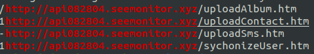
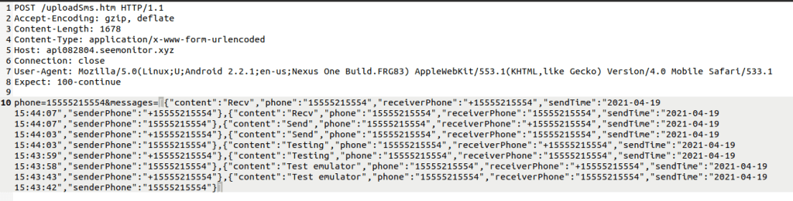

## Analyzing a Malicious APK

NAME: VPX.APK

MD5: 2914ABD93AB252A7DACD23AA6958A7F6

---

I first used Dex2Jar to decompile the APK file so that I can open it in JD-GUI for some code analysis.

After taking a look for a bit, I think I’ve started to figure out what the deal is with it.

When the application first runs, as per usual, it sets the permissions that it needs.

  

It wants to read the storage on any SD cards connected, it wants to read contacts, SMS, and phone state as well.

Keep in mind I have no idea what this app does but it looks like some sort of media player purely based off of its logo.

  

So why would a media player need to read SMS and Contacts? External memory sort of makes sense if it’s trying to read MP3 files on an SD card but the SMS/Contacts combo was a big red flag for me.

So I took a look at the RunService class and saw an interesting function.

  

It looks like it’s sending a message. That’s weird. By drilling down deeper into the code, we can see this very interesting URL.

  

Hmm….

So it’s uploading SMS messages to a remote server?

Maybe if we do a string search for that URL, we can find more.

  

Uhhh ok…

So It’s uploading SMS messages, Contacts, pictures, and something called “sychonizeUser” and I assume they meant “Synchronize.” Always a good sign when there’s a suspicious URL combined with typos.

I also did a quick Whois on that domain **seemonitor.xyz** and got a positive response that it’s located in China.

  

So let’s try to see what it’s sending.

---

Used AVD to open up an emulator and performed an adb push and installed the application. I then used Burp as a proxy to intercept the traffic.

Upon installing and running the application, I saw this in Burp.

  

So it looks like the first transfer is heading to the “sychonizeUser” aka “Synchronize User” address and sending the phone number, IMEI number, and Model information of the infected phone.

Here’s the response back from the server.

  

Not quite sure what the password being sent is. I’m not sure if it’s something random that the malware sets for each infected phone or if it’s grabbing some sort of password from the phone itself. If that’s the case, I’m not sure where it grabs it from because I have no passwords set on my emulator since I just created it for this APK and of course didn’t login to my Google account.

---

Here’s the contacts being sent.

  

And the messages.

  

It looks like it just makes arrays and pumps them out to the server. That matches what I see in the code. Plus we can double check by looking at these POSTs in the Decoder tab of Burp and decoding as URL.

  

The “content” tab shows the messages themselves. I just basically had the emulator send a couple messages to itself to populate some SMS to see if I could get any traffic out. Looks like I did.

Needless to say, we can definitely call this APK malicious. Under the nose of the user, it’s sending out personal data to an unknown domain. It’s sole purpose is to spy on the user. Remember when you’re downloading an app (even from the Google Play Store), make sure you pay attention to the permissions it asks for. There’s no reason a flashlight app should be sending/receiving/reading SMS messages, for example.

