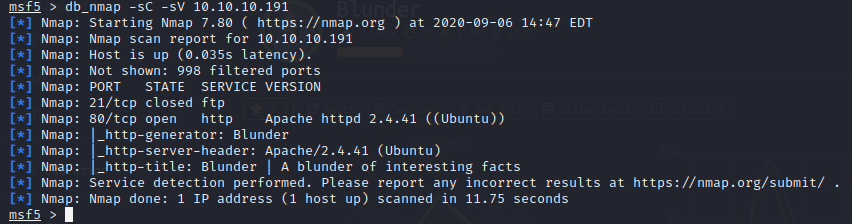
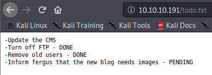
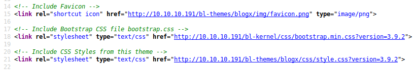
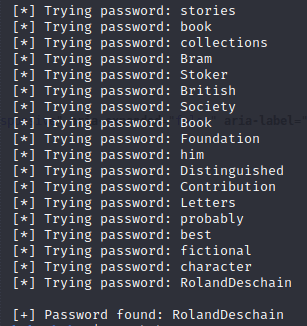
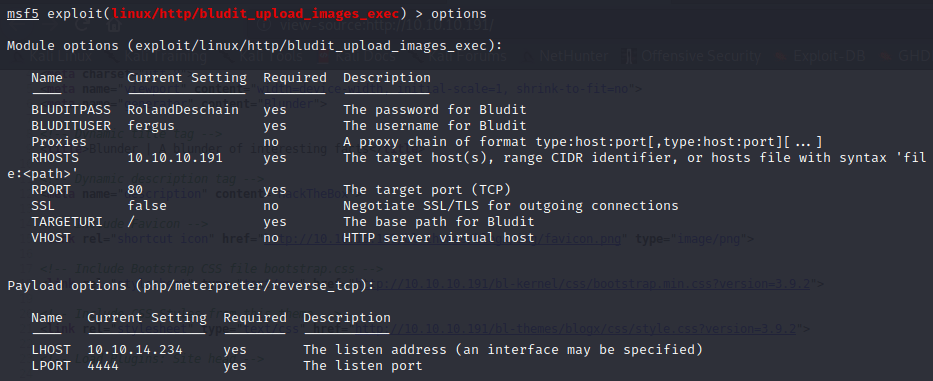
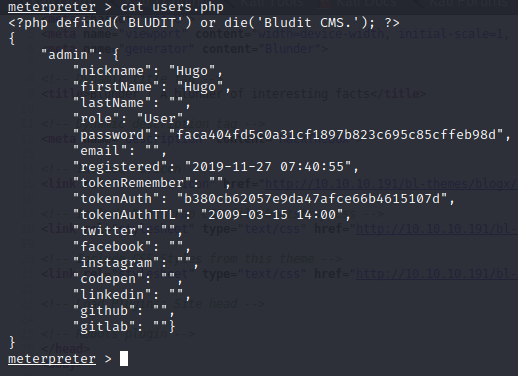
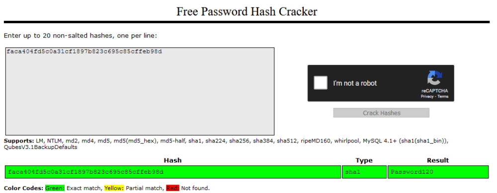
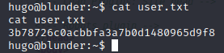
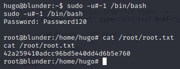

## HTB Blunder Writeup

As always start off with an Nmap scan. I also tend to use this time to add the box to my hosts file as [box_name].htb

  

Enumerate the directories of the webpage using Gobuster, dirsearch, wfuzz, etc.

[+] /about

[+] /0

[+] /admin

[+] /usb

[+] /LICENSE

[+] /todo.txt

[+] /robots.txt

After looking in todo.txt, possible username found: fergus

  

By looking at the page source, you can find Bludit version: 3.9.2

  

Googling that version you’ll find a Ruby script on Exploit DB for bruteforcing. Normally this version of Bludit has brute-force protection enabled but the way this protection works is vulnerable. Basically it adds your attacking IP to the X-Forwarded-For header and keeps track of how many times that IP fails to authenticate and then blacklists that IP. However, it trusts user input on the X-Forwarded-For header so we can spoof that header to evade this protection. This is exactly what this Ruby script does.

Utilizing that script with user fergus and wordlist created by using CeWL on the webpage, you’ll get the password for the initial foothold. [https://www.exploit-db.com/exploits/48746](https://www.exploit-db.com/exploits/48746)

  

Another Google search shows RCE which is actually a Metasploit module already loaded into Metasploit’s database. Search for “bludit” in msfconsole. You’ll find a module that achieves RCE via an image upload vulnerability in Bludit.

Edit the parameters for the Metasploit module to the correct parameters including the Username fergus and the corresponding password that you’ve cracked.

  

After running, you’ll get a Meterpreter shell where you’ll be logged in as www-data.
Browse to the Bludit 3.10 directory, not the Bludit 3.9.2 directory. Then head to bl-content/databases and look at users.php. That’ll give you a password hash for Hugo.

  

Search that hash in Crackstation and you’ll find that it’s Password120.

  

su into hugo with that password and you’ll have user flag.

  

After a bit of enumeration by use of **sudo -l** we can see that while user Hugo can’t run **/bin/bash** as root, he can run it as any user. To escalate use the following privesc exploit:[https://www.exploit-db.com/exploits/47502](https://www.exploit-db.com/exploits/47502). How this privesc works is that in this case, **sudo** doesn’t check for the existence of the specified user id so by entering **sudo -u#-1**, it actually equals uid 0 which is root’s uid.

Congrats! You’ve owned the box!

