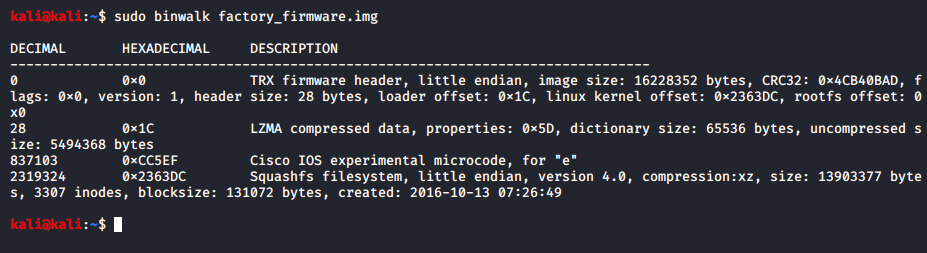
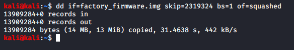
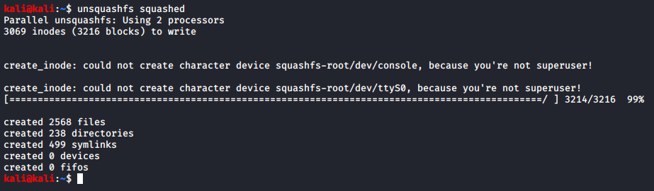
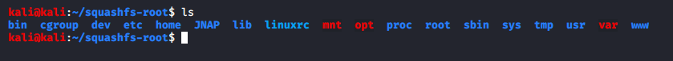
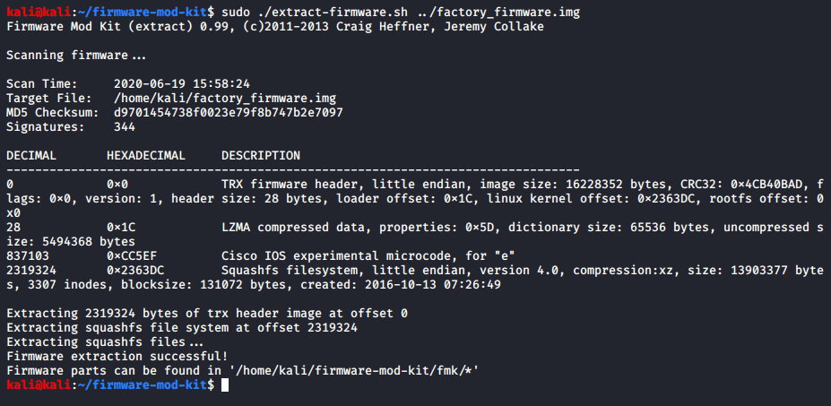
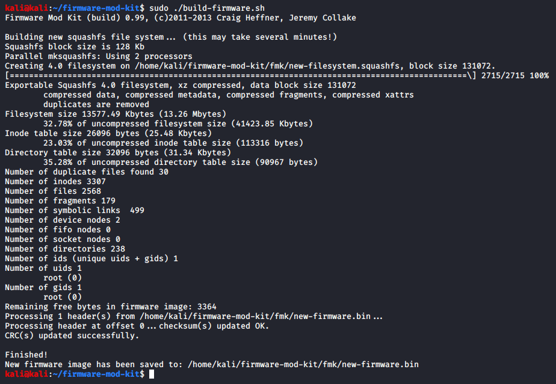
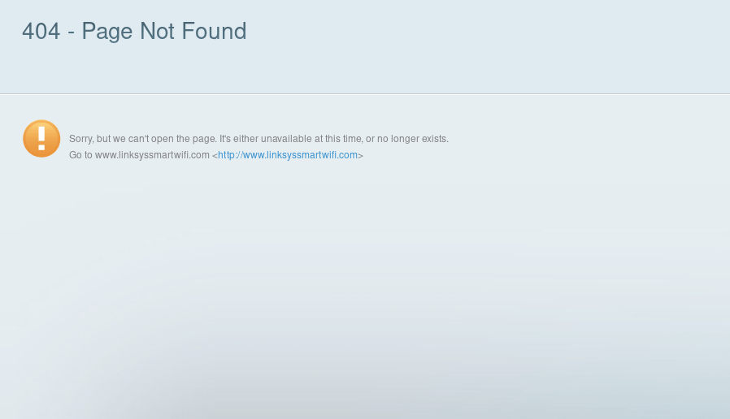
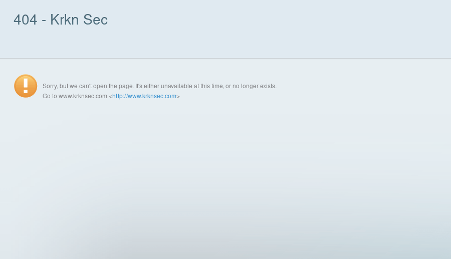

## Introduction to Firmware Modification

The IoT industry is booming right now and it’ll only keep growing. This led me to start playing around with firmware to learn more about trying to find vulnerabilities in IoT devices. To start with, however, I wanted to see if I could just modify firmware.

I got one of my super old Linksys routers and downloaded newer firmware for it. The “newest” firmware was released in 2017 to give you an idea to how old the device is itself.

To begin the analysis I used the tool BinWalk. This script looks for signatures it knows within a binary and reports out to what it thinks is included in the binary.

  

The key part here is the Squashfs filesystem. This is where all the files are stored for the ability for modification. We can easily extract this filesystem using DD.

  

Note that the skip flag here simply ensures we only acquire the Squashfs filesystem and none of the other sections of the binary.

Once it’s completed, the entire filesystem will be located in a single file. If we want to extract it and browse it like we would any other filesystem, we have to unsquash it. That’s as easy as running the unsquashfs command.

  

After this is completed, you should see a new directory made called **squashfs-root**.

If we navigate there and list all the files, we can see an entire file system structure.

  

From here we can edit some files, add a backdoor, look for private keys, check for hardcoded credentials, etc. Then we simply pack it back up and flash the device with the new firmware.

To make this process even simpler, I used the [Firmware Mod Toolkit](https://github.com/rampageX/firmware-mod-kit). This basically automates the entire process.

Extracting the firmware is as simple as the following command:

  

After we’ve done our changes, we can pack it back up just as easily with the next command:

  

A couple things to note. If you want to stop the script from padding the firmware to match the size, utilize the -nopad flag. Also if after your edits the firmware is too large, you can utilize the -min flag for the script.

As this was simply a quick test, the only thing I changed was a 404.html page.

Here it is with the factory firmware:

  

With my modified firmware:

  

However, you can add/modify way more than that. For example, you could add a line to a startup script to start a Netcat listener which would give you an easy backdoor with root access if that startup script is ran under the root context.

---

Another thing to emphasize is that this process isn’t an end-all-be-all solution. Firmware can be packed differently and with different contents. I used BinWalk on a Samsung TV firmware file and saw numerous MySQL entries, a VMware4 Image entry, and a load of others. I’ve also seen firmware files using CPIO.

I also tried this with another one of my older routers and ended up bricking it so don’t try this on a router you plan on using.

Even utilizing this router, I actually had to revert the firmware back to a previous version to accept my edited firmware because after the most recent firmware update, it’ll only accept GPG encrypted firmware files so I kept getting an update error and “firmware file corrupted” messages.
