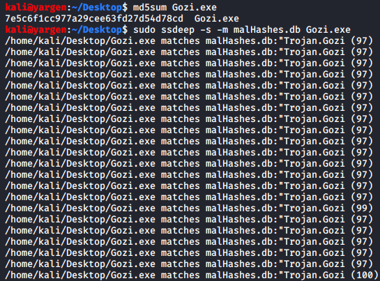
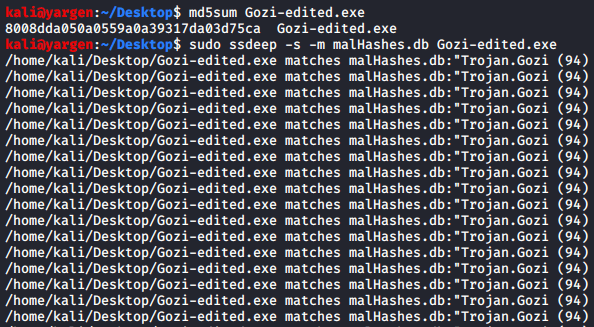

## Fuzzy Hashing

I’ve been doing some more malware analysis during my free time and started using some more techniques such as fuzzy hashing with SSDEEP and import hashing. It’s an easy way to find out what sort of malware an otherwise unknown executable is.

Fuzzy hashing with SSDEEP works by hashing through a different algorithm designed for similarity matching. This allows us to continue to identify malware that we otherwise wouldn’t be able to match with conventional MD5/SHA1 hashes due to the code being updated or changed slightly.

As an example, I’ve downloaded a sample of the Gozi malware. I have a database of about 1000 fuzzy hashes that I store locally. Let’s do a quick MD5 hash and a fuzzy hash and see what the results are.

  

Now I’ll open it real quick in HexEdit and just change a few characters and run these two commands again.

  

As we can see, the MD5 hash is completely different than the first which is to be expected. However, the fuzzy hashes are still similar enough for SSDEEP to state that it’s 94% similar to the hashes recorded in our database.

This helps when you get a new sample and you can’t find any preliminary information through VirusTotal or through conventional hash searching.

I plan on adding more fuzzy hashes to my database and then uploading it to my Github available for everyone.
