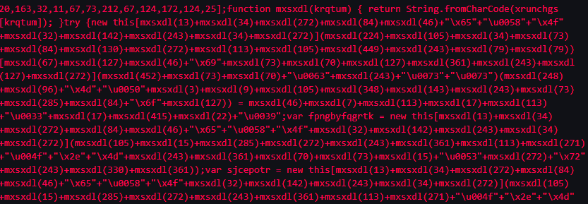
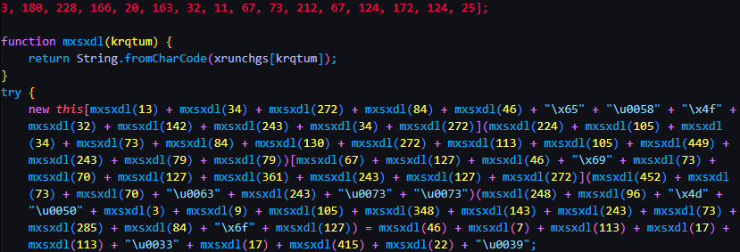
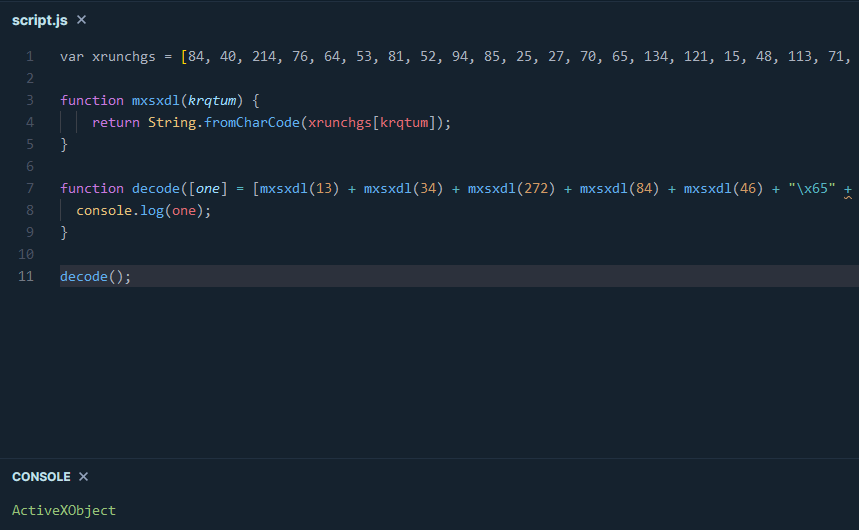
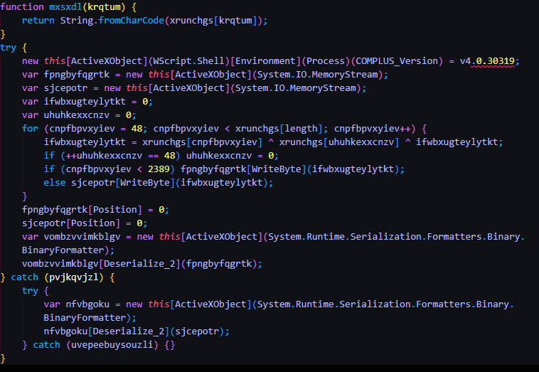
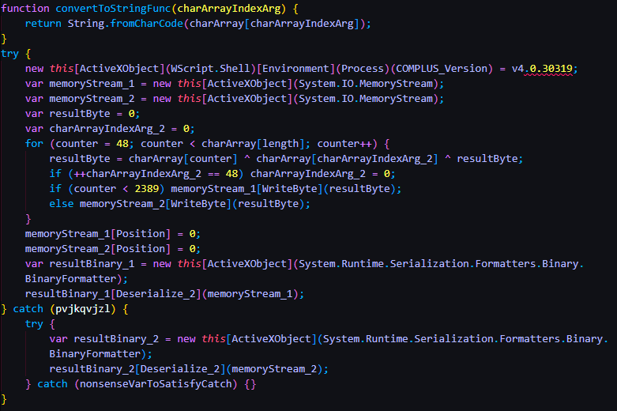
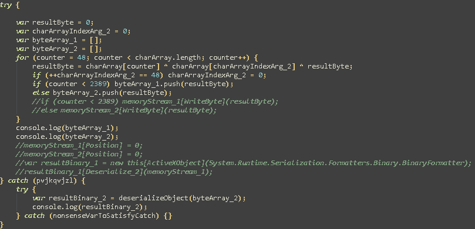
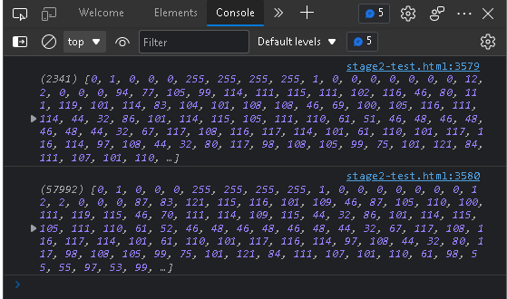
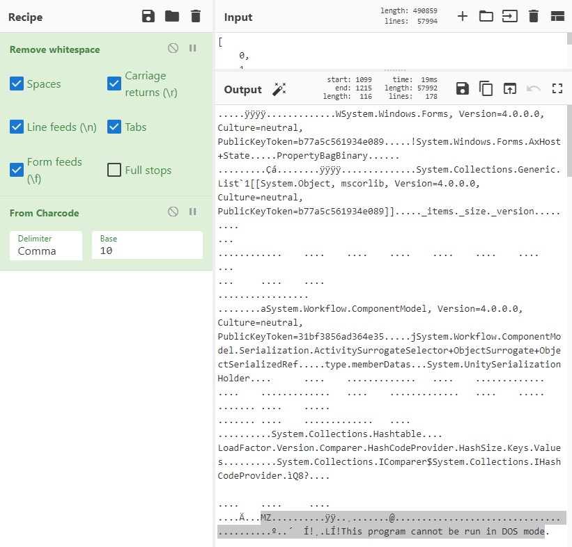

# Deobfuscating Magniber Javascript
---
## Introduction
I saw this [article](https://www.bleepingcomputer.com/news/security/magniber-ransomware-now-infects-windows-users-via-javascript-files/) from BleepingComputer in my travels today and it looked pretty interesting so I wanted to take a deeper look. The deeper technical analysis was performed by HP's threat intelligence team ([link](https://threatresearch.ext.hp.com/magniber-ransomware-switches-to-javascript-targeting-home-users-with-fake-software-updates/)) and it's a great write-up. But I noticed that when they talked about the Stage 1 loader, they didn't go into much detail. They basically went from obfuscated to deobfuscated without talking about the obfuscation technique used and the process of deobfuscating or unpacking it. So I took it upon myself to try to figure it out.

Usually first stage loaders are pretty boring and a necessary evil to get to the meat and potatoes of the malware infection chain but this one was actually quite fun and a bit of a challenge to figure out. To give a brief TL;DR of this stage 1 loader, it basically has a massive character array. It not only uses this character array to build the command strings but it also uses it to build AND execute a .NET binary in memory. I've heard of this as it's classic fileless malware and I've analyzed some .NET in-line injection samples before but I've never seen it done through Javascript so I found it pretty cool.

---

## Deobfuscation

So I'm not going to show the entire script because it's massive due to the large character array but here's a snippet.

It looks awful in its current format so I beautified it using [Beautifier.io](https://beautifier.io). 

Here we can see that the mxsxdl() function is responsible for making the strings from the character array.

I first attempted the normal tricks of wrapping things with console.log() or WScript.Echo but nothing worked. Technically, I could look up each character in the array manually but that also sounds like the worst thing I've ever heard. Work smarter not harder! So instead I ended up writing my own Javascript to do the job for me.

I went to [playcode.io](https://playcode.io) as my little Javascript debugger.

Below is the Javascript code I came up with. Nothing fancy. I’m piggybacking off of the String.fromCharCode function and basically telling Javascript to create the string and store it into my own array. Then I’m just printing out the results to the console with console.log().

This process is a bit tedious as there are brackets between a lot of the obfuscated groups so we can only do a group at a time. However, by doing this for every group, it gives us the following result that we can clean up a bit more:

Next I renamed some of the remaining weird variables to something actually readable. It looks way better than it did when we started. We can actually figure out how it all works now.

Essentially this code basically creates Memory Streams, grabs all the bytes for the binary from the character array, and then stores the binary in the Memory Streams. The new built binary in the Memory Stream is then executed.

So now that we know that Stage 2 will be in a memory stream, how can we grab that data? Well my approach was to get rid of all the memory stream business and instead have the Javascript store the bytes into my own arrays. From there I can print those arrays using console.log(). Below is the modified version that I came up with.

I then added: <script language=javascript/> at the start of the script and closed it out at the end of the script with </script/>

These are HTML tags that allow us to run this script in a browser on our lab machine so we can extract the console.log() results from the web developer console.

Here we can see it has populated the byte arrays and spit them out. At this point we can extract the byte arrays and plop it into CyberChef. Finally, by removing the white spaces and setting the proper parameters on “From Charcode” we can find ourselves a lovely “MZ” header that we were looking for.

