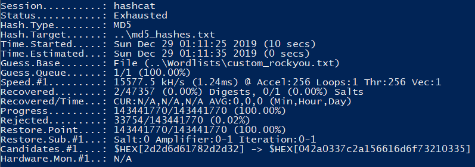
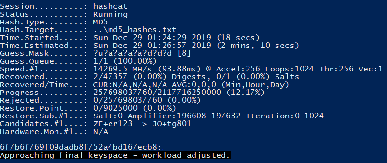
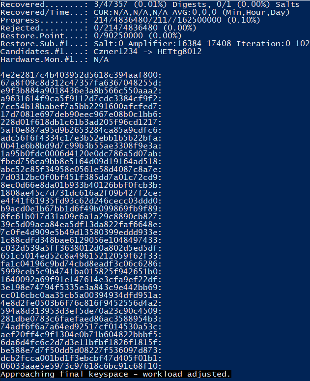
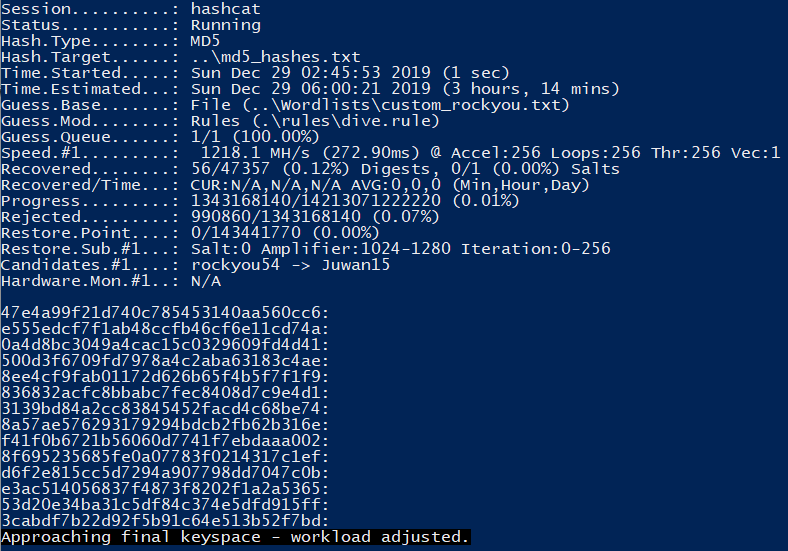
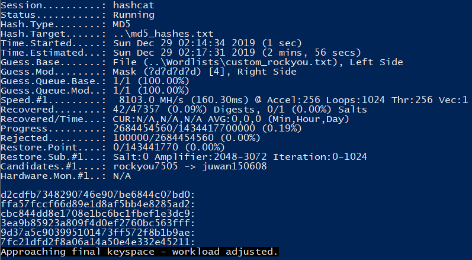
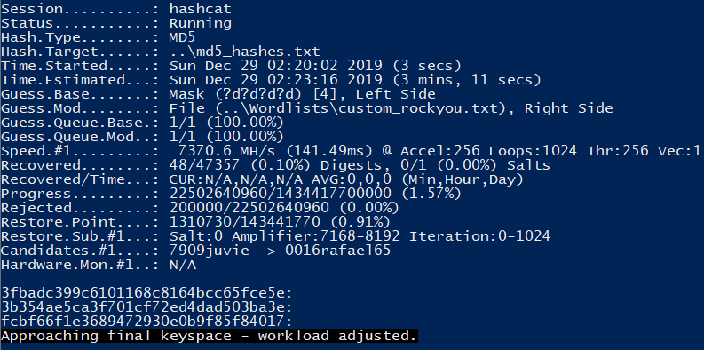

## Password Cracking Basics

*Disclaimer: This is for educational purposes only. Malicious actors use the same or similar techniques after data breaches. I can't stress enough how illegal it is to participate in such activities. I will not be held liable for any readers who choose to take this knowledge and perform illegal or malicious actions with it.*<br><br>

### Why Learn This? <br><br>

Password cracking is a good skill to have in the cybersecurity world. Everyone understands why the bad guys would want these skills but why should the good guys know this? Well pentesters act like the bad guys to discover vulnerabilities of a company and provide detailed reports to improve that company’s security. Knowing how to crack passwords helps to ensure companies are properly storing passwords in a secure manner. Digital forensic investigators will also need to know this in order to gain access to encrypted files, hard drives, etc. Finally, it can be useful for sysadmins or developers to know this to ensure the security of the password encryptions they have in place.

---
<br><br><br>

### Tools Needed <br><br>

Let me first say that you should have some powerful hardware. You can’t really crack passwords on a netbook. Some people have dedicated password cracking rigs that are similar to crypto mining rigs with 8 powerful GPUs. I’m not super deep into password cracking or coin mining to justify such a rig but my current GPU gets the job done well enough. Here’s my current PC specs:

|   **Part**  |   **Model**  |
|-------------|--------------|
| **Mobo**    | Asus Z270-A  |
| **Processor** | Intel i7-7700k |
| **RAM**     | 32GB G.Skill Royal TridentZ 3200Mhz |
| **GPU**     | AMD Radeon RX 5700 XT 50th Anniversary Edition | <br><br>


Next you’ll need a password cracking tool of your choice. I like **Hashcat** but **John the Ripper** is also very good. There’s also other options like **Ophcrack**, **HashSuite**, and **Aircrack-ng**.

Finally, you’ll need a wordlist. We’ll get more in-depth with this later but brute-forcing passwords should only be used as a last resort. Dictionary attacks and hybrid attacks are the go-to. Rainbow Tables are an option as well but they are large and takes a lot of resources. For most applications, dictionary attacks will work well. The secret to quick password cracking is taking basic/targeted wordlists and mangling them in certain ways. A great foundational wordlist is the infamous **rockyou.txt** wordlist. RockYou is a list of most used passwords. Mangled correctly, you can get a decent amount from it. [Hashes.org](hashes.org) also has some wordlists available that work well.

---
<br><br><br>

### Useful Password Statistics <br><br>

*The following information was taken from Hash Crack: Password Cracking Manual which I would recommend to everyone interested in this subject.*

By knowing password statistics, you can develop your wordlists, mangling rules, and masks, to maximize your chances in successful cracks.

- Average password ranges from 7-9 characters long
- Average English word is 5 characters long
- If numbers are used, they’ll most likely be sequential or personally relevant
- Capital letters are most likely to be used at the beginning of the password
- 1 out of 9 people use a password in the top 500 passwords list
- Western countries typically use lowercase letters while Eastern countries use digits
- Digits are more likely to come at the end of the password
<br><br>

**20-60-20 Rule**
- 20% of passwords are easily guessed dictionary words
- 60% are variations of the above 20%
- 20% are complex and unique

---
<br><br><br>

### Cracking Methods <br><br>

**Masks**
Masks are a brute-forcing method but can be rather effective and quick if given the correct variables. First let’s go over the mask indicators.

* ?a – any character
* ?d – any digit
* ?l – any lowercase letter
* ?u – any uppercase letter
* ?s – any special characters

With this in mind, we can utilize the password statistics to create a mask that could have some decent results. Remember, passwords are on average 7-9 characters long, the average English word is 5 characters, passwords typically start with an uppercase, and end in digits.

```
hashcat -a 3 -m <hash type> <hash list file> ?u?a?a?a?a?d?d?d
```

This mask is matching the password stats I mentioned above. You could use ?l instead of ?a but using ?a will cover passwords using “l33t sp34k” and this mask won’t take too long to run through a list. Now of course, if you’re attacking a specific application, you could use their password guidelines to help for the length. Just know that once you get to around 8-9+ characters, it’s going to start taking longer and longer to crack.

You can also use a tool called **PolicyGen** to generate masks based off of password policies/guidelines for the application you’re trying to crack.

Here’s some top masks for passwords found in Western countries: <br><br>
| **Mask Syntax** | **Mask Translation** |
|-----------------|----------------------|
| ?l?l?l?l?l?l |	6-Lowercase |
| ?l?l?l?l?l?l?l |	7-Lowercase |
| ?l?l?l?l?l?l?l?l |	8-Lowercase |
| ?d?d?d?d?d?d |	6-Digits |
| ?l?l?l?l?l?l?l?l?l?l?l?l |	12-Lowercase |
| ?l?l?l?l?l?l?l?l?l |	9-Lowercase |
| ?l?l?l?l?l?l?l?l?l?l |	10-Lowercase |
| ?l?l?l?l?l |	5-Lowercase |
| ?l?l?l?l?l?l?d?d?l?l?l?l |	6-Lowercase + 2-Digits + 4-Lowercase |
| ?d?d?d?d?d?d?d?d?l?l?l?l |	8-Digits + 4-Lowercase |
| ?l?l?l?l?l?d?d |	5-Lowercase + 2-Digits |
| ?l?l?l?l?l?l?d?d |	6-Lowercase + 2-Digits |
| ?d?d?d?d?d?d?d?d |	8-Digits |
| ?l?l?l?l?l?l?l?l?d?d |	8-Lowercase + 2-Digits |


*Taken from Hash Crack*

---
<br><br><br>

### Rainbow Tables

Rainbows tables are very fast when it comes to cracking standard hashes. However, there are some major drawbacks. Not only do they take up a massive amount of storage space, they also require major processing power. They are also worthless when it comes to salted hashes which is pretty much the standard these days. For example, the hashing algorithm for vBulletin uses a double MD5 hash that’s also salted. Rainbow Tables just wouldn’t work for this.

```
To simplify vBulletin -> (MD5(MD5(password)salt))
```

It’s good to know about rainbow tables but I honestly can’t remember a time where I’ve used one. Wordlists and brute-forcing have worked just fine for me.

---
<br><br><br>

### Dictionary Attacks

A dictionary attack is the most widely used method for password cracking. These password cracking tools hash each word in the wordlist you supplied and compares it to the list of hashes you’re trying to crack. If both hashes match, you’ve cracked the password. Now of course you can’t simply feed it the entire Webster’s dictionary and expect to crack all the passwords. Sure, you’ll probably get some, but to do it right, you’re going to wanna mangle the wordlist.

Mangling is a way of taking a basic wordlist and modifying it using a ruleset. For example, let’s say we have a very basic wordlist consisting of 3 words:

* password
* test
* admin

<br><br>

After mangling the wordlist, it could look like this:

* password
* password123
* Password!
* p@ssw0rd
* test
* test123
* Test!
* t3st
* admin
* admin123
* Admin!
* 4dm1n

Now it’s starting to look more like legitimate password list. However, you can see how mangling can get out of hand. We only applied 3 different mangling rules to 3 words, and now we have 12 words in our wordlist. When you start mangling real wordlists, be careful of the rules you use because it can substantially increase your wordlist and therefore substantially increase the time it takes for that password to be cracked.
<br><br>

**Rules**

Hashcat and John both come supplied with a bunch of rules that work quite well and I could probably make a whole blog post simply on creating rules. There’s also a tool called RuleGen that makes this process much simpler. Looking at the supplied rulesets can also help you learn more about what each rule does. You can get very creative with rules.

I found the d3ad0ne ruleset supplied with Hashcat to work incredibly well but it does significantly increase your cracking time. With my modified RockYou wordlist(I combined the original RockYou with berzerk0’s Top207-probable-v2 wordlist) , I can run through a large hashfile pretty quickly. 30 seconds or less. However, with the d3ad0ne ruleset, that turns into about an hour. You can see how this can get pretty ridiculous with a larger wordlist. I tried with a 5.5 GB wordlist I have. It’s estimated to be finished in a day. That’s 24 hours of my GPU just doing constant hashing at about 1.4 billion hashes per second (1400 MH/s). Pretty quickly rules can turn from mangling to a plain ole brute-force so keep that in mind. Regardless, below are some rule examples.

**Word**    |   **Rule**    |   **Output**
------------|---------------|--------------
password    |   	$1        |   password1
password    |   ^|^1        |   1!password
password    |   so0 sa@     |   p@ssw0rd
password    |  c so0 sa@ $1 |   P@ssw0rd1
password    |   	u r       |   DROWSSAP

*Taken from Hash Crack*

---
<br><br><br>

### Hybrid Attacks

Hybrid attacks mix masks and dictionary attacks. For example, the following command will look for anything in the RockYou wordlist with 4 characters appended to the end of each word in the list.

```
hashcat -a 6 -m <hash type> <hash list> <wordlist> ?a?a?a?a
```

Use the following to have 4 characters appended to the start of each word in the list.
```
hashcat -a 7 -m <hash type> <hash list> ?a?a?a?a <wordlist>
```

---<br><br><br>

### Putting It All Together

Now that we have some more in-depth knowledge about password cracking instead of just adding RockYou to Hashcat, let’s do some testing. Hashes.org is a great place to get uncracked hash lists. I grabbed a random list containing MD5 hashes for purposes of testing what we’ve learned. Let’s first just run through my modified RockYou wordlist and see if we get any hits.

```
hashcat -a 0 -m 0 .\md5_hashes.txt .\custom_rockyou.txt
```

The runtime was 8 seconds and it didn’t find anything. By the way I’m using Windows because I run Linux via VMs and I don’t really feel like going through the process of GPU passthrough to allow my GPU to do the cracking. If I didn’t utilize my GPU, password cracking would be done via my CPU which would be significantly slower.

 <br><br>

So let’s try some of those common masks. They really shouldn’t take long. If none of these work, we’ll try some rulesets and hybrid attacks. Get through all the quick calculations first and work yourself up to the longer cracking methods.

 <br><br>

Using the **?u?a?a?a?a?d?d?d?** mask, I was able to find one in a couple minutes. Adding one more **?d** to the end increases the cracking time to about 25 minutes. However, this is the number of passwords found just using that one mask.

 <br><br>

Let’s start adding rules to the RockYou and see how much we can get. I used the dive.rule with my RockYou wordlist. It took about 3 hours to complete and was able to find 14 passwords. That might not seem like a lot but a majority of these passwords were 10+ characters long. It would’ve taken much longer to brute-force these passwords. Wordlists+rules are great at finding more of the more complex/longer passwords.

 <br><br>

Let’s try out a hybrid attack. Here’s a number of hashes I got from adding **?d?d?d?d** to the end of each word in the list. This took 3 minutes.

 <br><br>

After doing the same as above but starting with the digits, I was able to crack three more passwords in the same amount of time.

 <br><br>

---
<br><br><br>

### Conclusion

Keep in mind, these are real password hashes acquired by Hashes.org from leaks (hence me censoring the results). Just in a couple hours with gaming hardware, basic password cracking techniques, and a basic wordlist, I was able to crack about 60+ passwords over the course of a couple hours. Now this might not sound like a lot but if I purchased a AWS instance with 8xGPUs or had a dedicated cracking rig, I would be able to crack a lot more. However, for criminals, any password cracked is valuable.

This also highlights the necessities for 2FA, strong password hashing algorithms, and passphrases.
