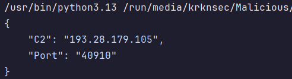

# Emulating TinyLoader With Qiling
---

I recently analyzed TinyLoader. As its name suggests, it's a very tiny binary that downloads an executes an additional payload. In many of the samples I came across, the C2 was stored just in plaintext which makes it very simple to make an extractor for. However, in other samples, it used a custom packer which is what we're solving today.

---
## The Packer
Here's the entirety of the program when I loaded it up in IDA. It's very small and not a lot going on.


```c
void start()
{
  _DWORD *v0; // rax
  _DWORD *v1; // rbx
  __int64 v2; // rax
  _DWORD *v3; // rbx
  __int64 v4; // rax
  int v5; // ecx

  Sleep(0x2710u);
  while ( 1 )
  {
    v0 = VirtualAlloc(0, 0x1000u, 0x3000u, 0x40u);
    if ( v0 )
      break;
    Sleep(0x64u);
  }
  v1 = v0;
  v2 = 0;
  while ( 1 )
  {
    *v1 = *(_DWORD *)(unsigned int)((_DWORD)&dword_401010 + v2);
    if ( (unsigned int)v2 >= 0x6AC )
      break;
    v2 = (unsigned int)(v2 + 4);
    ++v1;
  }
  v3 = (_DWORD *)((char *)v1 - v2);
  v4 = 0;
  v5 = 0;
  while ( 1 )
  {
    while ( 1 )
    {
      *v3 ^= v5;
      if ( *v3 == -443987883 || (_DWORD)v4 )
        break;
      *v3 ^= v5;
      v3 = (_DWORD *)((char *)v3 - v4);
      v4 = 0;
      ++v5;
    }
    if ( (unsigned int)v4 >= 0x6AC )
    {
      qword_402030 = (__int64)LoadLibraryA;
      qword_402038 = (__int64)GetProcAddress;
      dword_4027F8 = 1568268787;
      ((void (*)(void))((char *)v3 - v4))();
      JUMPOUT(0x401707);
    }
    v4 = (unsigned int)(v4 + 4);
    ++v3;
  }
}
```


It starts with a Sleep() for 10 seconds. Attempts to create a new memory buffer using VirtualAlloc() with PAGE_EXECUTE_READWRITE permissions. It copies 0x6ac or 1708 bytes from dword_401010 to the newly allocated buffer in 4-byte chunks. It then performs some sort of XOR decrypt on it and then jumps there to start execution. So in a debugger this would be pretty easy. Just set a breakpoint on CALL RAX -> Step-Into and you're at the decrypted code. But what if we want to completely automate this statically?

So first let's clean it up.


```c
void start()
{
  LPVOID new_buffer; // rax
  LPVOID new_buffer_1; // rbx
  __int64 offset; // rax
  char *start_new_buffer; // rbx
  __int64 offset_1; // rax
  int xor_key; // ecx

  Sleep(10000u);
  while ( 1 )
  {                                             // MEM_COMMIT | MEM_RESERVE
    new_buffer = VirtualAlloc(0, 4096u, 0x3000u, PAGE_EXECUTE_READWRITE);
    if ( new_buffer )
      break;
    Sleep(100u);
  }
  new_buffer_1 = new_buffer;
  offset = 0;
  while ( 1 )
  {
    *new_buffer_1 = *(enc_bytes + offset);
    if ( offset >= 1708 )
      break;
    offset = (offset + 4);
    new_buffer_1 = new_buffer_1 + 4;
  }
  start_new_buffer = new_buffer_1 - offset;
  offset_1 = 0;
  xor_key = 0;
  while ( 1 )
  {
    while ( 1 )
    {
      *start_new_buffer ^= xor_key;
      if ( *start_new_buffer == 0xE5894855 || offset_1 )
        break;
      *start_new_buffer ^= xor_key;
      start_new_buffer -= offset_1;
      offset_1 = 0;
      ++xor_key;
    }
    if ( offset_1 >= 1708 )
    {
      qword_402030 = LoadLibraryA;
      qword_402038 = GetProcAddress;
      dword_4027F8 = 1568268787;
      (&start_new_buffer[-offset_1])();
      JUMPOUT(0x401707);
    }
    offset_1 = (offset_1 + 4);
    start_new_buffer += 4;
  }
}
```


Now it's a bit more readable. We can clearly see the memcpy() at the first while loop. Then it basically bruteforces the 4-byte XOR key during execution until it sees the magic bytes: 0xE5894855. Finally, it decrypts all of the encrypted bytes in DWORD increments. It's pretty simple but I just thought it was cool that it has no hardcoded key and it bruteforces itself.

Now we could reimplement this in C and call it a day to decrypt it. Which I did because C is super fast and bruteforced the key instantly.


```c
// Find XOR key
    while (1) {
        *allocated_buffer ^= enc_key;

        // Break if magic bytes are found
        if (*allocated_buffer == MAGIC)
            break;

        // Otherwise reset XOR, move pointer back by offset bytes, reset offset, increment key
        *allocated_buffer ^= enc_key;
        allocated_buffer = (uint32_t*)( (char*)allocated_buffer - (int)offset );
        offset = 0;
        ++enc_key;
    }


    // Decrypt encrypted bytes using found key
    while (1) {
        *(allocated_buffer_1+1) ^= enc_key;
        end_offset = (uint32_t)(end_offset + 4);
        if (end_offset >= bytes_len)
            break;
        ++allocated_buffer_1;
    }
```


---
## Emulating

However, in the search for new skills and knowledge I also decided to mess with some emulation. I did this because I wanted a single script that can work for both the packed and unpacked variants and get me the C2:Port combo every time. I went with Qiling because it seemed relatively straight-forward to implement and I kind of wanted to just execute the full binary each time instead of worrying about carving out specific data.

Now full disclosure, at first I just setup the barebones and told it to run.


```python
ql = Qiling([rootfs_file], rootfs=r"./rootfs/x8664_windows", archtype=QL_ARCH.X8664, ostype=QL_OS.WINDOWS, verbose=QL_VERBOSE.DISABLED, multithread=True)
ql.run()
```


I quickly found out it's not that easy. First I was just getting a GetModuleFileNameA() error when attempting to execute. The solution for this was to just copy the sample into the rootfs that you setup to actually run an environment in Qiling.


```python
rootfs_file = f"./rootfs/x8664_windows/Temp/sample.exe"
shutil.copyfile(self.file, rootfs_file)
```


It also turns out that the Sleep() and VirtualAlloc() functions are implemented fine but not RtlZeroMemory() (which TinyLoader ends up calling later). Good news is this is pretty easy to replicate. I just created a function hook for when this API is called and implemented my own version.


```python
# Hook em
ql.os.set_api('RtlZeroMemory', self.hook_RtlZeroMemory, QL_INTERCEPT.CALL)

# My hook
@staticmethod
@winsdkapi(cc=STDCALL, params={
    'Destination': LPVOID,
    'Length': SIZE_T
})
def hook_RtlZeroMemory(ql, address, params):
    if params.get('Destination'):
        dest = params['Destination']
    else:
        raise Exception('RtlZeroMemory hook failed! Destination not found in params.')

    if params.get('Length'):
        length = params['Length']
    else:
        raise Exception('RtlZeroMemory hook failed! Length not found in params.')

    # Zero out the memory at Destination
    ql.mem.write(dest, b'\x00' * length)

    return 0
```


Once I did this, emulation ran but next API issue: socket(). If I wanted to get the C2:Port combo I figured the easiest way would be to let emulation go until TinyLoader calls connect() but obviously all the previous API calls would need to be implemented in order to get there.


```python
@staticmethod
@winsdkapi(cc=STDCALL, params={
    'af': INT,
    'type': INT,
    'protocol': INT
})
def hook_socket(ql, address, params):
    # Create a fake socket handle and ret
    fake_socket = 0x1000
    return fake_socket


@staticmethod
@winsdkapi(cc=STDCALL, params={
    'hostshort': WORD
})
def hook_htons(ql, address, params):
    if params.get('hostshort'):
        hostshort = params['hostshort']
    else:
        raise Exception('htons hook failed! hostshort not found in params.')

    # Convert host byte order to network byte order (big-endian)
    netshort = ((hostshort & 0xFF) << 8) | ((hostshort & 0xFF00) >> 8)

    return netshort


@staticmethod
@winsdkapi(cc=STDCALL, params={
    'cp': STRING
})
def hook_inet_addr_v2(ql, address, params):
    if params.get('cp'):
        ip_string = params['cp']
    else:
        raise Exception('inet_addr hook failed! cp not found in params.')

    # Use Python's socket library to convert
    packed = socket.inet_aton(ip_string)
    result = int.from_bytes(packed, byteorder='big')
    return result
```


Using Qiling's built-in debugger "qdb" (super helpful by the way), I was able to confirm with these new hooks that the emulation was reaching connect(). Now all that was needed was reading the `sockaddr *name` argument from connect to grab the IP address and port number. Then once that's grabbed, we can just end the emulation.


```python
@staticmethod
@winsdkapi(cc=STDCALL, params={
    's': SOCKET,
    'name': POINTER,
    'namelen': INT
})
def hook_connect(ql, address, params):
    if params.get('name'):
        sockaddr = params['name']
    else:
        raise Exception('connect hook failed! name not found in params.')

    # Read sockaddr structure
    # Read the 32-bit IP address as stored in memory
    ip_dword = int.from_bytes(ql.mem.read(sockaddr + 4, 4), 'little')

    # Extract octets from the DWORD (reverse order due to little-endian)
    octet4 = ip_dword & 0xFF
    octet3 = (ip_dword >> 8) & 0xFF
    octet2 = (ip_dword >> 16) & 0xFF
    octet1 = (ip_dword >> 24) & 0xFF

    # Build IP string from octets
    ip_str = f"{octet1}.{octet2}.{octet3}.{octet4}"

    # Read port (network byte order - big-endian)
    port = int.from_bytes(ql.mem.read(sockaddr + 2, 2), 'big')

    # Made a global temp config to ret these values as I can't pass additional args, self_obj, or ret from this in a clean way
    CONFIG["C2"] = (f"{ip_str}")
    CONFIG["Port"] = (f"{port}")

    # Stop emulation
    ql.emu_stop()
```


And after running it on both a packed and unpacked sample we get this. Works great!



---

The full code is available [here.](https://github.com/Krkn-Sec/RE-Scripts/blob/main/Config%20Extractors/TinyLoader/emulator.py)
