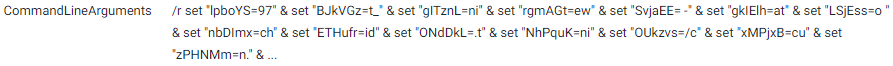
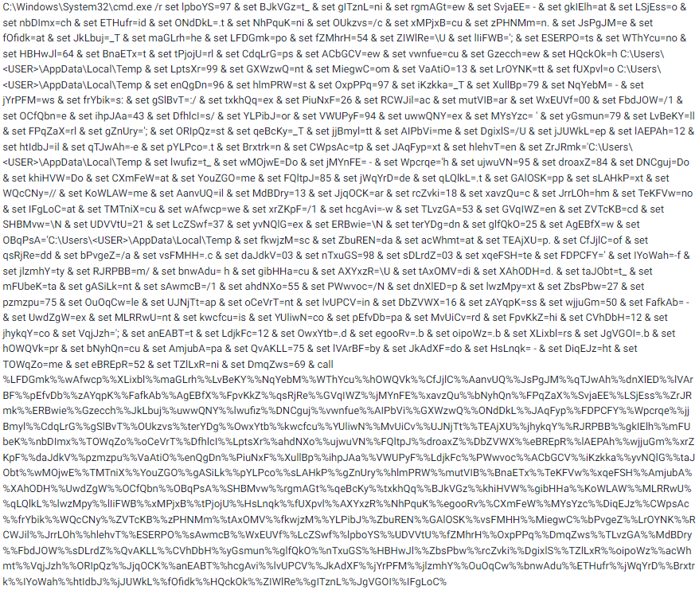
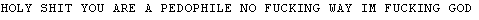
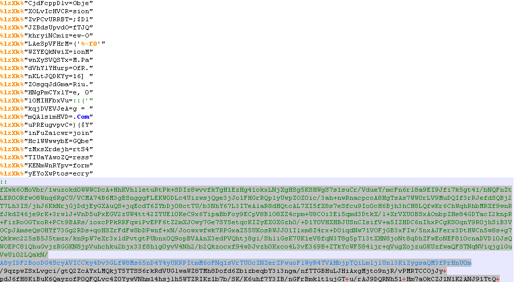
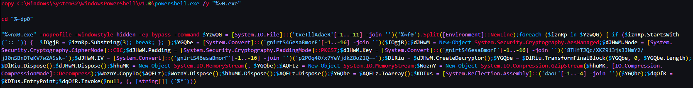
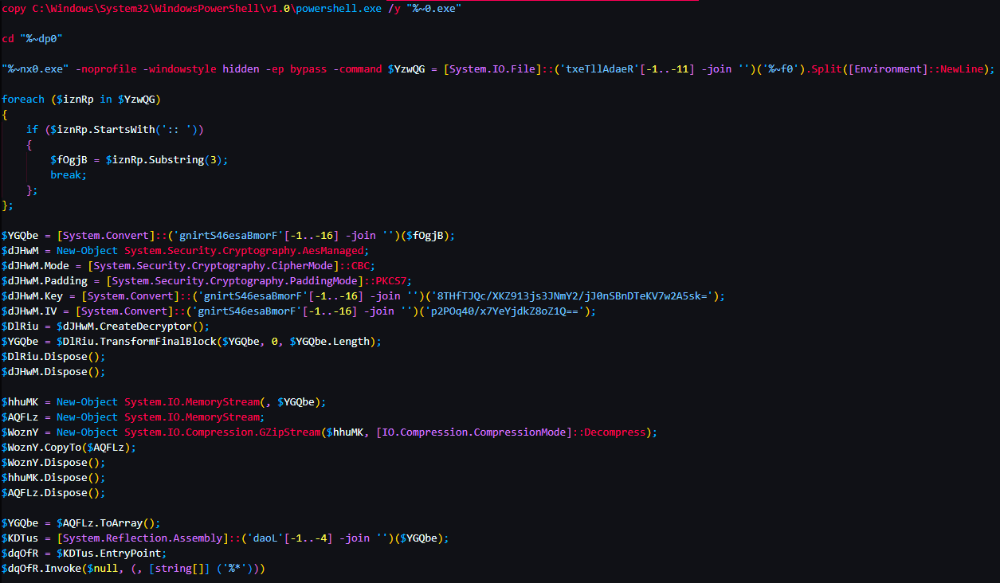
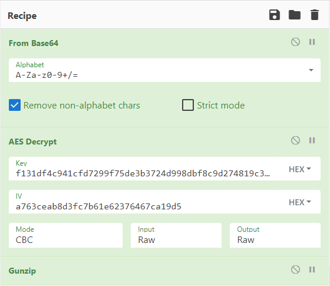
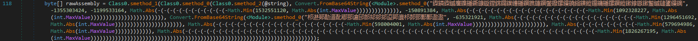
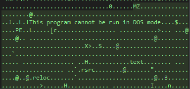
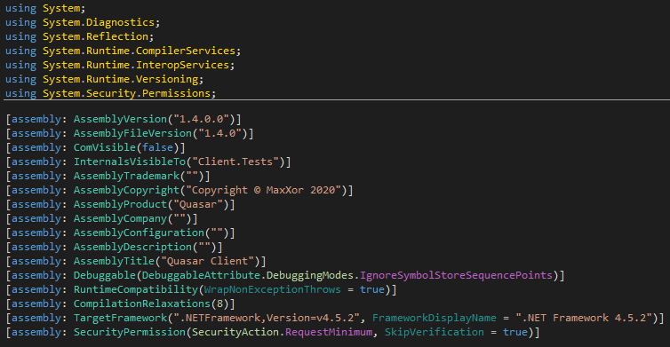

# Random Sample Analysis 1: Interesting Chain into Quasar
---
I was performing some research on commonly used file types for stage 1 loaders through phishing attacks. File types such as .ISO, .LNK, etc. In VirusTotal I came across the following .LNK file. 

| Name   | Proof + Dox (made by CrXpWalter.lnk                                         |
|--------|-----------------------------------------------------------------------------|
| MD5    | 7d15ffc27d415d11c91c3c4c38bab7df                                            |
| SHA1   | 5120854ae08a40897163fb343a7a46d151af1cf9                                    |
| SHA256 | 22f9c24a957846a240fc7b8c6981b482e85d3d7a26c7dbed526ec87981b771bd            |
| SSDEEP | 192:8no49GahAcZ9oEzyOnrQ9q6PWvFhxyVXacMAUH3lb2ikGmlql:ao+GahhByYeP+FhOqVbKG |

Upon looking at the properties, I saw an interesting command-line that made me decide to investigate further. 

Looking at the behavior tab in VirusTotal, I was able to look at the full command line included in the LNK file. 

This was easy to deal with. The "set <rand>=x" commands are just setting environment variables. Then the command will append the characters together and execute it with the "call" command. What I did to deobfuscate this is change the "call" to "echo" 

Due to the fact that I didn't keep the quotes from the original command-line and instead just copied the full command from VirusTotal which removed the quotes, some of the characters weren't translated correctly. However, it's still very clear what this powershell command is doing. It's downloading two different files. One of which is a text file and the other is a BAT file. The text file gets opened via Notepad and the BAT file gets executed. I proceeded to download these files. 

The text file contained the following text.

The BAT file contained a lot more and used the same environment variable obfuscation technique. It also contained a large amount of Base64 encoded bytes. 

I ignored the Base64 bytes first and took a look at the rest of the BAT file. I deobfuscating it using the same technique which resulted in the following ugly output. 

After cleaning it up:

It's now straight forward to read the process. It takes the large amount of Base64 characters seen in the BAT file and first Base64 decodes it. It then AES decrypts the bytes using the key and IV values currently Base64 encoded. Finally it decompresses the bytes using Gzip and proceeds to execute the resulting payload. To deal with this, all is needed is either a Python script, CyberChef, or to piggyback off of the same Powershell script. The Key and IV values were Base64 decoded first and saved in hex values. 

The large amount of Base64 content from the BAT file was copied into CyberChef and the same process was entered in CyberChef. Here's the recipe:

The output resulted in a PE file. 

The resulting PE file is a heavily obfuscated .NET executable that also performs dynamic API loading using LoadLibrary and GetProcAddress. 

It has multiple anti-debugging checks and anti-sandbox checks. The first check was to look at the hardware information and determine if the terms "vmware" or "VirtualBox" were present. This was trivial to bypass. I set a breakpoint on the "Contains" method where the program will iterate through the hardware information collected and see if any fields contains the word "vmware" or "VirtualBox." Once the breakpoint was hit, I simply changed the word it was searching for from "vmware" to "deez" because memes. I also ignored the "VirtualBox" check because I'm using vmware so nothing from VirtualBox will show up in the hardware. 

The program then proceeded to check for debugging. I was wondering if dnSpyEx protected against the basics like IsDebuggerPresent and it looks like it does because I didn't modify any values and I was never moved to the Exit function if a debugger check failed. 

Proceeding with the reversing, there was a routine that was placing something into an array labeled "rawAssembly" so I decided to set a breakpoint on the instruction after that to see what was put there. 

Once looking in the memory dump, there's another MZ header. 

This was another .NET executable and upon opening the sample up in dnSpyEx, it was identified as QuasarRAT. I won't be going into the analysis with Quasar since the source code is openly viewable on Github.

