# Smokeloader Panel
## Version Rev3/2018
### Malpedia Description:
```
The SmokeLoader family is a generic backdoor with a range of 
capabilities which depend on the modules included in any 
given build of the malware. The malware is delivered in a 
variety of ways and is broadly associated with criminal 
activity. 

The malware frequently tries to hide its C2 activity by 
generating requests to legitimate sites such as microsoft.com, 
bing.com, adobe.com, and others. Typically the actual 
Download returns an HTTP 404 but still contains data in 
the Response Body.
```
---
---
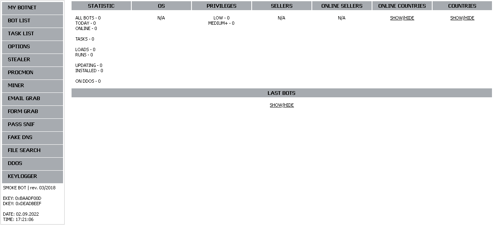
---
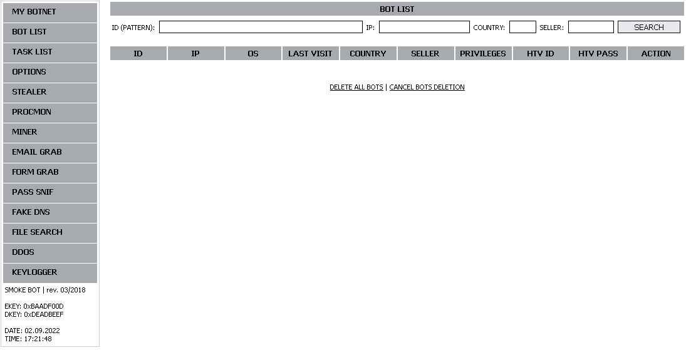
---
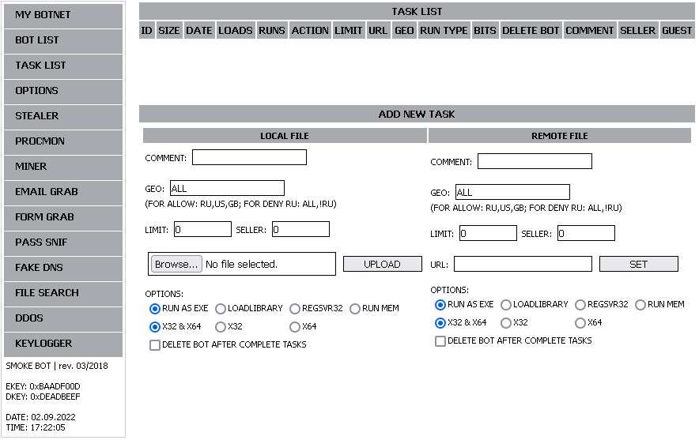
---
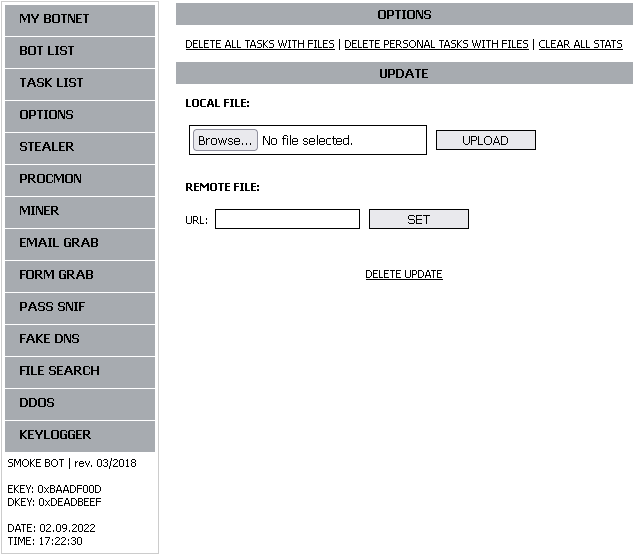
---
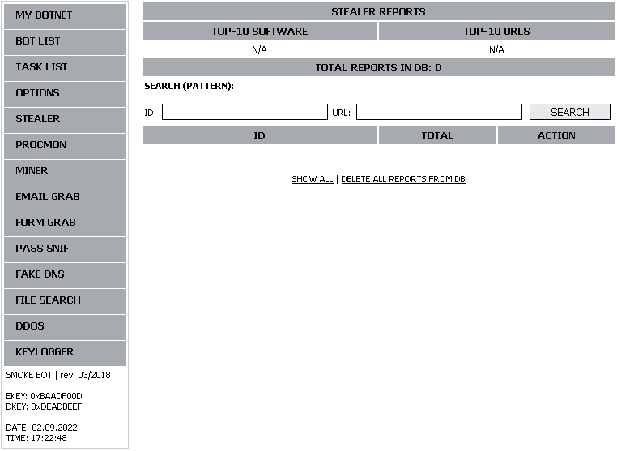
---
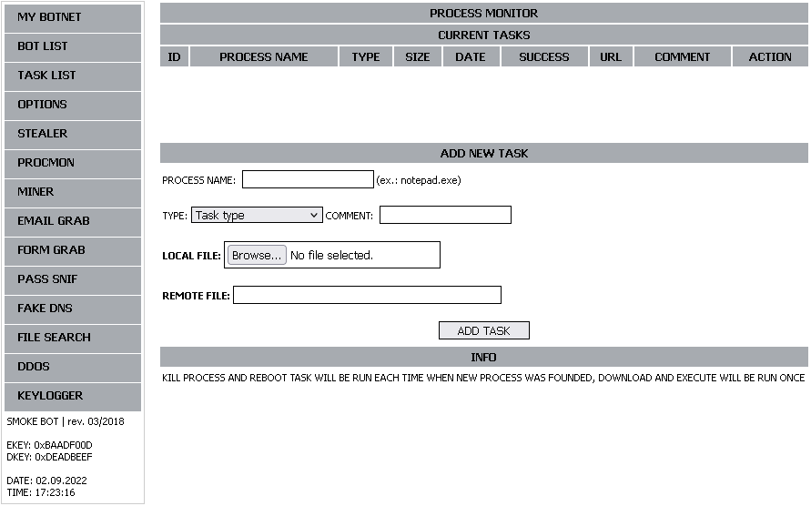
---
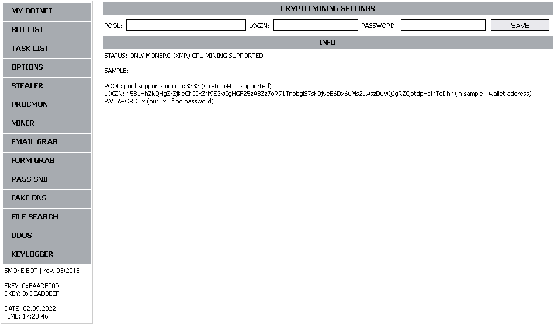
---
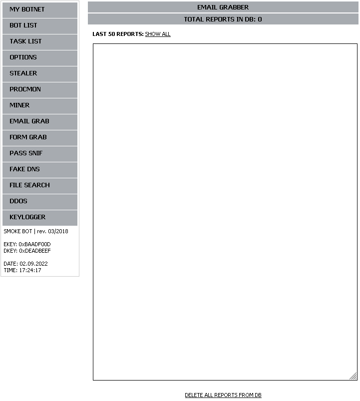
---
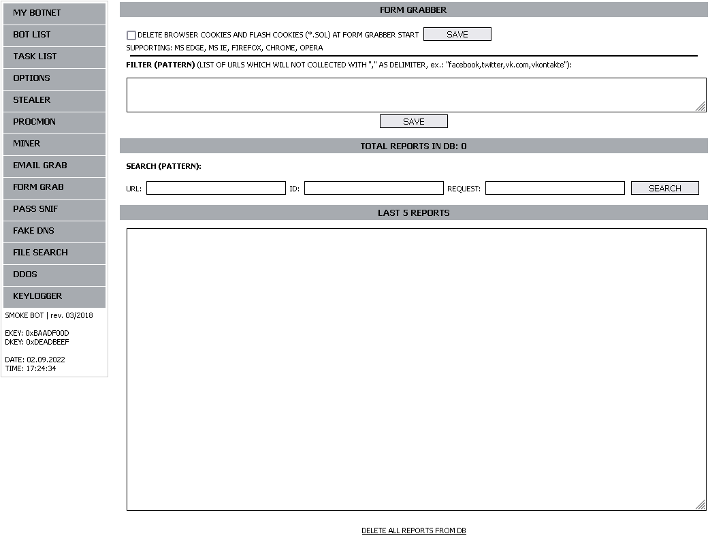
---

---
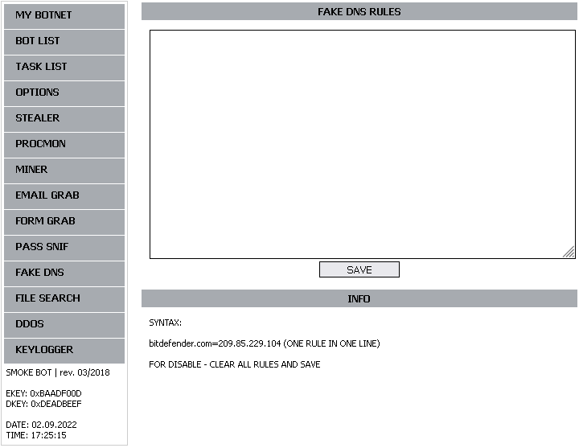
---
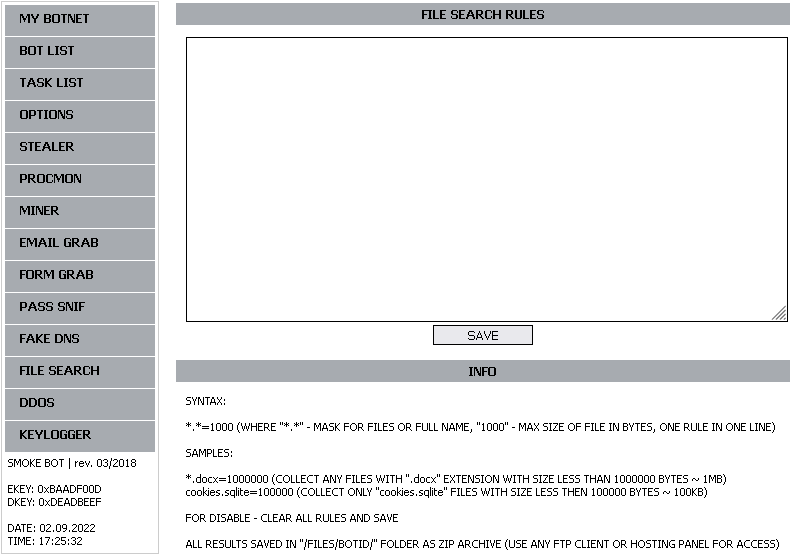
---
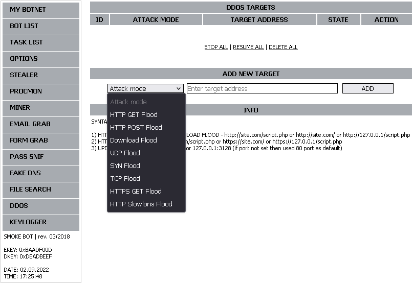
---
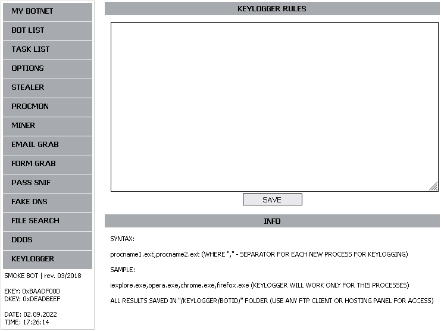
