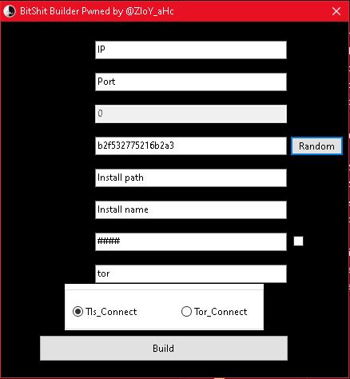

# BitRAT
## Unknown version -- Cracked
### Malpedia Description: 
*According to Bitdefender, BitRAT is a notorious remote access trojan (RAT) marketed on underground cybercriminal web markets and forums. Its price tag of $20 for lifetime access makes it irresistible to cybercriminals and helps the malicious payload spread.

Furthermore, each buyer’s modus operandi makes BitRAT even harder to stop, considering it can be employed in various operations, such as trojanized software, phishing and watering hole attacks.

BitRAT’s popularity arises from its versatility. The malicious tool can perform a wide range of operations, including data exfiltration, UAC bypass, DDoS attacks, clipboard monitoring, gaining unauthorized webcam access, credential theft, audio recording, XMRig coin mining and generic keylogging.*

