# DarkComet RAT
## Unknown Version
### Malpedia Description:
```
DarkComet is one of the most famous RATs, developed by Jean-Pierre Lesueur in 2008. 
After being used in the Syrian civil war in 2011, Lesuer decided to stop developing 
the trojan. Indeed, DarkComet is able to enable control over a compromised system 
through use of a simple graphic user interface. Experts think that this user 
friendliness is the key of its mass success.
```
### [Any.run Stats](https://any.run/malware-trends/darkcomet)
---
---
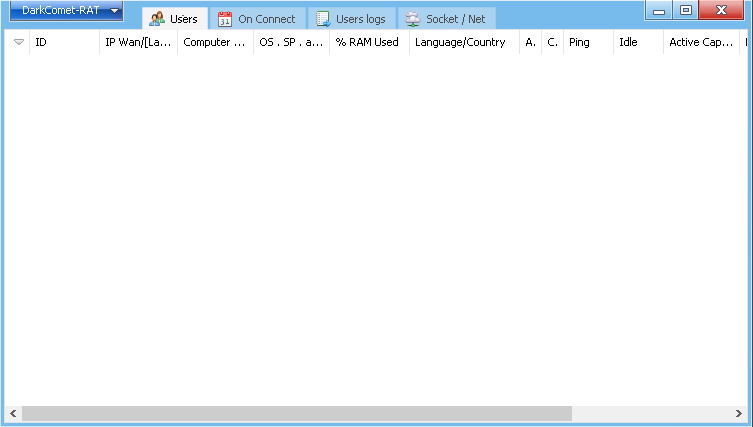
---
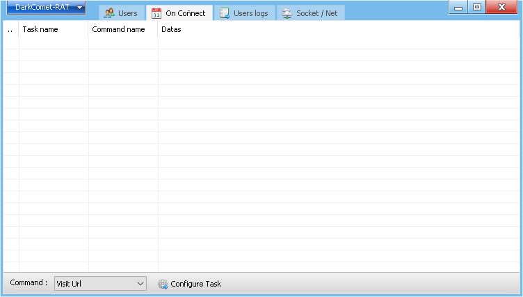
---
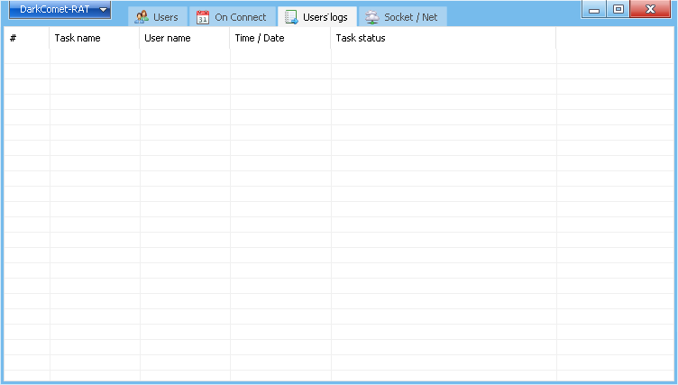
---
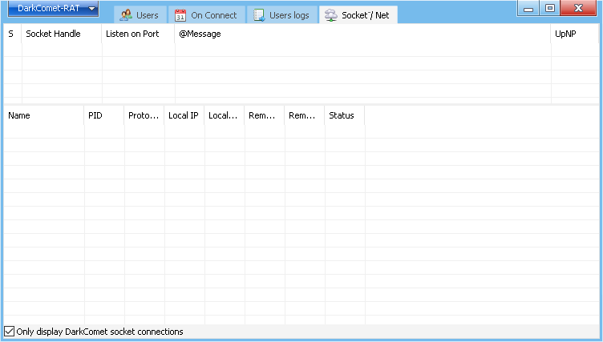
---
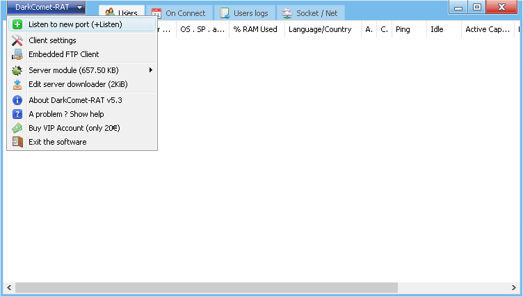
---
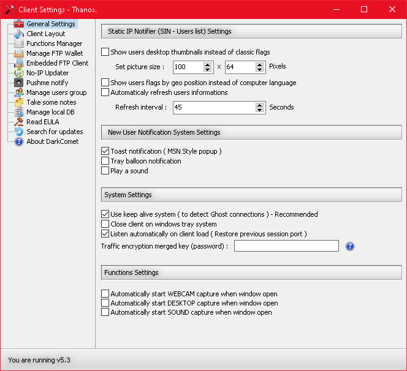
---
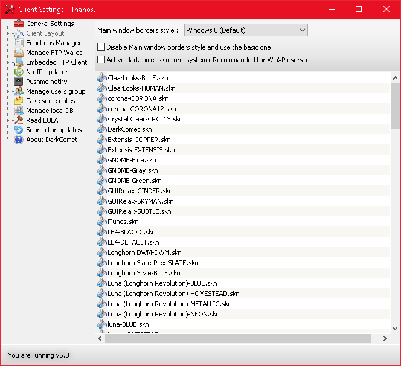
---
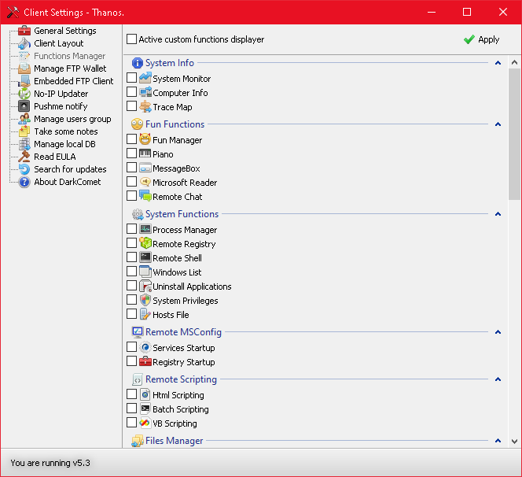
---
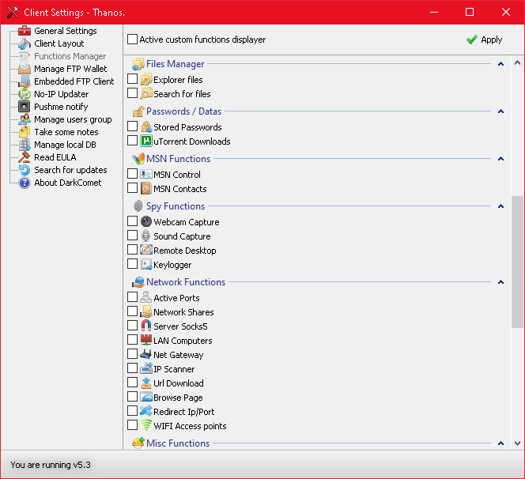
---
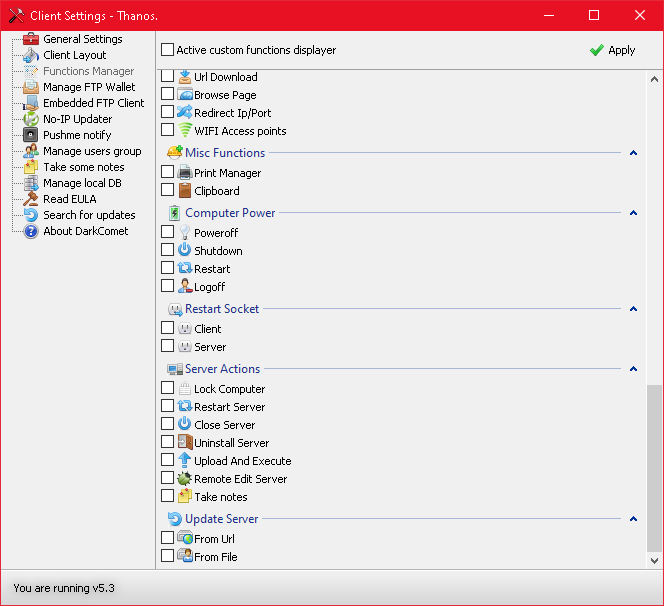
---
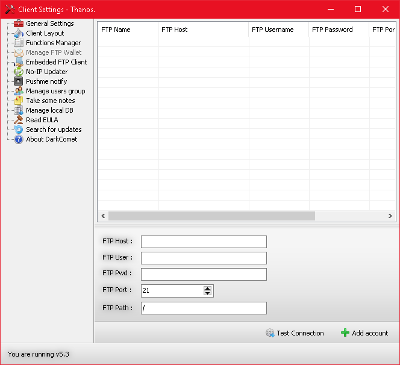
---
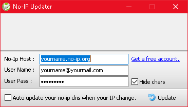
---

---
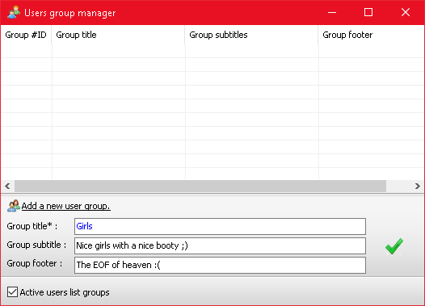
---
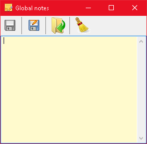
---
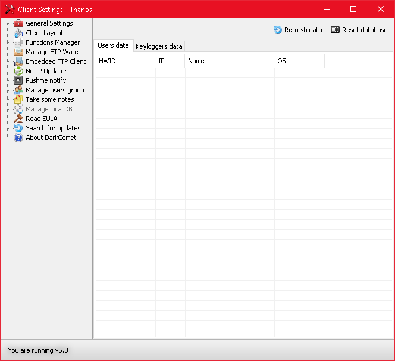
---

---
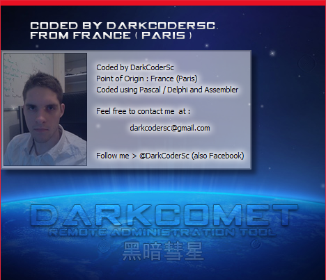
