# Eagle Monitor RAT
## Version REV2
### Malpedia Description:
```
This RAT written in C# was derived from HorusEyesRat. It was modified by "Arsium" and 
published on GitHub. There is also a client builder included.

Github Source: https://github.com/arsium/EagleMonitorRAT
```
---
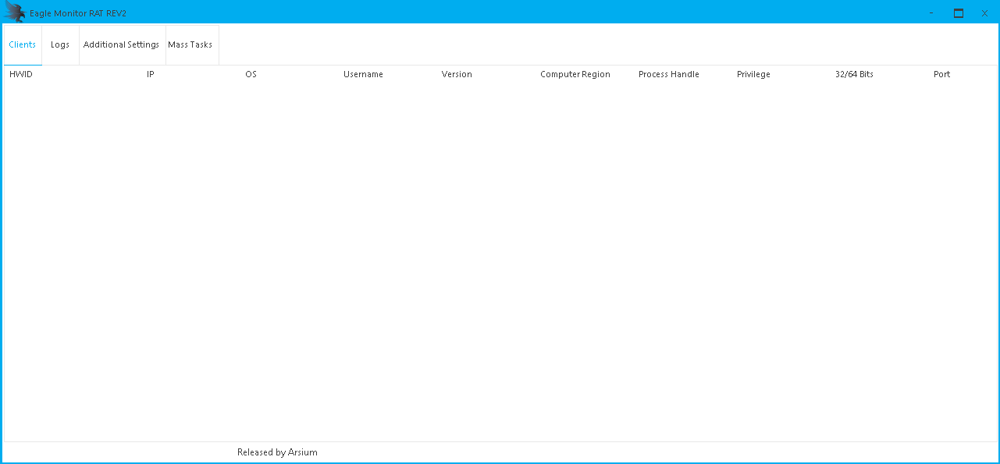
---
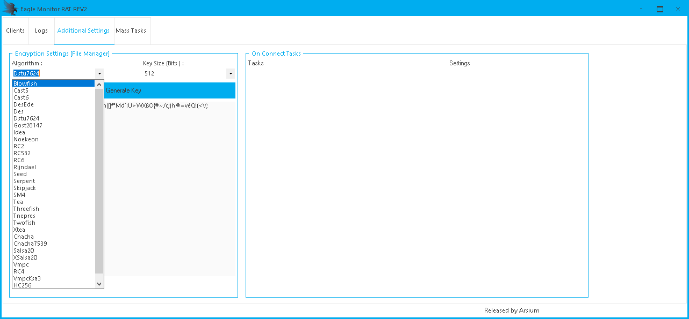
---
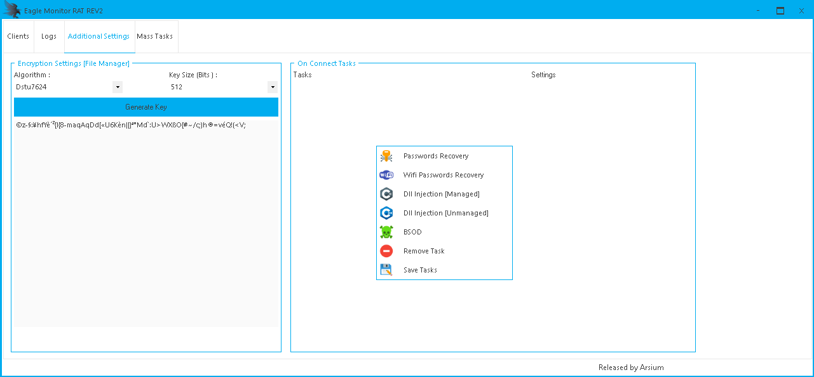
---
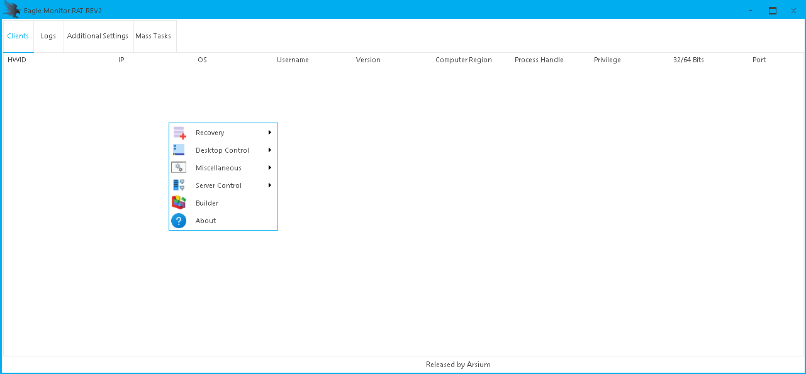
---
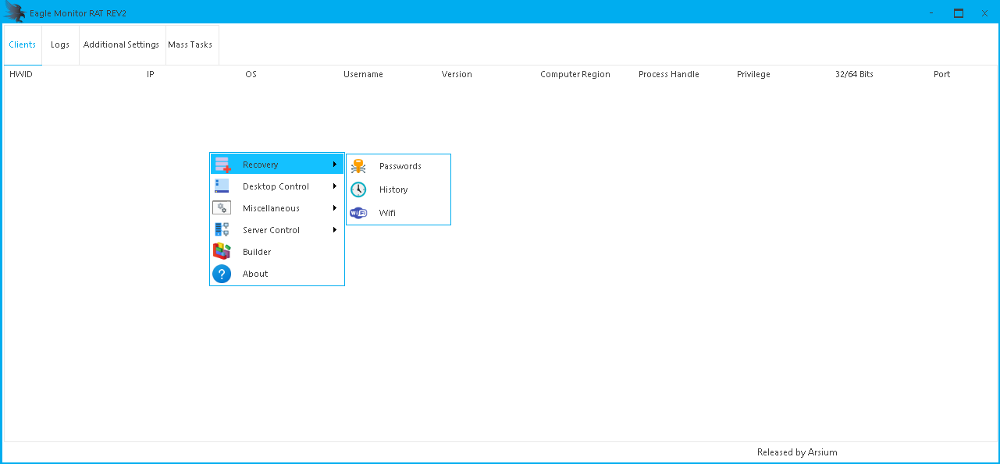
---
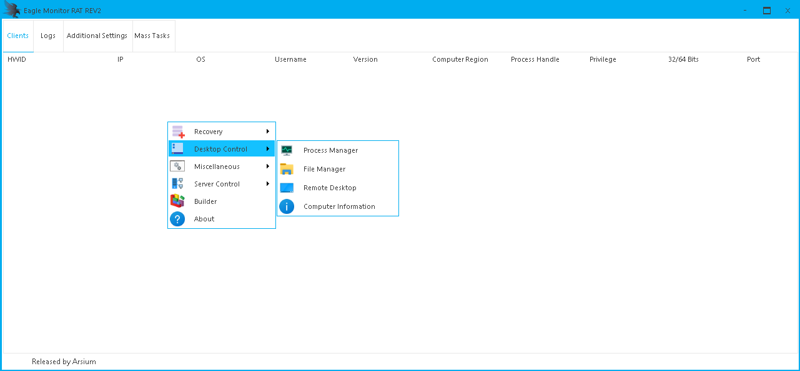
---
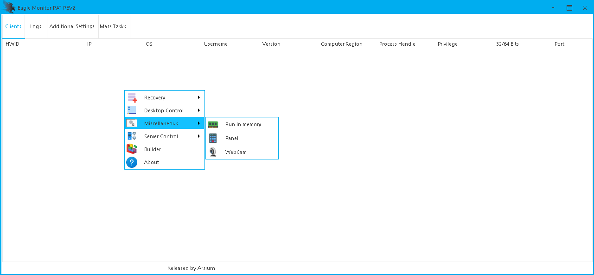
---
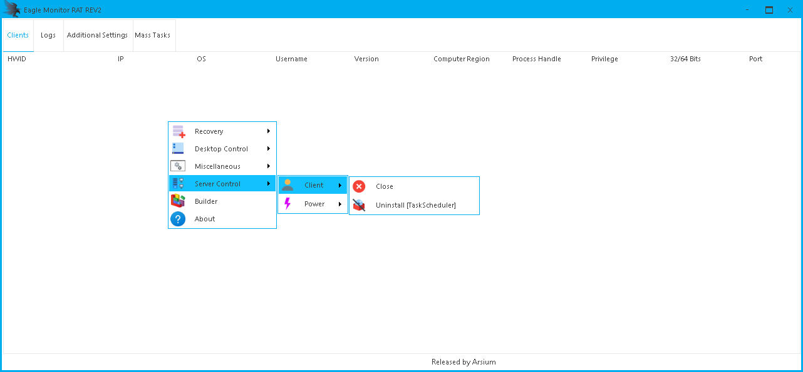
---
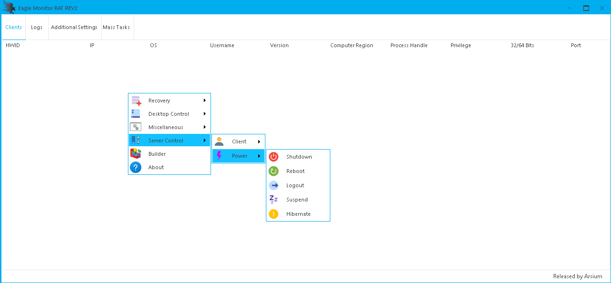
---
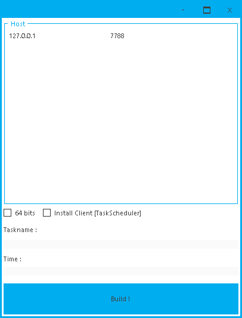
---
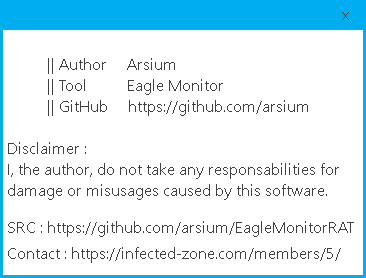
