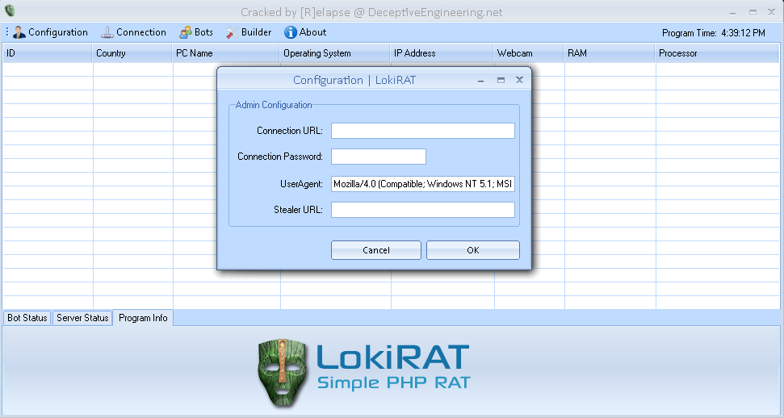

# LokiRAT
## Unknown version -- Cracked
### Malpedia Description:
```
This RAT written in Python is an open-source fork of the Ares RAT. This malware 
integrates additional modules, like recording, lockscreen, and locate options. 
It was used in a customized form version by El Machete APT in an ongoing 
champaign since 2020. The original code can be found at: 
https://github.com/TheGeekHT/Loki.Rat/
```
---

---

---

---

---

---

---

---

