# Nanocore RAT
## Version 1.2.2.0
### Malpedia Description:
```
Nanocore is a Remote Access Tool used to steal credentials and to spy on cameras. 
It as been used for a while by numerous criminal actors as well as by nation state threat actors.
```
### [Any.run Stats](https://any.run/malware-trends/nanocore)
---
---
### Main Panel
---
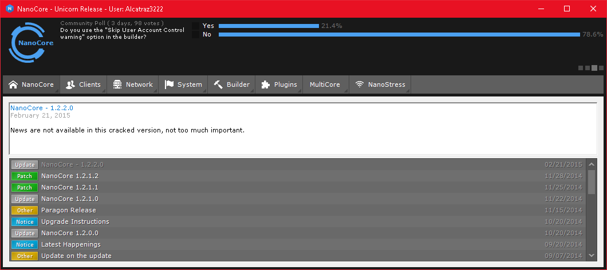
---
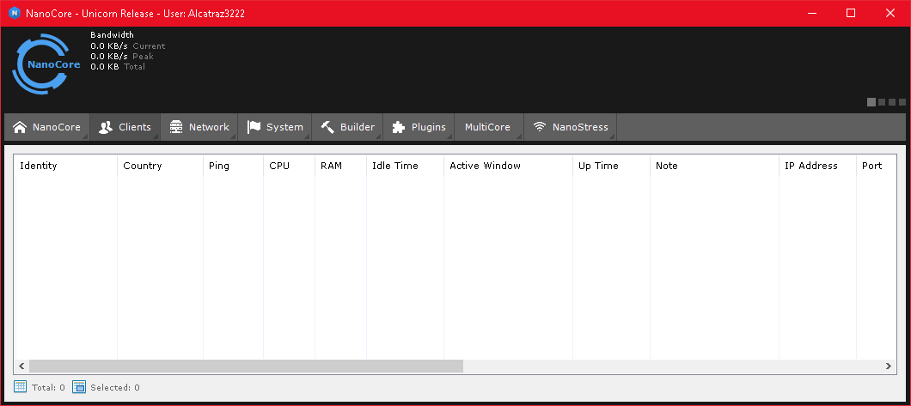
---
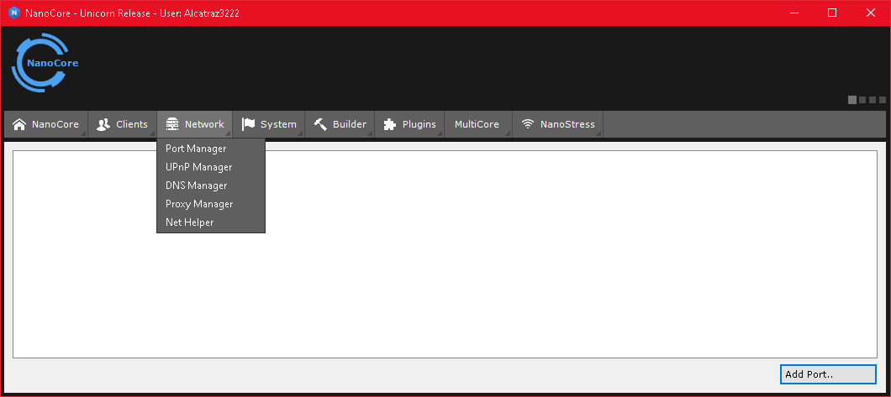
---
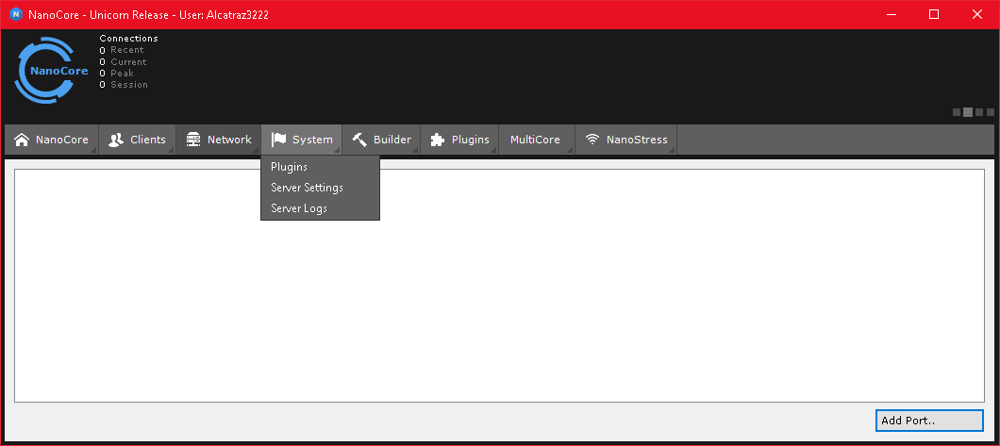
---
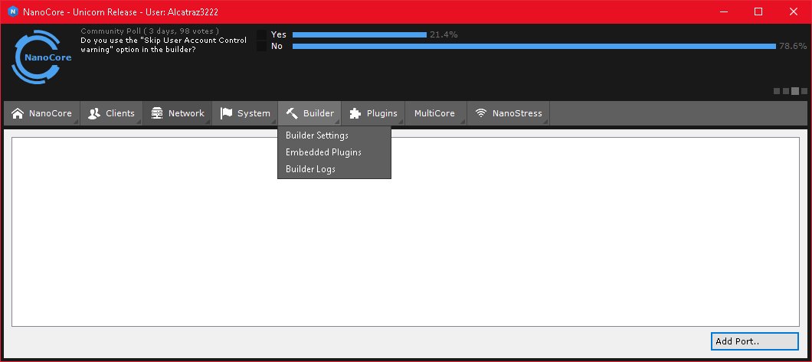
---
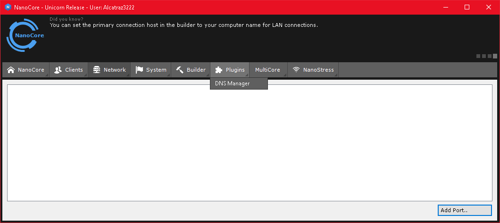
---
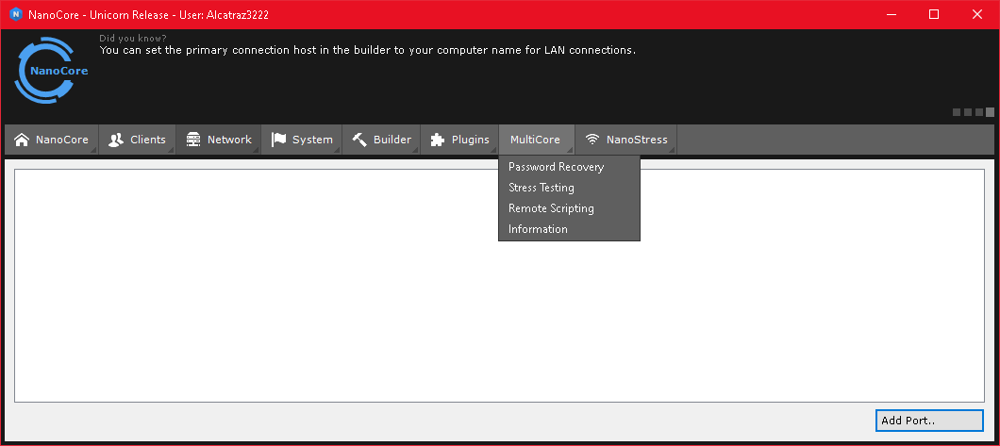
---
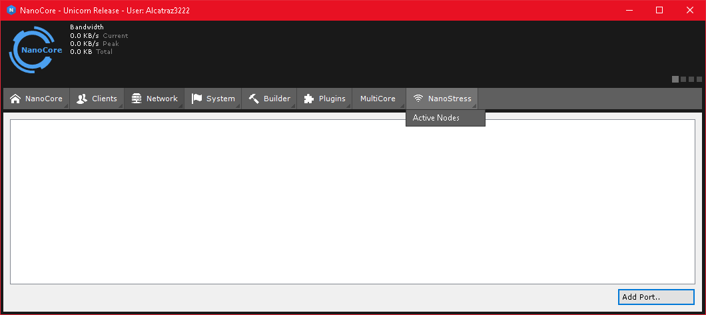
---
---
### Plugins
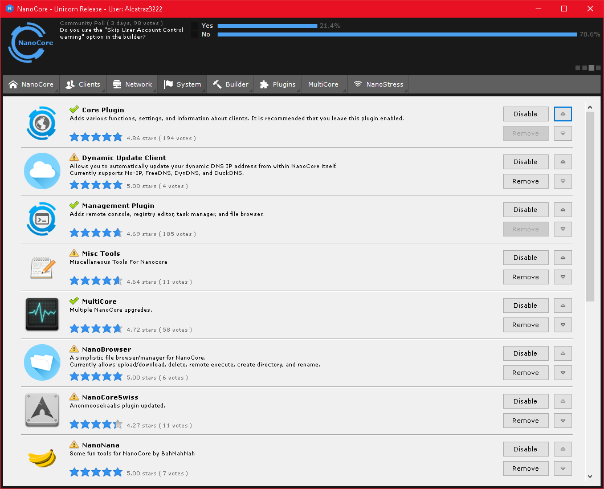
---
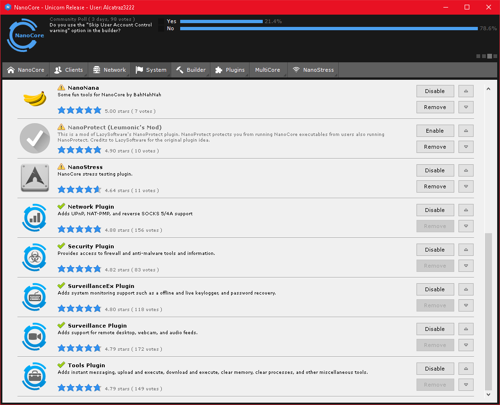
---
---
### Server Settings
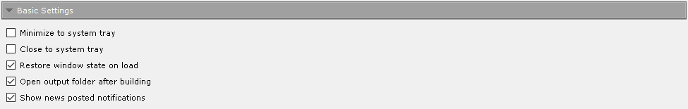
---

---

---
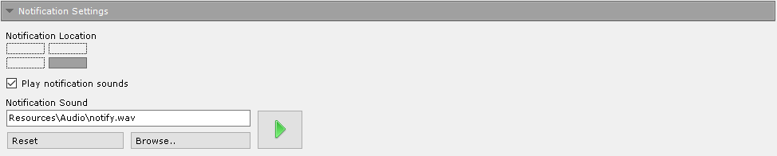
---
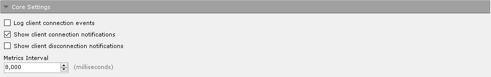
---
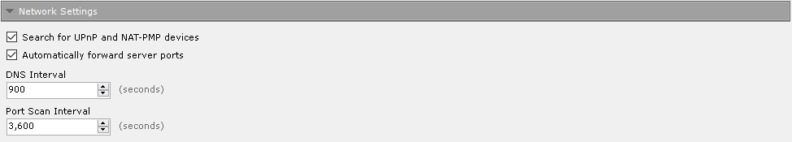
---
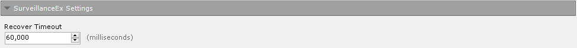
---
---
### Client Settings
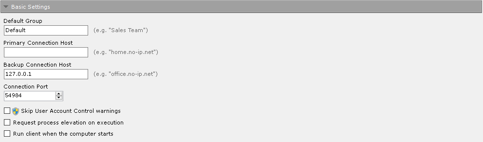
---
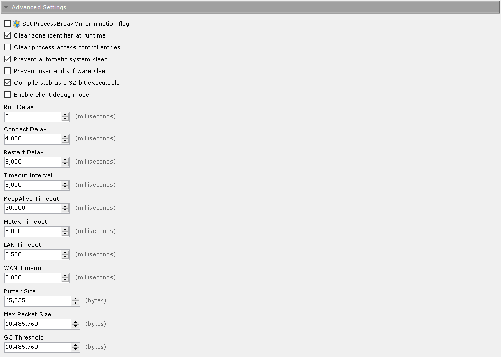
---
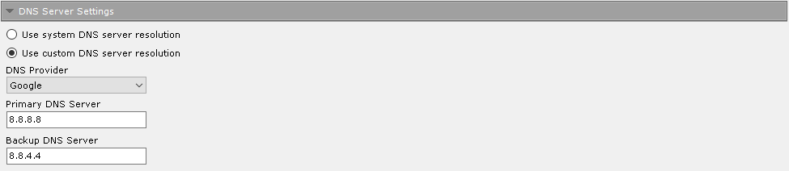
---
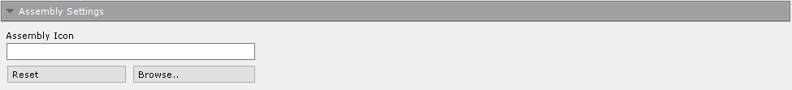
---
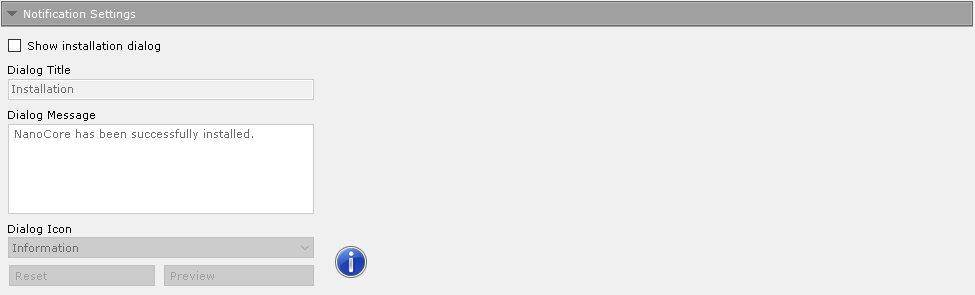
---

---
---
### Network Stress Capabilities
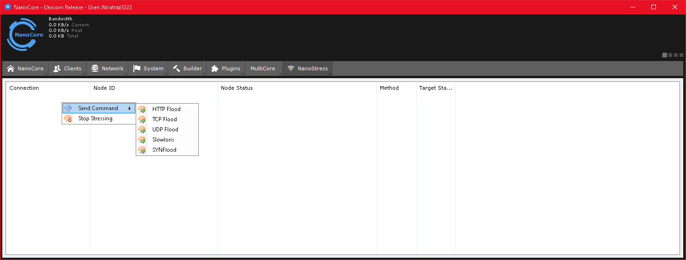
---
---
### Victim Interaction Capabilities
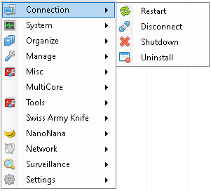
---

---
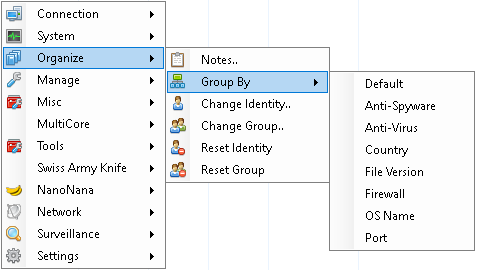
---

---

---

---
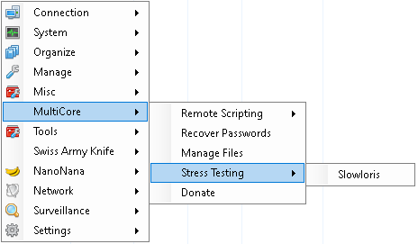
---

---

---
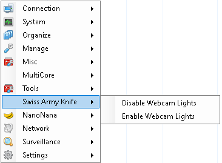
---
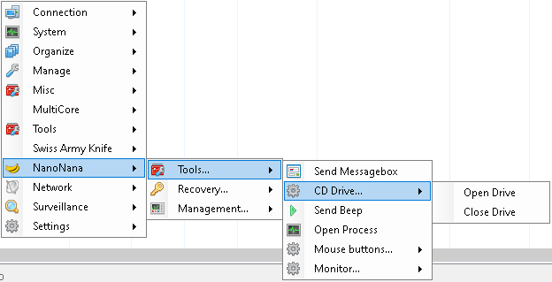
---
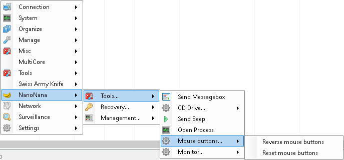
---
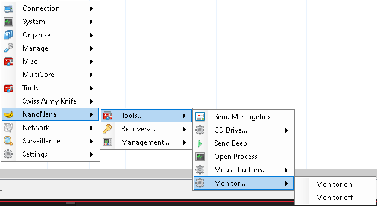
---
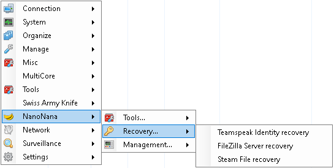
---

---
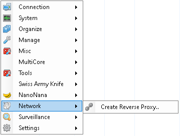
---

---
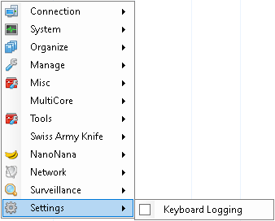
