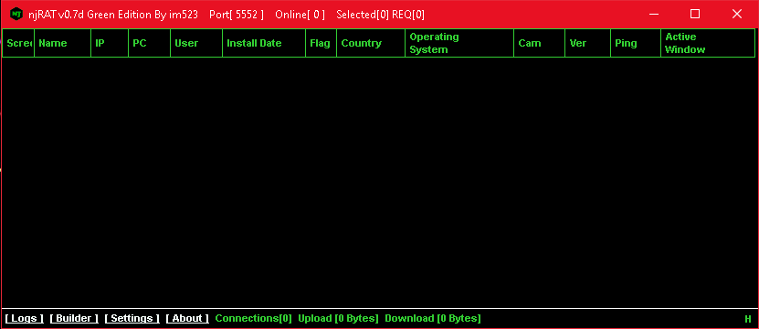

# njRAT
## Version 0.7d
### Malpedia Description:
```
RedPacket Security describes NJRat as "a remote access trojan (RAT) has capabilities to log keystrokes, access the victim's camera, steal credentials stored in browsers, open a reverse shell, upload/download files, view the victim's desktop, perform process, file, and registry manipulations, and capabilities to let the attacker update, uninstall, restart, close, disconnect the RAT and rename its campaign ID. Through the Command & Control (CnC) server software, the attacker has capabilities to create and configure the malware to spread through USB drives."

It is supposedly popular with actors in the Middle East. Similar to other RATs, many leaked builders may be backdoored.
```
---

---

---

---

---

