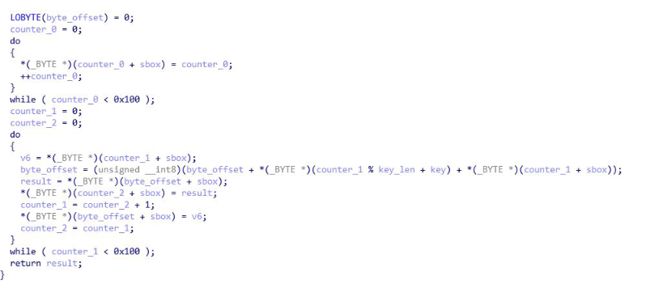

## Identifying Encryption Algorithms

*Main source of this information was taken from the Zero2Auto Malware Analysis Course. I highly recommend it.*

### AES

This is considered one of the most secure encryption algorithms. It supports 128, 192, and 256 bit key lengths and certain modes use IV's. Easiest way to identify AES is through the lookup tables, either S-Boxes or T-Tables. You can use the python tool Find-Crypt in IDA to find these.

  

---

### Blowfish

The key lengths of this algorithm can be between 4 bytes and 56 bytes. It is also fairly simple to determine based on the required S-boxes and P-arrays. The P-array is initialized via 2 loops of 18. There's also a loop that runs 4 times. Finally the S-boxes are initialized through an internal loop that will run 256 times.

  

---

### RC4

Algorithm has 3 main parts. The key-scheduling algorithm (initialization stage), the pseudo-random generation stage (scrambling stage), and the XOR stage. The initialization stage creates a table of values with the size of 256 bytes (0x100). A big giveaway that RC4 is being used is by identifying 0x100 being used in 2 loops. Both the initialization stage and scrambling stage will use this value. 

  

---

### Salsa20

Salsa20 is rather common in ransomware due to its speed. It has a 256 bit mode and a 128 bit mode. It is easy to recognize this algorithm just based on a couple of strings: aExpand32ByteK  and aExpand16ByteK. This algorithm requires both an IV and a key. In most cases the IV will be null but with ransomware it will be randomly generated. Another hint to determine is something is Salsa20 is to look at the main encryption loop and look for several rotate-left operations with the values 7, 9, 13, and 18.

